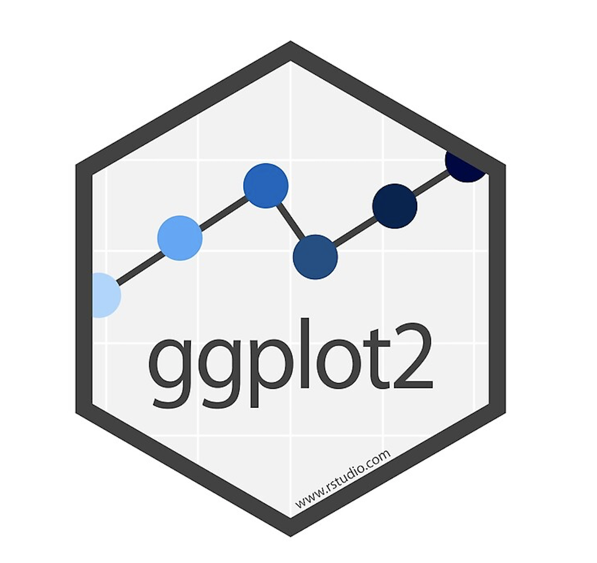

```{r setup, include=FALSE}
knitr::opts_chunk$set(echo = TRUE)
```

```{r, include=FALSE}
library(plotly)
library(ggplot2)
library(knitr)
```

## About Plotly

This graphing library is free and open source. It allows the user to make many different types of interactive, publication-quality plots. Some of the many things we can create with Plotly are line plots, scatter plots, area charts, bar charts, error bars, box plots, histograms, heatmaps, subplots, multiple-axes, and 3D Charts. One benefit of Plotly is that it allows the user to hover their mouse over the plots and see data points, zoom in or out of specific areas, or capture stills.

```plotly``` is a product of the tech company "Plotly" started by Alex Johnson, Jack Parmer, Chris Parmer, and Matthew Sundquist. The package is written in JavaScript, but can be used in other languages syntaxes such as R and Python. 

## Why use Plotly? 

Data visualization acts as an accentuating yet critical component of data science. Although quantitative analysis and technical knowledge drive the extraction of insight from data, perhaps what acts as a just as equal, if not more, counterpart is the presentation of findings. Data visualization perfectly accentuates data analytics, as it allows for data scientists to visually present and communicate important findings within the data in a digestible manner to key stakeholders. Traditional data visualization packages, such as ggplot2 or plotting functions within native R, provide means and methods of accomplishing this. However, ```plotly's``` value proposition is the ability to expound upon tradition two dimensional plotting techniques by offering interactivity and dimensionality that allows both data scientists and key stakeholders alike to extract more complex and meaningful insights, beyond what is capable in 2d graphics.

## How to Install Plotly

There are two ways of installing Plotly. One of the ways is by downloading from CRAN with the command ```install.packages("plotly")```. However, this may not be the most updated version so the other method of installing the library is suggested. This method is by downloading it from Github with the command ```devtools::install_github("ropensci/plotly")``` . This will ensure the latest version is downloaded. 

## How to Load the Plotly Package

In order to use the Plotly package, the user must first load it in using the command ```library(plotly)```.

### Some Important Info About Plotly {.tabset}

For an in-depth overview of the plotly package, click [here](https://cran.r-project.org/web/packages/plotly/index.html).

#### Version History

```{r, echo = FALSE}
table <- data.frame('Current Version' = '4.9.2.1')
kable(table)
```

#### Usage

```plotly``` is a data visualization package that can be used to make the following types of graphics: 

- line plots 
- scatter plots 
- area charts 
- bar charts 
- error bars 
- box plots 
- histograms 
- heatmaps 
- subplots 
- multiple-axes 
- 3D Charts

#### Dependencies 
- ```R (≥ 3.2.0)``` - R version 3.2.0 or later
- ```ggplot2 (≥ 3.0.0)``` - ggplot2 version 3.0.0 or later

#### Imports (Exogenous Package Use)
- tools
- scales 
- httr 
- jsonlite (≥ 1.6)
- magrittr 
- digest 
- viridisLite 
- base64enc 
- htmltools (≥ 0.3.6) 
- htmlwidgets (≥ 1.3) 
- tidyr, hexbin 
- RColorBrewer 
- dplyr 
- tibble 
- lazyeval (≥ 0.2.0) 
- rlang 
- crosstalk 
- purrr 
- data.table 
- promises

## About our Data Set
The World Happiness Report is a survey of the state of global happiness. This survey ranks 155 countries depending on their level of happiness, and analyzes the factors that leads to a happier country/citizens. The happiness scores and rankings are determined form the Gallup World Poll. There are six factors that the happiness score estimates: economic production, social support, life expectancy, freedom, absence of corruption, and generosity. These are believed to all contribute, in some manner, to the increase or decrease of global happiness. Our aim, through using this dataset, is to gain a better understanding of the factors that lead to a happier country, while also showing the different capabilities that the ```Plotly``` package allows. 

For an in-depth overview of the dataset used below, click [here](https://www.kaggle.com/unsdsn/world-happiness).


# Examples of plots that can be made with plotly 


```{r, include=FALSE}
#Reading the data in
fifteen <- read.csv('2015.csv')
sixteen<-read.csv('2016.csv')
seventeen<- read.csv('2017.csv')
eighteen<- read.csv('2018.csv')
nineteen<- read.csv('2019.csv')

#Loading libraries
library(dplyr)
library(plotly)
```


```{r,include=FALSE}
#Looking at the datasets
head(fifteen)
head(sixteen)
head(seventeen)
head(eighteen)
head(nineteen)
```

## Scatterplots  {.tabset}
Plotly allows the user to make many different types of scatterplots. These can range from the basic 2D scatterplot analyzing two variables, to more complex 3D structures that look at the relationship between three variables. Below are some examples of the many types of scatterplots that can be produced with Plotly.

### Basic 2D Scatter Plots
Plotly makes it extremely easy to create simple 2D scatterplots to see relationships between two 
variables.
```{r, warning=FALSE,message=FALSE}
fig <- plot_ly(data = nineteen, x = ~Healthy.life.expectancy, y = ~Overall.rank)
fig
```
This scatterplot shows that as Healthy Life Expectancy increases, the overall rank decreases.This means that countries with citizens who have higher Healthy Life Expectancies are also more likely  to be the countries with a better ranking (lower, in this case, is better). 

### Styled 2D Scatter Plots 
```{r, warning=FALSE,message=FALSE}
fig <- plot_ly(data = nineteen, x = ~Healthy.life.expectancy, y = ~Overall.rank,
               marker = list(size = 10,
                             color = '#BFDFFC',
                             line = list(color = '#067BEA',
                                         width = 2)))
fig <- fig %>% layout(title = 'Styled Scatter',
         yaxis = list(zeroline = FALSE),
         xaxis = list(zeroline = FALSE))

fig
```
Here, we have the same relationship being analyzed as we did in the Basic 2D Scatterplot, but we have styled the scatter plot through manipulations to the data markers.   

### 2D Scatterplot with Quantitative Colorscales
Plotly also allows the user to have a colorscale dependent on a specific grouping. For Quantitative or Continuous groupings, the legend will be a scale that fades from one color to another to show varying levels of the grouping.
```{r, warning=FALSE, messages=FALSE}
fig <- plot_ly(nineteen, x = ~Freedom.to.make.life.choices, y = ~Social.support, text = ~Country.or.region, type = 'scatter', mode = 'markers', color = ~Score, colors = 'Blues',
        marker = list(size = ~Score, opacity = 0.7,sizemode = 'diameter'))
fig <- fig %>% layout(title = 'Social Support and Freedom to Make Life Choices per Country',
         xaxis = list(showgrid = FALSE),
         yaxis = list(showgrid = FALSE))
fig
```
Here, we have an example of a qualitative colorscale where the scatterplot is broken down by the overall scores. The darker colors signify a higher overall score, and the lighter colors signify a lower overall score. We can see that the countries that have the highest freedom to make life choices and the highest social support are also the highest in their scores. Some of these countries are Iceland, Denmark, Finland, Australia, and Canada. 

### 2D Scatterplot with Qualitative Colorscales
As discussed on the previous example, Plotly allows the user to have a colorscale dependent on a specific grouping. For Qualitative groupings, the legend will separate the colors based on the specific groupings. 
```{r, warning=FALSE, messages=FALSE}
fig <- plot_ly(data = nineteen, x = ~Healthy.life.expectancy, y = ~Score, color = ~Country.or.region , colors="Blues")
fig

```
In the example above, we have grouped the points by Country/Region. We can see that each grouping (in this case country) was assigned a different shade of blue. As a result, we can analyze the Score vs Healthy Life Expectancy broken down by the Country. 

### 3D Scatter Plots
With Plotly, the user can also create 3D scatter plots to analyze three different variables and their relationships. 
```{r, warning=FALSE, messages=FALSE}
fig <- plot_ly(nineteen, x = ~Healthy.life.expectancy, y = ~Perceptions.of.corruption,
               z = ~Social.support, color = ~Overall.rank, colors = c('#067BEA', '#464D52'))
fig <- fig %>% add_markers()
fig <- fig %>% layout(scene = list(xaxis = list(title = 'Healthy Life Expectancy'),
                     yaxis = list(title = 'Perceptions of Corruption'),
                     zaxis = list(title = 'Social Support')))
fig
```
This scatter plot shows the relationship between Perceptions of Corruption, Generosity, and Overall Rank. We can see that the countries with the best overall rank (aka lowest rank) are those with high social support, low perceptions of corruption, and high healthy life expectancy. 

## Bar Graphs  {.tabset}

### Basic Bar Graph with Direct Labels
This shows a bar chart for the 2019 data set. It analyzes the Country/Region and the Score associated with that location.
```{r, warning=FALSE}
#Subsetting the data to only show the top 10 countries with the highest scores
nineteen<- nineteen %>%
    group_by(Score) %>%
    top_n(10, Score) %>%
    head(10)

x<- as.factor(nineteen$Country.or.region)
y<- as.numeric(nineteen$Score)
data <- data.frame(x, y)

fig1 <- plot_ly(data, x = ~x, y = ~y, type = 'bar',
             text = y, textposition = 'auto',
             marker = list(color = 'rgb(158,202,225)',
                           line = list(color = 'rgb(8,48,107)', width = 1.5)))
fig1 <- fig1 %>% layout(title = "Top Ten Happiness Scores Based on Country (for the year 2019)",
         xaxis = list(title = "Country/Region"),
         yaxis = list(title = "Score"))
fig1
```

### Grouped Bar Graph
This shows a grouped bar chart for the 2019 data set. This shows a bar graph looking at the top 10 countries with the highest scores. The graph shows their healthy life expectancy, social support, and GDP per capita counts.
```{r, warning=FALSE}
#Subsetting the data to only show the top 10 countries with the highest scores
nineteen<- nineteen %>%
    group_by(Score) %>%
    top_n(10, Score) %>%
    head(10)

x<- as.factor(nineteen$Country.or.region)
y<- as.numeric(nineteen$Score)
data <- data.frame(nineteen, x, y)

fig <- plot_ly(nineteen, x = ~Country.or.region, y = ~Healthy.life.expectancy, type = 'bar', 
            name = 'Healthy Life Expectancy', text = y, textposition = 'auto',
             marker = list(color = '#065198',
                           line = list(color = '#0F242A', width = 1.5)))

fig <- fig %>% add_trace(y = ~Social.support, name = 'Social Support',
            name = 'Score', text = y, textposition = 'auto',
             marker = list(color = '#CCE4FC',
                           line = list(color = '#0F242A', width = 1.5)))
fig <- fig %>% add_trace(y = ~GDP.per.capita, name = 'GDP per Capita',
            name = 'Score', text = y, textposition = 'auto',
             marker = list(color = '#32A6C6',
                           line = list(color = '#0F242A', width = 1.5)))
fig <- fig %>% layout(title = "Analyzing the Top 10 Countries (for the year 2019)",
         xaxis = list(title = "Country/Region"),
         yaxis = list(title = "Count"))

fig
```
As we can see above, of the ten groups, Iceland has the most Social Support, Norway has the most GDP per Capita, and Switzerland has the most Healthy Life Expectancy values.

### Putting Two (or more) Graphs Side-By-Side
In order to see relationships or analyze data more clearly, the user can use Plotly to place two (or more) plots side-by-side. 
```{r, warning=FALSE}
#Subsetting the data to only show the top 10 countries with the highest scores
nineteen<- nineteen %>%
    group_by(Score) %>%
    top_n(10, Score) %>%
    head(10)
    
x<- as.factor(nineteen$Country.or.region)
y<- as.numeric(nineteen$Score)
data <- data.frame(x, y)

fig1 <- plot_ly(data, x = ~x, y = ~y, type = 'bar',
             name = '2019',
             text = y, textposition = 'auto',
             marker = list(color = '#065198',
                           line = list(color = '#0F242A', width = 1.5)))
fig1 <- fig1 %>% layout(title = "Top Ten Happiness Scores Based on Country (for the year 2019)",
         xaxis = list(title = "Country/Region"),
         yaxis = list(title = "Score"))

#Subsetting the data to only show the top 10 countries with the highest scores
eighteen<- eighteen %>%
    group_by(Score) %>%
    top_n(10, Score) %>%
    head(10)
    
x2<- as.factor(eighteen$Country.or.region)
y2<- as.numeric(eighteen$Score)
data2 <- data.frame(x2, y2)

fig2 <- plot_ly(data, x = ~x2, y = ~y2, type = 'bar',
             name = '2018',
             text = y2, textposition = 'auto',
             marker = list(color = '#CCE4FC',
                           line = list(color = '#0F242A', width = 1.5)))
fig2 <- fig2 %>% layout(title = "Top Ten Happiness Scores Based on Country (for the year 2018)",
         xaxis = list(title = "Country/Region"),
         yaxis = list(title = "Score"))

subplot(fig2,fig1) %>% layout(title ="Top Ten Happiness Scores Based on Country")
```
Here, we are using both the 2018 and 2019 datasets. We have made bar graphs to analyze general trends of their overall score based on the country/region. We can see that both years have similar results; however, in 2018, Norway was the country with the highest Happiness Score, and in 2019, Finland was the country with the highest Happiness Score.


## Not a fan of Plotly? Here are some alternatives! {.tabset}

#### ggplot2
{width=10%}
<br> The ```ggplot2``` package was created by Hadley Wickham and offers yet another powerful way of creating complex but elegant visualizations and graphics. Plotly and ggplot2 have a lot of differences in their syntax, customization, and documentation. 


#### leaflet
{width=10%}
<br> The ```leaflet``` package was created by 

