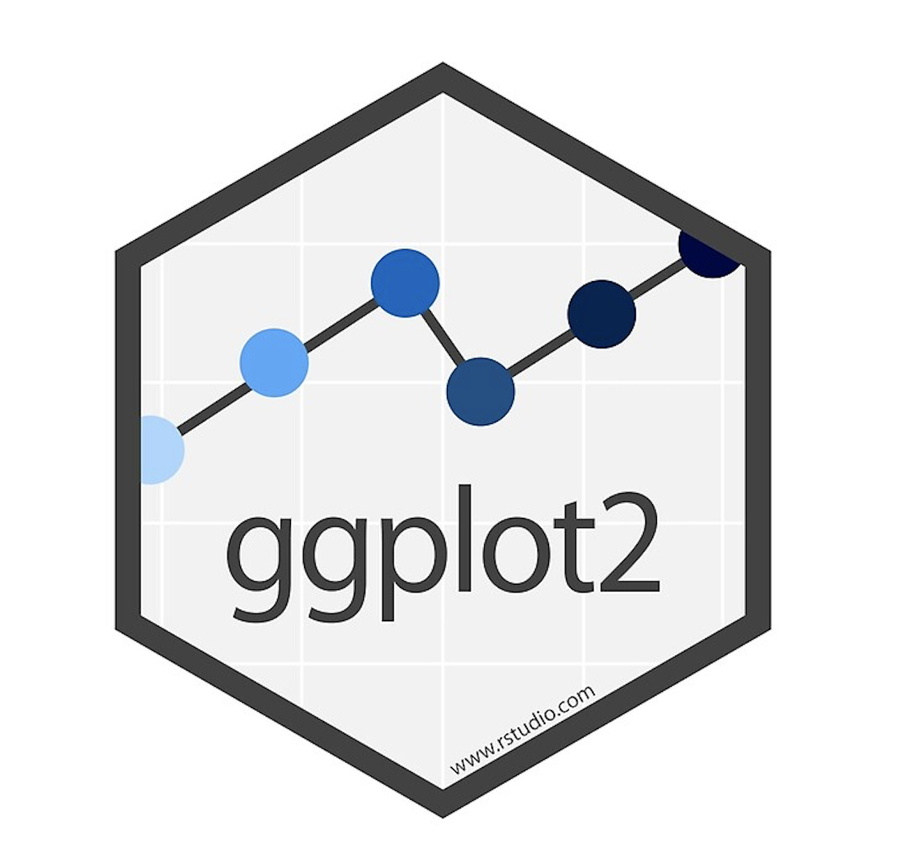
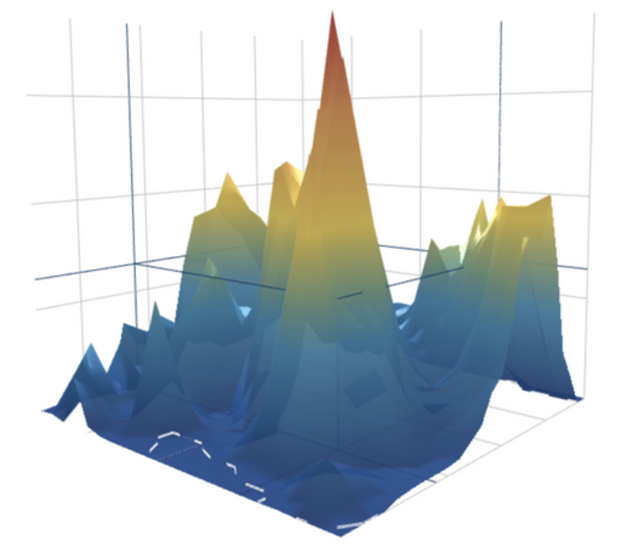

## About Plotly {.tabset}

This graphing library is free and open source. It allows the user to make many different types of interactive, publication-quality plots. Some of the many things we can create with Plotly are line plots, scatter plots, area charts, bar charts, error bars, box plots, histograms, heatmaps, subplots, multiple-axes, and 3D Charts. One benefit of Plotly is that it allows the user to hover their mouse over the plots and see data points, zoom in or out of specific areas, or capture stills. It also allows the user to click on different buttons, or use other interactive tools, to see different data points and analyzations. 

```plotly``` is a product of the tech company "Plotly" started by Alex Johnson, Jack Parmer, Chris Parmer, and Matthew Sundquist. The package is written in JavaScript, but can be used in other languages syntaxes such as R and Python. 

### Why use Plotly? 
Data visualization acts as an accentuating yet critical component of data science. Although quantitative analysis and technical knowledge drive the extraction of insight from data, perhaps what acts as a just as equal, if not more, counterpart is the presentation of findings. Data visualization perfectly accentuates data analytics, as it allows for data scientists to visually present and communicate important findings within the data in a digestible manner to key stakeholders. Traditional data visualization packages, such as ggplot2 or plotting functions within native R, provide means and methods of accomplishing this. However, ```plotly's``` value proposition is the ability to expound upon tradition two dimensional plotting techniques by offering interactivity and dimensionality that allows both data scientists and key stakeholders alike to extract more complex and meaningful insights, beyond what is capable in 2d graphics.

### How to Install Plotly
There are two ways of installing Plotly. One of the ways is by downloading from CRAN with the command ```install.packages("plotly")```. However, this may not be the most updated version so the other method of installing the library is suggested. This method is by downloading it from Github with the command ```devtools::install_github("ropensci/plotly")``` . This will ensure the latest version is downloaded. 

### How to Load the Plotly Package
In order to use the Plotly package, the user must first load it in using the command ```library(plotly)```.

## Important Info About Plotly {.tabset}
For an in-depth overview of the plotly package, click [here](https://cran.r-project.org/web/packages/plotly/index.html).

### Version History

|Current.Version |
|:---------------|
|4.9.2.1         |

### Usage
```plotly``` is a data visualization package that can be used to make the following types of graphics: 
<br> - line plots 
<br> - scatter plots 
<br> - area charts 
<br> - bar charts 
<br> - error bars 
<br> - box plots 
<br> - histograms 
<br> - heatmaps 
<br> - subplots 
<br> - multiple-axes 
<br> - 3D Charts

### Dependencies 
- ```R (≥ 3.2.0)``` - R version 3.2.0 or later
- ```ggplot2 (≥ 3.0.0)``` - ggplot2 version 3.0.0 or later

### Imports (Exogenous Package Use)
<br> - tools
<br> - scales 
<br> - httr 
<br> - jsonlite (≥ 1.6)
<br> - magrittr 
<br> - digest 
<br> - viridisLite 
<br> - base64enc 
<br> - htmltools (≥ 0.3.6) 
<br> - htmlwidgets (≥ 1.3) 
<br> - tidyr, hexbin 
<br> - RColorBrewer 
<br> - dplyr 
<br> - tibble 
<br> - lazyeval (≥ 0.2.0) 
<br> - rlang 
<br> - crosstalk 
<br> - purrr 
<br> - data.table 
<br> - promises

## About the Data Set
The World Happiness Report is a survey of the state of global happiness. This survey ranks 155 countries depending on their level of happiness, and analyzes the factors that leads to a happier country/citizens. The happiness scores and rankings are determined form the Gallup World Poll. There are six factors that the happiness score estimates: economic production, social support, life expectancy, freedom, absence of corruption, and generosity. These are believed to all contribute, in some manner, to the increase or decrease of global happiness. Our aim, through using this dataset, is to gain a better understanding of the factors that lead to a happier country, while also showing the different capabilities that the ```Plotly``` package allows. 
The variables used can be further described:
<br> - Region: separated by continent and location
<br> - Happiness Rank: ranks each country 1-155, based on Happiness Score
<br> - Happiness Score: "How would you rate your happiness on a scale from 1-10?"
<br> - Standard Error: SE from the Happiness Score
<br> - Economy (GDP per capita): a calculation of the extent to which GDP effects the Happiness Score
<br> - Family: a calculation of the extent to which Family effects the Happiness Score
<br> - Health (Life Expectancy): a calculation of the extent to which modern life expectancy effects the Happiness Score
<br> - Freedom: a calculation of the extent to which freedom effects the Happiness Score
<br> - Trust (Government Corruption): a calculation of the extent to which the perception of government corruption effects the Happiness Score
<br> - Generosity: a calculation of the extent to which generosity effects the Happiness Score
*Adding up the numbers from Economy, Family, Health, Freedom, Trust, and Generosity gives us the overall Happiness Score

For an in-depth overview of the dataset used above, click [here](https://www.kaggle.com/unsdsn/world-happiness).

## Examples of plots that can be made with plotly 


## Scatterplots  {.tabset}
Plotly allows the user to make many different types of scatterplots. These can range from the basic 2D scatterplots analyzing two variables, to more complex 3D structures that look at the relationship between three variables. Below are some examples of the many types of scatterplots that can be produced with Plotly.

### Basic 2D Scatter Plots
Plotly makes it extremely easy to create simple 2D scatterplots to see relationships between two 
variables.

```r
fig <- plot_ly(data = nineteen, x = ~Healthy.life.expectancy, y = ~Overall.rank)
fig
```

<!--html_preserve--><div id="htmlwidget-5a38f088b8570fdd18b0" style="width:672px;height:480px;" class="plotly html-widget"></div>
<script type="application/json" data-for="htmlwidget-5a38f088b8570fdd18b0">{"x":{"visdat":{"f126acecbb1":["function () ","plotlyVisDat"]},"cur_data":"f126acecbb1","attrs":{"f126acecbb1":{"x":{},"y":{},"alpha_stroke":1,"sizes":[10,100],"spans":[1,20]}},"layout":{"margin":{"b":40,"l":60,"t":25,"r":10},"xaxis":{"domain":[0,1],"automargin":true,"title":"Healthy.life.expectancy"},"yaxis":{"domain":[0,1],"automargin":true,"title":"Overall.rank"},"hovermode":"closest","showlegend":false},"source":"A","config":{"showSendToCloud":false},"data":[{"x":[0.986,0.996,1.028,1.026,0.999,1.052,1.009,1.026,1.039,1.016,1.036,0.963,1.029,1.012,0.996,0.999,0.987,0.986,0.874,0.92,0.825,0.999,0.861,1.045,0.914,0.92,0.746,0.795,0.871,1.062,0.91,0.802,0.891,1.141,0.789,1.039,0.871,0.881,0.713,0.884,0.756,0.818,0.841,0.953,0.835,0.758,0.881,0.825,1.042,0.868,0.808,0.828,0.812,1.036,0.874,0.831,0.798,1.088,0.828,0.729,0.706,0.828,0.777,1.042,0.854,0.999,0.535,0.726,0.657,0.854,0.739,0.673,0.871,0.718,0.914,1.122,0.779,0.845,0.808,0.828,0.789,0.999,0.667,0.838,0.245,0.723,0.657,0.785,0.782,0.769,0.815,0.66,0.893,0.851,0.604,0.331,0.815,0.486,0.232,0.677,0.815,0.397,0.508,0.571,0.551,0.469,0.874,0.805,0.637,0.672,0.571,0.268,0.477,0.366,0.38,0.815,0.785,0.375,0.752,0.428,0.581,0.489,0.39,0.815,0.723,0.574,0.357,0.308,0.242,0.831,0.555,0.192,0.739,0.532,0,0.443,0.644,0.426,0.41,0.588,0.443,0.505,0.555,0.168,0.38,0.433,0.449,0.538,0.44,0.495,0.463,0.614,0.499,0.361,0.105,0.295],"y":[1,2,3,4,5,6,7,8,9,10,11,12,13,14,15,16,17,18,19,20,21,22,23,24,25,26,27,28,29,30,31,32,33,34,35,36,37,38,39,40,41,42,43,44,45,46,47,48,49,50,51,52,53,54,55,56,57,58,59,60,61,62,63,64,65,66,67,68,69,70,71,72,73,74,75,76,77,78,79,80,81,82,83,84,85,86,87,88,89,90,91,92,93,94,95,96,97,98,99,100,101,102,103,104,105,106,107,108,109,110,111,112,113,114,115,116,117,118,119,120,121,122,123,124,125,126,127,128,129,130,131,132,133,134,135,136,137,138,139,140,141,142,143,144,145,146,147,148,149,150,151,152,153,154,155,156],"type":"scatter","mode":"markers","marker":{"color":"rgba(31,119,180,1)","line":{"color":"rgba(31,119,180,1)"}},"error_y":{"color":"rgba(31,119,180,1)"},"error_x":{"color":"rgba(31,119,180,1)"},"line":{"color":"rgba(31,119,180,1)"},"xaxis":"x","yaxis":"y","frame":null}],"highlight":{"on":"plotly_click","persistent":false,"dynamic":false,"selectize":false,"opacityDim":0.2,"selected":{"opacity":1},"debounce":0},"shinyEvents":["plotly_hover","plotly_click","plotly_selected","plotly_relayout","plotly_brushed","plotly_brushing","plotly_clickannotation","plotly_doubleclick","plotly_deselect","plotly_afterplot","plotly_sunburstclick"],"base_url":"https://plot.ly"},"evals":[],"jsHooks":[]}</script><!--/html_preserve-->
This scatterplot shows that as Healthy Life Expectancy increases, the overall rank decreases. This means that countries with citizens who have higher Healthy Life Expectancies are also more likely to be the countries with a better ranking (lower, in this case, is better). 

### Styled 2D Scatter Plots 

```r
fig <- plot_ly(data = nineteen, x = ~Healthy.life.expectancy, y = ~Overall.rank,
               marker = list(size = 10,
                             color = '#BFDFFC',
                             line = list(color = '#067BEA',
                                         width = 2)))
fig <- fig %>% layout(title = 'Styled Scatter',
         yaxis = list(zeroline = FALSE),
         xaxis = list(zeroline = FALSE))
fig
```

<!--html_preserve--><div id="htmlwidget-ace8ad073f9ff5552182" style="width:672px;height:480px;" class="plotly html-widget"></div>
<script type="application/json" data-for="htmlwidget-ace8ad073f9ff5552182">{"x":{"visdat":{"f12993bcd0":["function () ","plotlyVisDat"]},"cur_data":"f12993bcd0","attrs":{"f12993bcd0":{"x":{},"y":{},"marker":{"size":10,"color":"#BFDFFC","line":{"color":"#067BEA","width":2}},"alpha_stroke":1,"sizes":[10,100],"spans":[1,20]}},"layout":{"margin":{"b":40,"l":60,"t":25,"r":10},"title":"Styled Scatter","yaxis":{"domain":[0,1],"automargin":true,"zeroline":false,"title":"Overall.rank"},"xaxis":{"domain":[0,1],"automargin":true,"zeroline":false,"title":"Healthy.life.expectancy"},"hovermode":"closest","showlegend":false},"source":"A","config":{"showSendToCloud":false},"data":[{"x":[0.986,0.996,1.028,1.026,0.999,1.052,1.009,1.026,1.039,1.016,1.036,0.963,1.029,1.012,0.996,0.999,0.987,0.986,0.874,0.92,0.825,0.999,0.861,1.045,0.914,0.92,0.746,0.795,0.871,1.062,0.91,0.802,0.891,1.141,0.789,1.039,0.871,0.881,0.713,0.884,0.756,0.818,0.841,0.953,0.835,0.758,0.881,0.825,1.042,0.868,0.808,0.828,0.812,1.036,0.874,0.831,0.798,1.088,0.828,0.729,0.706,0.828,0.777,1.042,0.854,0.999,0.535,0.726,0.657,0.854,0.739,0.673,0.871,0.718,0.914,1.122,0.779,0.845,0.808,0.828,0.789,0.999,0.667,0.838,0.245,0.723,0.657,0.785,0.782,0.769,0.815,0.66,0.893,0.851,0.604,0.331,0.815,0.486,0.232,0.677,0.815,0.397,0.508,0.571,0.551,0.469,0.874,0.805,0.637,0.672,0.571,0.268,0.477,0.366,0.38,0.815,0.785,0.375,0.752,0.428,0.581,0.489,0.39,0.815,0.723,0.574,0.357,0.308,0.242,0.831,0.555,0.192,0.739,0.532,0,0.443,0.644,0.426,0.41,0.588,0.443,0.505,0.555,0.168,0.38,0.433,0.449,0.538,0.44,0.495,0.463,0.614,0.499,0.361,0.105,0.295],"y":[1,2,3,4,5,6,7,8,9,10,11,12,13,14,15,16,17,18,19,20,21,22,23,24,25,26,27,28,29,30,31,32,33,34,35,36,37,38,39,40,41,42,43,44,45,46,47,48,49,50,51,52,53,54,55,56,57,58,59,60,61,62,63,64,65,66,67,68,69,70,71,72,73,74,75,76,77,78,79,80,81,82,83,84,85,86,87,88,89,90,91,92,93,94,95,96,97,98,99,100,101,102,103,104,105,106,107,108,109,110,111,112,113,114,115,116,117,118,119,120,121,122,123,124,125,126,127,128,129,130,131,132,133,134,135,136,137,138,139,140,141,142,143,144,145,146,147,148,149,150,151,152,153,154,155,156],"marker":{"color":"#BFDFFC","size":10,"line":{"color":"#067BEA","width":2}},"type":"scatter","mode":"markers","error_y":{"color":"rgba(31,119,180,1)"},"error_x":{"color":"rgba(31,119,180,1)"},"line":{"color":"rgba(31,119,180,1)"},"xaxis":"x","yaxis":"y","frame":null}],"highlight":{"on":"plotly_click","persistent":false,"dynamic":false,"selectize":false,"opacityDim":0.2,"selected":{"opacity":1},"debounce":0},"shinyEvents":["plotly_hover","plotly_click","plotly_selected","plotly_relayout","plotly_brushed","plotly_brushing","plotly_clickannotation","plotly_doubleclick","plotly_deselect","plotly_afterplot","plotly_sunburstclick"],"base_url":"https://plot.ly"},"evals":[],"jsHooks":[]}</script><!--/html_preserve-->
Here, we have the same relationship being analyzed as we did in the Basic 2D Scatterplot, but we have styled the scatter plot through manipulations to the data markers.   

### 2D Scatterplot with Quantitative Colorscales
Plotly also allows the user to have a colorscale dependent on a specific grouping. For Quantitative or Continuous groupings, the legend will be a scale that fades from one color to another to show varying levels of the grouping.

```r
fig <- plot_ly(nineteen, x = ~Freedom.to.make.life.choices, y = ~Social.support, text = ~Country.or.region, type = 'scatter', mode = 'markers', color = ~Score, colors = 'Blues',
        marker = list(size = ~Score, opacity = 0.7,sizemode = 'diameter'))
fig <- fig %>% layout(title = 'Social Support and Freedom to Make Life Choices per Country',
         xaxis = list(showgrid = FALSE),
         yaxis = list(showgrid = FALSE))
fig
```

<!--html_preserve--><div id="htmlwidget-325da429c2ddb031c1c0" style="width:672px;height:480px;" class="plotly html-widget"></div>
<script type="application/json" data-for="htmlwidget-325da429c2ddb031c1c0">{"x":{"visdat":{"f12740c7e7b":["function () ","plotlyVisDat"]},"cur_data":"f12740c7e7b","attrs":{"f12740c7e7b":{"x":{},"y":{},"text":{},"mode":"markers","marker":{"size":{},"opacity":0.7,"sizemode":"diameter"},"color":{},"colors":"Blues","alpha_stroke":1,"sizes":[10,100],"spans":[1,20],"type":"scatter"}},"layout":{"margin":{"b":40,"l":60,"t":25,"r":10},"title":"Social Support and Freedom to Make Life Choices per Country","xaxis":{"domain":[0,1],"automargin":true,"showgrid":false,"title":"Freedom.to.make.life.choices"},"yaxis":{"domain":[0,1],"automargin":true,"showgrid":false,"title":"Social.support"},"hovermode":"closest","showlegend":false,"legend":{"yanchor":"top","y":0.5}},"source":"A","config":{"showSendToCloud":false},"data":[{"x":[0.596,0.592,0.603,0.591,0.557,0.572,0.574,0.585,0.584,0.532,0.557,0.558,0.371,0.526,0.45,0.516,0.495,0.473,0.454,0.457,0.598,0.564,0.433,0.436,0.351,0.357,0.535,0.439,0.555,0.362,0.516,0.39,0.523,0.556,0.43,0.231,0.536,0.334,0.489,0.483,0.631,0.291,0.47,0.564,0.435,0.489,0.471,0.462,0.406,0.498,0.493,0.557,0.264,0.159,0.495,0.49,0.498,0.445,0.507,0.41,0.511,0.199,0.514,0.417,0.455,0.508,0.313,0.334,0.558,0.282,0.245,0.416,0.197,0.389,0.296,0.44,0.497,0.212,0.195,0.508,0.235,0.067,0.317,0.345,0.426,0.508,0.394,0.086,0.418,0.351,0.216,0.491,0.521,0.543,0.457,0.381,0.311,0.381,0.352,0.439,0.383,0.349,0.372,0.295,0.547,0.389,0.383,0.154,0.609,0.225,0.292,0.559,0.401,0.318,0.255,0.283,0.305,0.332,0.346,0.382,0.431,0.066,0.494,0.167,0.527,0.241,0.269,0.327,0.309,0.47,0.525,0.174,0.178,0.344,0.313,0.356,0.241,0.431,0.293,0.498,0.37,0.142,0.148,0.359,0.22,0.361,0.026,0.455,0.013,0.443,0.143,0.555,0.417,0,0.225,0.01],"y":[1.587,1.573,1.582,1.624,1.522,1.526,1.487,1.557,1.505,1.475,1.548,1.441,1.455,1.479,1.538,1.553,1.454,1.504,1.457,1.487,1.31,1.52,1.323,1.472,1.43,1.369,1.269,1.357,1.313,1.484,1.442,1.439,1.465,1.463,1.242,1.488,1.368,1.504,1.477,1.438,1.529,1.515,1.41,1.523,1.325,1.232,1.432,1.232,1.223,1.312,1.319,1.409,1.465,1.219,1.528,1.478,1.402,1.419,1.236,1.508,1.209,1.41,1.475,1.252,1.274,1.431,0.886,1.452,1.293,1.383,1.328,1.303,1.361,1.098,1.266,1.277,1.401,1.212,1.36,1.171,1.465,1.156,1.531,1.294,1.111,1.438,1.538,1.16,0.782,1.147,1.224,1.203,1.125,1.346,1.321,0.91,1.513,0.868,0.808,1.226,1.225,0.437,0.799,1.183,1.03,1.351,0.848,1.427,1.122,1.247,1.134,0.698,1.313,0.774,1.056,1.055,0.842,0.829,0.666,0.939,0.983,1.167,0.986,1,0.928,0.98,1.125,1.105,0.841,1.265,1.181,0.766,1.39,1.033,1.149,1.069,1.039,1.058,0.572,0.765,0.922,0.757,0.916,1.169,0.447,1.114,0.688,1.145,0.378,0.56,1.163,0.711,0.885,0.517,0,0.575],"text":["Finland","Denmark","Norway","Iceland","Netherlands","Switzerland","Sweden","New Zealand","Canada","Austria","Australia","Costa Rica","Israel","Luxembourg","United Kingdom","Ireland","Germany","Belgium","United States","Czech Republic","United Arab Emirates","Malta","Mexico","France","Taiwan","Chile","Guatemala","Saudi Arabia","Qatar","Spain","Panama","Brazil","Uruguay","Singapore","El Salvador","Italy","Bahrain","Slovakia","Trinidad & Tobago","Poland","Uzbekistan","Lithuania","Colombia","Slovenia","Nicaragua","Kosovo","Argentina","Romania","Cyprus","Ecuador","Kuwait","Thailand","Latvia","South Korea","Estonia","Jamaica","Mauritius","Japan","Honduras","Kazakhstan","Bolivia","Hungary","Paraguay","Northern Cyprus","Peru","Portugal","Pakistan","Russia","Philippines","Serbia","Moldova","Libya","Montenegro","Tajikistan","Croatia","Hong Kong","Dominican Republic","Bosnia and Herzegovina","Turkey","Malaysia","Belarus","Greece","Mongolia","North Macedonia","Nigeria","Kyrgyzstan","Turkmenistan","Algeria","Morocco","Azerbaijan","Lebanon","Indonesia","China","Vietnam","Bhutan","Cameroon","Bulgaria","Ghana","Ivory Coast","Nepal","Jordan","Benin","Congo (Brazzaville)","Gabon","Laos","South Africa","Albania","Venezuela","Cambodia","Palestinian Territories","Senegal","Somalia","Namibia","Niger","Burkina Faso","Armenia","Iran","Guinea","Georgia","Gambia","Kenya","Mauritania","Mozambique","Tunisia","Bangladesh","Iraq","Congo (Kinshasa)","Mali","Sierra Leone","Sri Lanka","Myanmar","Chad","Ukraine","Ethiopia","Swaziland","Uganda","Egypt","Zambia","Togo","India","Liberia","Comoros","Madagascar","Lesotho","Burundi","Zimbabwe","Haiti","Botswana","Syria","Malawi","Yemen","Rwanda","Tanzania","Afghanistan","Central African Republic","South Sudan"],"mode":"markers","marker":{"colorbar":{"title":"Score","ticklen":2},"cmin":2.853,"cmax":7.769,"colorscale":[["0","rgba(247,251,255,1)"],["0.0416666666666666","rgba(239,246,252,1)"],["0.0833333333333334","rgba(230,240,250,1)"],["0.125","rgba(222,235,247,1)"],["0.166666666666667","rgba(214,230,244,1)"],["0.208333333333333","rgba(206,224,242,1)"],["0.25","rgba(198,219,239,1)"],["0.291666666666667","rgba(185,213,234,1)"],["0.333333333333333","rgba(172,208,230,1)"],["0.375","rgba(158,202,225,1)"],["0.416666666666667","rgba(142,193,221,1)"],["0.458333333333333","rgba(125,183,218,1)"],["0.5","rgba(107,174,214,1)"],["0.541666666666667","rgba(94,165,209,1)"],["0.583333333333333","rgba(81,155,203,1)"],["0.625","rgba(66,146,198,1)"],["0.666666666666667","rgba(57,135,192,1)"],["0.708333333333333","rgba(46,124,187,1)"],["0.75","rgba(33,113,181,1)"],["0.791666666666667","rgba(27,102,173,1)"],["0.833333333333333","rgba(19,91,164,1)"],["0.875","rgba(8,81,156,1)"],["0.916666666666667","rgba(9,70,139,1)"],["0.958333333333333","rgba(9,59,123,1)"],["1","rgba(8,48,107,1)"]],"showscale":false,"color":[7.769,7.6,7.554,7.494,7.488,7.48,7.343,7.307,7.278,7.246,7.228,7.167,7.139,7.09,7.054,7.021,6.985,6.923,6.892,6.852,6.825,6.726,6.595,6.592,6.446,6.444,6.436,6.375,6.374,6.354,6.321,6.3,6.293,6.262,6.253,6.223,6.199,6.198,6.192,6.182,6.174,6.149,6.125,6.118,6.105,6.1,6.086,6.07,6.046,6.028,6.021,6.008,5.94,5.895,5.893,5.89,5.888,5.886,5.86,5.809,5.779,5.758,5.743,5.718,5.697,5.693,5.653,5.648,5.631,5.603,5.529,5.525,5.523,5.467,5.432,5.43,5.425,5.386,5.373,5.339,5.323,5.287,5.285,5.274,5.265,5.261,5.247,5.211,5.208,5.208,5.197,5.192,5.191,5.175,5.082,5.044,5.011,4.996,4.944,4.913,4.906,4.883,4.812,4.799,4.796,4.722,4.719,4.707,4.7,4.696,4.681,4.668,4.639,4.628,4.587,4.559,4.548,4.534,4.519,4.516,4.509,4.49,4.466,4.461,4.456,4.437,4.418,4.39,4.374,4.366,4.36,4.35,4.332,4.286,4.212,4.189,4.166,4.107,4.085,4.015,3.975,3.973,3.933,3.802,3.775,3.663,3.597,3.488,3.462,3.41,3.38,3.334,3.231,3.203,3.083,2.853],"size":[7.769,7.6,7.554,7.494,7.488,7.48,7.343,7.307,7.278,7.246,7.228,7.167,7.139,7.09,7.054,7.021,6.985,6.923,6.892,6.852,6.825,6.726,6.595,6.592,6.446,6.444,6.436,6.375,6.374,6.354,6.321,6.3,6.293,6.262,6.253,6.223,6.199,6.198,6.192,6.182,6.174,6.149,6.125,6.118,6.105,6.1,6.086,6.07,6.046,6.028,6.021,6.008,5.94,5.895,5.893,5.89,5.888,5.886,5.86,5.809,5.779,5.758,5.743,5.718,5.697,5.693,5.653,5.648,5.631,5.603,5.529,5.525,5.523,5.467,5.432,5.43,5.425,5.386,5.373,5.339,5.323,5.287,5.285,5.274,5.265,5.261,5.247,5.211,5.208,5.208,5.197,5.192,5.191,5.175,5.082,5.044,5.011,4.996,4.944,4.913,4.906,4.883,4.812,4.799,4.796,4.722,4.719,4.707,4.7,4.696,4.681,4.668,4.639,4.628,4.587,4.559,4.548,4.534,4.519,4.516,4.509,4.49,4.466,4.461,4.456,4.437,4.418,4.39,4.374,4.366,4.36,4.35,4.332,4.286,4.212,4.189,4.166,4.107,4.085,4.015,3.975,3.973,3.933,3.802,3.775,3.663,3.597,3.488,3.462,3.41,3.38,3.334,3.231,3.203,3.083,2.853],"opacity":0.7,"sizemode":"diameter","line":{"colorbar":{"title":"","ticklen":2},"cmin":2.853,"cmax":7.769,"colorscale":[["0","rgba(247,251,255,1)"],["0.0416666666666666","rgba(239,246,252,1)"],["0.0833333333333334","rgba(230,240,250,1)"],["0.125","rgba(222,235,247,1)"],["0.166666666666667","rgba(214,230,244,1)"],["0.208333333333333","rgba(206,224,242,1)"],["0.25","rgba(198,219,239,1)"],["0.291666666666667","rgba(185,213,234,1)"],["0.333333333333333","rgba(172,208,230,1)"],["0.375","rgba(158,202,225,1)"],["0.416666666666667","rgba(142,193,221,1)"],["0.458333333333333","rgba(125,183,218,1)"],["0.5","rgba(107,174,214,1)"],["0.541666666666667","rgba(94,165,209,1)"],["0.583333333333333","rgba(81,155,203,1)"],["0.625","rgba(66,146,198,1)"],["0.666666666666667","rgba(57,135,192,1)"],["0.708333333333333","rgba(46,124,187,1)"],["0.75","rgba(33,113,181,1)"],["0.791666666666667","rgba(27,102,173,1)"],["0.833333333333333","rgba(19,91,164,1)"],["0.875","rgba(8,81,156,1)"],["0.916666666666667","rgba(9,70,139,1)"],["0.958333333333333","rgba(9,59,123,1)"],["1","rgba(8,48,107,1)"]],"showscale":false,"color":[7.769,7.6,7.554,7.494,7.488,7.48,7.343,7.307,7.278,7.246,7.228,7.167,7.139,7.09,7.054,7.021,6.985,6.923,6.892,6.852,6.825,6.726,6.595,6.592,6.446,6.444,6.436,6.375,6.374,6.354,6.321,6.3,6.293,6.262,6.253,6.223,6.199,6.198,6.192,6.182,6.174,6.149,6.125,6.118,6.105,6.1,6.086,6.07,6.046,6.028,6.021,6.008,5.94,5.895,5.893,5.89,5.888,5.886,5.86,5.809,5.779,5.758,5.743,5.718,5.697,5.693,5.653,5.648,5.631,5.603,5.529,5.525,5.523,5.467,5.432,5.43,5.425,5.386,5.373,5.339,5.323,5.287,5.285,5.274,5.265,5.261,5.247,5.211,5.208,5.208,5.197,5.192,5.191,5.175,5.082,5.044,5.011,4.996,4.944,4.913,4.906,4.883,4.812,4.799,4.796,4.722,4.719,4.707,4.7,4.696,4.681,4.668,4.639,4.628,4.587,4.559,4.548,4.534,4.519,4.516,4.509,4.49,4.466,4.461,4.456,4.437,4.418,4.39,4.374,4.366,4.36,4.35,4.332,4.286,4.212,4.189,4.166,4.107,4.085,4.015,3.975,3.973,3.933,3.802,3.775,3.663,3.597,3.488,3.462,3.41,3.38,3.334,3.231,3.203,3.083,2.853]}},"type":"scatter","xaxis":"x","yaxis":"y","frame":null},{"x":[0,0.631],"y":[0,1.624],"type":"scatter","mode":"markers","opacity":0,"hoverinfo":"none","showlegend":false,"marker":{"colorbar":{"title":"Score","ticklen":2,"len":0.5,"lenmode":"fraction","y":1,"yanchor":"top"},"cmin":2.853,"cmax":7.769,"colorscale":[["0","rgba(247,251,255,1)"],["0.0416666666666666","rgba(239,246,252,1)"],["0.0833333333333334","rgba(230,240,250,1)"],["0.125","rgba(222,235,247,1)"],["0.166666666666667","rgba(214,230,244,1)"],["0.208333333333333","rgba(206,224,242,1)"],["0.25","rgba(198,219,239,1)"],["0.291666666666667","rgba(185,213,234,1)"],["0.333333333333333","rgba(172,208,230,1)"],["0.375","rgba(158,202,225,1)"],["0.416666666666667","rgba(142,193,221,1)"],["0.458333333333333","rgba(125,183,218,1)"],["0.5","rgba(107,174,214,1)"],["0.541666666666667","rgba(94,165,209,1)"],["0.583333333333333","rgba(81,155,203,1)"],["0.625","rgba(66,146,198,1)"],["0.666666666666667","rgba(57,135,192,1)"],["0.708333333333333","rgba(46,124,187,1)"],["0.75","rgba(33,113,181,1)"],["0.791666666666667","rgba(27,102,173,1)"],["0.833333333333333","rgba(19,91,164,1)"],["0.875","rgba(8,81,156,1)"],["0.916666666666667","rgba(9,70,139,1)"],["0.958333333333333","rgba(9,59,123,1)"],["1","rgba(8,48,107,1)"]],"showscale":true,"color":[2.853,7.769],"line":{"color":"rgba(255,127,14,1)"}},"xaxis":"x","yaxis":"y","frame":null}],"highlight":{"on":"plotly_click","persistent":false,"dynamic":false,"selectize":false,"opacityDim":0.2,"selected":{"opacity":1},"debounce":0},"shinyEvents":["plotly_hover","plotly_click","plotly_selected","plotly_relayout","plotly_brushed","plotly_brushing","plotly_clickannotation","plotly_doubleclick","plotly_deselect","plotly_afterplot","plotly_sunburstclick"],"base_url":"https://plot.ly"},"evals":[],"jsHooks":[]}</script><!--/html_preserve-->
Here, we have an example of a qualitative colorscale where the scatterplot is broken down by the overall scores. The darker colors signify a higher overall score, and the lighter colors signify a lower overall score. We can see that the countries that have the highest freedom to make life choices and the highest social support are also the highest in their scores. Some of these countries are Iceland, Denmark, Finland, Australia, and Canada. 

### 2D Scatterplot with Qualitative Colorscales
As discussed on the previous example, Plotly allows the user to have a colorscale dependent on a specific grouping. For Qualitative groupings, the legend will separate the colors based on the specific groupings. 

```r
fig <- plot_ly(data = nineteen, x = ~Healthy.life.expectancy, y = ~Score, color = ~Country.or.region , colors="Blues")
fig
```

<!--html_preserve--><div id="htmlwidget-b373fd75bfb02b0d68f6" style="width:672px;height:480px;" class="plotly html-widget"></div>
<script type="application/json" data-for="htmlwidget-b373fd75bfb02b0d68f6">{"x":{"visdat":{"f1266d898d8":["function () ","plotlyVisDat"]},"cur_data":"f1266d898d8","attrs":{"f1266d898d8":{"x":{},"y":{},"color":{},"colors":"Blues","alpha_stroke":1,"sizes":[10,100],"spans":[1,20]}},"layout":{"margin":{"b":40,"l":60,"t":25,"r":10},"xaxis":{"domain":[0,1],"automargin":true,"title":"Healthy.life.expectancy"},"yaxis":{"domain":[0,1],"automargin":true,"title":"Score"},"hovermode":"closest","showlegend":true},"source":"A","config":{"showSendToCloud":false},"data":[{"x":[0.361],"y":[3.203],"type":"scatter","mode":"markers","name":"Afghanistan","marker":{"color":"rgba(247,251,255,1)","line":{"color":"rgba(247,251,255,1)"}},"textfont":{"color":"rgba(247,251,255,1)"},"error_y":{"color":"rgba(247,251,255,1)"},"error_x":{"color":"rgba(247,251,255,1)"},"line":{"color":"rgba(247,251,255,1)"},"xaxis":"x","yaxis":"y","frame":null},{"x":[0.874],"y":[4.719],"type":"scatter","mode":"markers","name":"Albania","marker":{"color":"rgba(246,250,255,1)","line":{"color":"rgba(246,250,255,1)"}},"textfont":{"color":"rgba(246,250,255,1)"},"error_y":{"color":"rgba(246,250,255,1)"},"error_x":{"color":"rgba(246,250,255,1)"},"line":{"color":"rgba(246,250,255,1)"},"xaxis":"x","yaxis":"y","frame":null},{"x":[0.785],"y":[5.211],"type":"scatter","mode":"markers","name":"Algeria","marker":{"color":"rgba(244,249,254,1)","line":{"color":"rgba(244,249,254,1)"}},"textfont":{"color":"rgba(244,249,254,1)"},"error_y":{"color":"rgba(244,249,254,1)"},"error_x":{"color":"rgba(244,249,254,1)"},"line":{"color":"rgba(244,249,254,1)"},"xaxis":"x","yaxis":"y","frame":null},{"x":[0.881],"y":[6.086],"type":"scatter","mode":"markers","name":"Argentina","marker":{"color":"rgba(243,249,254,1)","line":{"color":"rgba(243,249,254,1)"}},"textfont":{"color":"rgba(243,249,254,1)"},"error_y":{"color":"rgba(243,249,254,1)"},"error_x":{"color":"rgba(243,249,254,1)"},"line":{"color":"rgba(243,249,254,1)"},"xaxis":"x","yaxis":"y","frame":null},{"x":[0.815],"y":[4.559],"type":"scatter","mode":"markers","name":"Armenia","marker":{"color":"rgba(242,248,253,1)","line":{"color":"rgba(242,248,253,1)"}},"textfont":{"color":"rgba(242,248,253,1)"},"error_y":{"color":"rgba(242,248,253,1)"},"error_x":{"color":"rgba(242,248,253,1)"},"line":{"color":"rgba(242,248,253,1)"},"xaxis":"x","yaxis":"y","frame":null},{"x":[1.036],"y":[7.228],"type":"scatter","mode":"markers","name":"Australia","marker":{"color":"rgba(241,247,253,1)","line":{"color":"rgba(241,247,253,1)"}},"textfont":{"color":"rgba(241,247,253,1)"},"error_y":{"color":"rgba(241,247,253,1)"},"error_x":{"color":"rgba(241,247,253,1)"},"line":{"color":"rgba(241,247,253,1)"},"xaxis":"x","yaxis":"y","frame":null},{"x":[1.016],"y":[7.246],"type":"scatter","mode":"markers","name":"Austria","marker":{"color":"rgba(239,246,253,1)","line":{"color":"rgba(239,246,253,1)"}},"textfont":{"color":"rgba(239,246,253,1)"},"error_y":{"color":"rgba(239,246,253,1)"},"error_x":{"color":"rgba(239,246,253,1)"},"line":{"color":"rgba(239,246,253,1)"},"xaxis":"x","yaxis":"y","frame":null},{"x":[0.769],"y":[5.208],"type":"scatter","mode":"markers","name":"Azerbaijan","marker":{"color":"rgba(238,245,252,1)","line":{"color":"rgba(238,245,252,1)"}},"textfont":{"color":"rgba(238,245,252,1)"},"error_y":{"color":"rgba(238,245,252,1)"},"error_x":{"color":"rgba(238,245,252,1)"},"line":{"color":"rgba(238,245,252,1)"},"xaxis":"x","yaxis":"y","frame":null},{"x":[0.871],"y":[6.199],"type":"scatter","mode":"markers","name":"Bahrain","marker":{"color":"rgba(237,244,252,1)","line":{"color":"rgba(237,244,252,1)"}},"textfont":{"color":"rgba(237,244,252,1)"},"error_y":{"color":"rgba(237,244,252,1)"},"error_x":{"color":"rgba(237,244,252,1)"},"line":{"color":"rgba(237,244,252,1)"},"xaxis":"x","yaxis":"y","frame":null},{"x":[0.723],"y":[4.456],"type":"scatter","mode":"markers","name":"Bangladesh","marker":{"color":"rgba(235,244,251,1)","line":{"color":"rgba(235,244,251,1)"}},"textfont":{"color":"rgba(235,244,251,1)"},"error_y":{"color":"rgba(235,244,251,1)"},"error_x":{"color":"rgba(235,244,251,1)"},"line":{"color":"rgba(235,244,251,1)"},"xaxis":"x","yaxis":"y","frame":null},{"x":[0.789],"y":[5.323],"type":"scatter","mode":"markers","name":"Belarus","marker":{"color":"rgba(234,243,251,1)","line":{"color":"rgba(234,243,251,1)"}},"textfont":{"color":"rgba(234,243,251,1)"},"error_y":{"color":"rgba(234,243,251,1)"},"error_x":{"color":"rgba(234,243,251,1)"},"line":{"color":"rgba(234,243,251,1)"},"xaxis":"x","yaxis":"y","frame":null},{"x":[0.986],"y":[6.923],"type":"scatter","mode":"markers","name":"Belgium","marker":{"color":"rgba(233,242,250,1)","line":{"color":"rgba(233,242,250,1)"}},"textfont":{"color":"rgba(233,242,250,1)"},"error_y":{"color":"rgba(233,242,250,1)"},"error_x":{"color":"rgba(233,242,250,1)"},"line":{"color":"rgba(233,242,250,1)"},"xaxis":"x","yaxis":"y","frame":null},{"x":[0.397],"y":[4.883],"type":"scatter","mode":"markers","name":"Benin","marker":{"color":"rgba(232,241,250,1)","line":{"color":"rgba(232,241,250,1)"}},"textfont":{"color":"rgba(232,241,250,1)"},"error_y":{"color":"rgba(232,241,250,1)"},"error_x":{"color":"rgba(232,241,250,1)"},"line":{"color":"rgba(232,241,250,1)"},"xaxis":"x","yaxis":"y","frame":null},{"x":[0.604],"y":[5.082],"type":"scatter","mode":"markers","name":"Bhutan","marker":{"color":"rgba(230,240,250,1)","line":{"color":"rgba(230,240,250,1)"}},"textfont":{"color":"rgba(230,240,250,1)"},"error_y":{"color":"rgba(230,240,250,1)"},"error_x":{"color":"rgba(230,240,250,1)"},"line":{"color":"rgba(230,240,250,1)"},"xaxis":"x","yaxis":"y","frame":null},{"x":[0.706],"y":[5.779],"type":"scatter","mode":"markers","name":"Bolivia","marker":{"color":"rgba(229,239,249,1)","line":{"color":"rgba(229,239,249,1)"}},"textfont":{"color":"rgba(229,239,249,1)"},"error_y":{"color":"rgba(229,239,249,1)"},"error_x":{"color":"rgba(229,239,249,1)"},"line":{"color":"rgba(229,239,249,1)"},"xaxis":"x","yaxis":"y","frame":null},{"x":[0.845],"y":[5.386],"type":"scatter","mode":"markers","name":"Bosnia and Herzegovina","marker":{"color":"rgba(228,239,249,1)","line":{"color":"rgba(228,239,249,1)"}},"textfont":{"color":"rgba(228,239,249,1)"},"error_y":{"color":"rgba(228,239,249,1)"},"error_x":{"color":"rgba(228,239,249,1)"},"line":{"color":"rgba(228,239,249,1)"},"xaxis":"x","yaxis":"y","frame":null},{"x":[0.538],"y":[3.488],"type":"scatter","mode":"markers","name":"Botswana","marker":{"color":"rgba(226,238,248,1)","line":{"color":"rgba(226,238,248,1)"}},"textfont":{"color":"rgba(226,238,248,1)"},"error_y":{"color":"rgba(226,238,248,1)"},"error_x":{"color":"rgba(226,238,248,1)"},"line":{"color":"rgba(226,238,248,1)"},"xaxis":"x","yaxis":"y","frame":null},{"x":[0.802],"y":[6.3],"type":"scatter","mode":"markers","name":"Brazil","marker":{"color":"rgba(225,237,248,1)","line":{"color":"rgba(225,237,248,1)"}},"textfont":{"color":"rgba(225,237,248,1)"},"error_y":{"color":"rgba(225,237,248,1)"},"error_x":{"color":"rgba(225,237,248,1)"},"line":{"color":"rgba(225,237,248,1)"},"xaxis":"x","yaxis":"y","frame":null},{"x":[0.815],"y":[5.011],"type":"scatter","mode":"markers","name":"Bulgaria","marker":{"color":"rgba(224,236,248,1)","line":{"color":"rgba(224,236,248,1)"}},"textfont":{"color":"rgba(224,236,248,1)"},"error_y":{"color":"rgba(224,236,248,1)"},"error_x":{"color":"rgba(224,236,248,1)"},"line":{"color":"rgba(224,236,248,1)"},"xaxis":"x","yaxis":"y","frame":null},{"x":[0.38],"y":[4.587],"type":"scatter","mode":"markers","name":"Burkina Faso","marker":{"color":"rgba(222,235,247,1)","line":{"color":"rgba(222,235,247,1)"}},"textfont":{"color":"rgba(222,235,247,1)"},"error_y":{"color":"rgba(222,235,247,1)"},"error_x":{"color":"rgba(222,235,247,1)"},"line":{"color":"rgba(222,235,247,1)"},"xaxis":"x","yaxis":"y","frame":null},{"x":[0.38],"y":[3.775],"type":"scatter","mode":"markers","name":"Burundi","marker":{"color":"rgba(221,234,247,1)","line":{"color":"rgba(221,234,247,1)"}},"textfont":{"color":"rgba(221,234,247,1)"},"error_y":{"color":"rgba(221,234,247,1)"},"error_x":{"color":"rgba(221,234,247,1)"},"line":{"color":"rgba(221,234,247,1)"},"xaxis":"x","yaxis":"y","frame":null},{"x":[0.637],"y":[4.7],"type":"scatter","mode":"markers","name":"Cambodia","marker":{"color":"rgba(220,234,246,1)","line":{"color":"rgba(220,234,246,1)"}},"textfont":{"color":"rgba(220,234,246,1)"},"error_y":{"color":"rgba(220,234,246,1)"},"error_x":{"color":"rgba(220,234,246,1)"},"line":{"color":"rgba(220,234,246,1)"},"xaxis":"x","yaxis":"y","frame":null},{"x":[0.331],"y":[5.044],"type":"scatter","mode":"markers","name":"Cameroon","marker":{"color":"rgba(219,233,246,1)","line":{"color":"rgba(219,233,246,1)"}},"textfont":{"color":"rgba(219,233,246,1)"},"error_y":{"color":"rgba(219,233,246,1)"},"error_x":{"color":"rgba(219,233,246,1)"},"line":{"color":"rgba(219,233,246,1)"},"xaxis":"x","yaxis":"y","frame":null},{"x":[1.039],"y":[7.278],"type":"scatter","mode":"markers","name":"Canada","marker":{"color":"rgba(218,232,246,1)","line":{"color":"rgba(218,232,246,1)"}},"textfont":{"color":"rgba(218,232,246,1)"},"error_y":{"color":"rgba(218,232,246,1)"},"error_x":{"color":"rgba(218,232,246,1)"},"line":{"color":"rgba(218,232,246,1)"},"xaxis":"x","yaxis":"y","frame":null},{"x":[0.105],"y":[3.083],"type":"scatter","mode":"markers","name":"Central African Republic","marker":{"color":"rgba(216,231,245,1)","line":{"color":"rgba(216,231,245,1)"}},"textfont":{"color":"rgba(216,231,245,1)"},"error_y":{"color":"rgba(216,231,245,1)"},"error_x":{"color":"rgba(216,231,245,1)"},"line":{"color":"rgba(216,231,245,1)"},"xaxis":"x","yaxis":"y","frame":null},{"x":[0.192],"y":[4.35],"type":"scatter","mode":"markers","name":"Chad","marker":{"color":"rgba(215,230,245,1)","line":{"color":"rgba(215,230,245,1)"}},"textfont":{"color":"rgba(215,230,245,1)"},"error_y":{"color":"rgba(215,230,245,1)"},"error_x":{"color":"rgba(215,230,245,1)"},"line":{"color":"rgba(215,230,245,1)"},"xaxis":"x","yaxis":"y","frame":null},{"x":[0.92],"y":[6.444],"type":"scatter","mode":"markers","name":"Chile","marker":{"color":"rgba(214,230,244,1)","line":{"color":"rgba(214,230,244,1)"}},"textfont":{"color":"rgba(214,230,244,1)"},"error_y":{"color":"rgba(214,230,244,1)"},"error_x":{"color":"rgba(214,230,244,1)"},"line":{"color":"rgba(214,230,244,1)"},"xaxis":"x","yaxis":"y","frame":null},{"x":[0.893],"y":[5.191],"type":"scatter","mode":"markers","name":"China","marker":{"color":"rgba(213,229,244,1)","line":{"color":"rgba(213,229,244,1)"}},"textfont":{"color":"rgba(213,229,244,1)"},"error_y":{"color":"rgba(213,229,244,1)"},"error_x":{"color":"rgba(213,229,244,1)"},"line":{"color":"rgba(213,229,244,1)"},"xaxis":"x","yaxis":"y","frame":null},{"x":[0.841],"y":[6.125],"type":"scatter","mode":"markers","name":"Colombia","marker":{"color":"rgba(211,228,243,1)","line":{"color":"rgba(211,228,243,1)"}},"textfont":{"color":"rgba(211,228,243,1)"},"error_y":{"color":"rgba(211,228,243,1)"},"error_x":{"color":"rgba(211,228,243,1)"},"line":{"color":"rgba(211,228,243,1)"},"xaxis":"x","yaxis":"y","frame":null},{"x":[0.505],"y":[3.973],"type":"scatter","mode":"markers","name":"Comoros","marker":{"color":"rgba(210,227,243,1)","line":{"color":"rgba(210,227,243,1)"}},"textfont":{"color":"rgba(210,227,243,1)"},"error_y":{"color":"rgba(210,227,243,1)"},"error_x":{"color":"rgba(210,227,243,1)"},"line":{"color":"rgba(210,227,243,1)"},"xaxis":"x","yaxis":"y","frame":null},{"x":[0.508],"y":[4.812],"type":"scatter","mode":"markers","name":"Congo (Brazzaville)","marker":{"color":"rgba(209,226,243,1)","line":{"color":"rgba(209,226,243,1)"}},"textfont":{"color":"rgba(209,226,243,1)"},"error_y":{"color":"rgba(209,226,243,1)"},"error_x":{"color":"rgba(209,226,243,1)"},"line":{"color":"rgba(209,226,243,1)"},"xaxis":"x","yaxis":"y","frame":null},{"x":[0.357],"y":[4.418],"type":"scatter","mode":"markers","name":"Congo (Kinshasa)","marker":{"color":"rgba(208,225,242,1)","line":{"color":"rgba(208,225,242,1)"}},"textfont":{"color":"rgba(208,225,242,1)"},"error_y":{"color":"rgba(208,225,242,1)"},"error_x":{"color":"rgba(208,225,242,1)"},"line":{"color":"rgba(208,225,242,1)"},"xaxis":"x","yaxis":"y","frame":null},{"x":[0.963],"y":[7.167],"type":"scatter","mode":"markers","name":"Costa Rica","marker":{"color":"rgba(206,225,242,1)","line":{"color":"rgba(206,225,242,1)"}},"textfont":{"color":"rgba(206,225,242,1)"},"error_y":{"color":"rgba(206,225,242,1)"},"error_x":{"color":"rgba(206,225,242,1)"},"line":{"color":"rgba(206,225,242,1)"},"xaxis":"x","yaxis":"y","frame":null},{"x":[0.914],"y":[5.432],"type":"scatter","mode":"markers","name":"Croatia","marker":{"color":"rgba(205,224,241,1)","line":{"color":"rgba(205,224,241,1)"}},"textfont":{"color":"rgba(205,224,241,1)"},"error_y":{"color":"rgba(205,224,241,1)"},"error_x":{"color":"rgba(205,224,241,1)"},"line":{"color":"rgba(205,224,241,1)"},"xaxis":"x","yaxis":"y","frame":null},{"x":[1.042],"y":[6.046],"type":"scatter","mode":"markers","name":"Cyprus","marker":{"color":"rgba(204,223,241,1)","line":{"color":"rgba(204,223,241,1)"}},"textfont":{"color":"rgba(204,223,241,1)"},"error_y":{"color":"rgba(204,223,241,1)"},"error_x":{"color":"rgba(204,223,241,1)"},"line":{"color":"rgba(204,223,241,1)"},"xaxis":"x","yaxis":"y","frame":null},{"x":[0.92],"y":[6.852],"type":"scatter","mode":"markers","name":"Czech Republic","marker":{"color":"rgba(203,222,241,1)","line":{"color":"rgba(203,222,241,1)"}},"textfont":{"color":"rgba(203,222,241,1)"},"error_y":{"color":"rgba(203,222,241,1)"},"error_x":{"color":"rgba(203,222,241,1)"},"line":{"color":"rgba(203,222,241,1)"},"xaxis":"x","yaxis":"y","frame":null},{"x":[0.996],"y":[7.6],"type":"scatter","mode":"markers","name":"Denmark","marker":{"color":"rgba(201,221,240,1)","line":{"color":"rgba(201,221,240,1)"}},"textfont":{"color":"rgba(201,221,240,1)"},"error_y":{"color":"rgba(201,221,240,1)"},"error_x":{"color":"rgba(201,221,240,1)"},"line":{"color":"rgba(201,221,240,1)"},"xaxis":"x","yaxis":"y","frame":null},{"x":[0.779],"y":[5.425],"type":"scatter","mode":"markers","name":"Dominican Republic","marker":{"color":"rgba(200,220,240,1)","line":{"color":"rgba(200,220,240,1)"}},"textfont":{"color":"rgba(200,220,240,1)"},"error_y":{"color":"rgba(200,220,240,1)"},"error_x":{"color":"rgba(200,220,240,1)"},"line":{"color":"rgba(200,220,240,1)"},"xaxis":"x","yaxis":"y","frame":null},{"x":[0.868],"y":[6.028],"type":"scatter","mode":"markers","name":"Ecuador","marker":{"color":"rgba(199,220,239,1)","line":{"color":"rgba(199,220,239,1)"}},"textfont":{"color":"rgba(199,220,239,1)"},"error_y":{"color":"rgba(199,220,239,1)"},"error_x":{"color":"rgba(199,220,239,1)"},"line":{"color":"rgba(199,220,239,1)"},"xaxis":"x","yaxis":"y","frame":null},{"x":[0.644],"y":[4.166],"type":"scatter","mode":"markers","name":"Egypt","marker":{"color":"rgba(197,219,239,1)","line":{"color":"rgba(197,219,239,1)"}},"textfont":{"color":"rgba(197,219,239,1)"},"error_y":{"color":"rgba(197,219,239,1)"},"error_x":{"color":"rgba(197,219,239,1)"},"line":{"color":"rgba(197,219,239,1)"},"xaxis":"x","yaxis":"y","frame":null},{"x":[0.789],"y":[6.253],"type":"scatter","mode":"markers","name":"El Salvador","marker":{"color":"rgba(195,218,238,1)","line":{"color":"rgba(195,218,238,1)"}},"textfont":{"color":"rgba(195,218,238,1)"},"error_y":{"color":"rgba(195,218,238,1)"},"error_x":{"color":"rgba(195,218,238,1)"},"line":{"color":"rgba(195,218,238,1)"},"xaxis":"x","yaxis":"y","frame":null},{"x":[0.874],"y":[5.893],"type":"scatter","mode":"markers","name":"Estonia","marker":{"color":"rgba(193,217,237,1)","line":{"color":"rgba(193,217,237,1)"}},"textfont":{"color":"rgba(193,217,237,1)"},"error_y":{"color":"rgba(193,217,237,1)"},"error_x":{"color":"rgba(193,217,237,1)"},"line":{"color":"rgba(193,217,237,1)"},"xaxis":"x","yaxis":"y","frame":null},{"x":[0.532],"y":[4.286],"type":"scatter","mode":"markers","name":"Ethiopia","marker":{"color":"rgba(191,216,237,1)","line":{"color":"rgba(191,216,237,1)"}},"textfont":{"color":"rgba(191,216,237,1)"},"error_y":{"color":"rgba(191,216,237,1)"},"error_x":{"color":"rgba(191,216,237,1)"},"line":{"color":"rgba(191,216,237,1)"},"xaxis":"x","yaxis":"y","frame":null},{"x":[0.986],"y":[7.769],"type":"scatter","mode":"markers","name":"Finland","marker":{"color":"rgba(189,215,236,1)","line":{"color":"rgba(189,215,236,1)"}},"textfont":{"color":"rgba(189,215,236,1)"},"error_y":{"color":"rgba(189,215,236,1)"},"error_x":{"color":"rgba(189,215,236,1)"},"line":{"color":"rgba(189,215,236,1)"},"xaxis":"x","yaxis":"y","frame":null},{"x":[1.045],"y":[6.592],"type":"scatter","mode":"markers","name":"France","marker":{"color":"rgba(187,214,235,1)","line":{"color":"rgba(187,214,235,1)"}},"textfont":{"color":"rgba(187,214,235,1)"},"error_y":{"color":"rgba(187,214,235,1)"},"error_x":{"color":"rgba(187,214,235,1)"},"line":{"color":"rgba(187,214,235,1)"},"xaxis":"x","yaxis":"y","frame":null},{"x":[0.571],"y":[4.799],"type":"scatter","mode":"markers","name":"Gabon","marker":{"color":"rgba(185,214,234,1)","line":{"color":"rgba(185,214,234,1)"}},"textfont":{"color":"rgba(185,214,234,1)"},"error_y":{"color":"rgba(185,214,234,1)"},"error_x":{"color":"rgba(185,214,234,1)"},"line":{"color":"rgba(185,214,234,1)"},"xaxis":"x","yaxis":"y","frame":null},{"x":[0.428],"y":[4.516],"type":"scatter","mode":"markers","name":"Gambia","marker":{"color":"rgba(183,213,234,1)","line":{"color":"rgba(183,213,234,1)"}},"textfont":{"color":"rgba(183,213,234,1)"},"error_y":{"color":"rgba(183,213,234,1)"},"error_x":{"color":"rgba(183,213,234,1)"},"line":{"color":"rgba(183,213,234,1)"},"xaxis":"x","yaxis":"y","frame":null},{"x":[0.752],"y":[4.519],"type":"scatter","mode":"markers","name":"Georgia","marker":{"color":"rgba(181,212,233,1)","line":{"color":"rgba(181,212,233,1)"}},"textfont":{"color":"rgba(181,212,233,1)"},"error_y":{"color":"rgba(181,212,233,1)"},"error_x":{"color":"rgba(181,212,233,1)"},"line":{"color":"rgba(181,212,233,1)"},"xaxis":"x","yaxis":"y","frame":null},{"x":[0.987],"y":[6.985],"type":"scatter","mode":"markers","name":"Germany","marker":{"color":"rgba(179,211,232,1)","line":{"color":"rgba(179,211,232,1)"}},"textfont":{"color":"rgba(179,211,232,1)"},"error_y":{"color":"rgba(179,211,232,1)"},"error_x":{"color":"rgba(179,211,232,1)"},"line":{"color":"rgba(179,211,232,1)"},"xaxis":"x","yaxis":"y","frame":null},{"x":[0.486],"y":[4.996],"type":"scatter","mode":"markers","name":"Ghana","marker":{"color":"rgba(177,210,232,1)","line":{"color":"rgba(177,210,232,1)"}},"textfont":{"color":"rgba(177,210,232,1)"},"error_y":{"color":"rgba(177,210,232,1)"},"error_x":{"color":"rgba(177,210,232,1)"},"line":{"color":"rgba(177,210,232,1)"},"xaxis":"x","yaxis":"y","frame":null},{"x":[0.999],"y":[5.287],"type":"scatter","mode":"markers","name":"Greece","marker":{"color":"rgba(175,209,231,1)","line":{"color":"rgba(175,209,231,1)"}},"textfont":{"color":"rgba(175,209,231,1)"},"error_y":{"color":"rgba(175,209,231,1)"},"error_x":{"color":"rgba(175,209,231,1)"},"line":{"color":"rgba(175,209,231,1)"},"xaxis":"x","yaxis":"y","frame":null},{"x":[0.746],"y":[6.436],"type":"scatter","mode":"markers","name":"Guatemala","marker":{"color":"rgba(173,208,230,1)","line":{"color":"rgba(173,208,230,1)"}},"textfont":{"color":"rgba(173,208,230,1)"},"error_y":{"color":"rgba(173,208,230,1)"},"error_x":{"color":"rgba(173,208,230,1)"},"line":{"color":"rgba(173,208,230,1)"},"xaxis":"x","yaxis":"y","frame":null},{"x":[0.375],"y":[4.534],"type":"scatter","mode":"markers","name":"Guinea","marker":{"color":"rgba(171,207,229,1)","line":{"color":"rgba(171,207,229,1)"}},"textfont":{"color":"rgba(171,207,229,1)"},"error_y":{"color":"rgba(171,207,229,1)"},"error_x":{"color":"rgba(171,207,229,1)"},"line":{"color":"rgba(171,207,229,1)"},"xaxis":"x","yaxis":"y","frame":null},{"x":[0.449],"y":[3.597],"type":"scatter","mode":"markers","name":"Haiti","marker":{"color":"rgba(169,206,229,1)","line":{"color":"rgba(169,206,229,1)"}},"textfont":{"color":"rgba(169,206,229,1)"},"error_y":{"color":"rgba(169,206,229,1)"},"error_x":{"color":"rgba(169,206,229,1)"},"line":{"color":"rgba(169,206,229,1)"},"xaxis":"x","yaxis":"y","frame":null},{"x":[0.828],"y":[5.86],"type":"scatter","mode":"markers","name":"Honduras","marker":{"color":"rgba(167,206,228,1)","line":{"color":"rgba(167,206,228,1)"}},"textfont":{"color":"rgba(167,206,228,1)"},"error_y":{"color":"rgba(167,206,228,1)"},"error_x":{"color":"rgba(167,206,228,1)"},"line":{"color":"rgba(167,206,228,1)"},"xaxis":"x","yaxis":"y","frame":null},{"x":[1.122],"y":[5.43],"type":"scatter","mode":"markers","name":"Hong Kong","marker":{"color":"rgba(165,205,227,1)","line":{"color":"rgba(165,205,227,1)"}},"textfont":{"color":"rgba(165,205,227,1)"},"error_y":{"color":"rgba(165,205,227,1)"},"error_x":{"color":"rgba(165,205,227,1)"},"line":{"color":"rgba(165,205,227,1)"},"xaxis":"x","yaxis":"y","frame":null},{"x":[0.828],"y":[5.758],"type":"scatter","mode":"markers","name":"Hungary","marker":{"color":"rgba(163,204,227,1)","line":{"color":"rgba(163,204,227,1)"}},"textfont":{"color":"rgba(163,204,227,1)"},"error_y":{"color":"rgba(163,204,227,1)"},"error_x":{"color":"rgba(163,204,227,1)"},"line":{"color":"rgba(163,204,227,1)"},"xaxis":"x","yaxis":"y","frame":null},{"x":[1.026],"y":[7.494],"type":"scatter","mode":"markers","name":"Iceland","marker":{"color":"rgba(160,203,226,1)","line":{"color":"rgba(160,203,226,1)"}},"textfont":{"color":"rgba(160,203,226,1)"},"error_y":{"color":"rgba(160,203,226,1)"},"error_x":{"color":"rgba(160,203,226,1)"},"line":{"color":"rgba(160,203,226,1)"},"xaxis":"x","yaxis":"y","frame":null},{"x":[0.588],"y":[4.015],"type":"scatter","mode":"markers","name":"India","marker":{"color":"rgba(158,202,225,1)","line":{"color":"rgba(158,202,225,1)"}},"textfont":{"color":"rgba(158,202,225,1)"},"error_y":{"color":"rgba(158,202,225,1)"},"error_x":{"color":"rgba(158,202,225,1)"},"line":{"color":"rgba(158,202,225,1)"},"xaxis":"x","yaxis":"y","frame":null},{"x":[0.66],"y":[5.192],"type":"scatter","mode":"markers","name":"Indonesia","marker":{"color":"rgba(156,201,225,1)","line":{"color":"rgba(156,201,225,1)"}},"textfont":{"color":"rgba(156,201,225,1)"},"error_y":{"color":"rgba(156,201,225,1)"},"error_x":{"color":"rgba(156,201,225,1)"},"line":{"color":"rgba(156,201,225,1)"},"xaxis":"x","yaxis":"y","frame":null},{"x":[0.785],"y":[4.548],"type":"scatter","mode":"markers","name":"Iran","marker":{"color":"rgba(153,199,224,1)","line":{"color":"rgba(153,199,224,1)"}},"textfont":{"color":"rgba(153,199,224,1)"},"error_y":{"color":"rgba(153,199,224,1)"},"error_x":{"color":"rgba(153,199,224,1)"},"line":{"color":"rgba(153,199,224,1)"},"xaxis":"x","yaxis":"y","frame":null},{"x":[0.574],"y":[4.437],"type":"scatter","mode":"markers","name":"Iraq","marker":{"color":"rgba(151,198,223,1)","line":{"color":"rgba(151,198,223,1)"}},"textfont":{"color":"rgba(151,198,223,1)"},"error_y":{"color":"rgba(151,198,223,1)"},"error_x":{"color":"rgba(151,198,223,1)"},"line":{"color":"rgba(151,198,223,1)"},"xaxis":"x","yaxis":"y","frame":null},{"x":[0.999],"y":[7.021],"type":"scatter","mode":"markers","name":"Ireland","marker":{"color":"rgba(148,196,223,1)","line":{"color":"rgba(148,196,223,1)"}},"textfont":{"color":"rgba(148,196,223,1)"},"error_y":{"color":"rgba(148,196,223,1)"},"error_x":{"color":"rgba(148,196,223,1)"},"line":{"color":"rgba(148,196,223,1)"},"xaxis":"x","yaxis":"y","frame":null},{"x":[1.029],"y":[7.139],"type":"scatter","mode":"markers","name":"Israel","marker":{"color":"rgba(146,195,222,1)","line":{"color":"rgba(146,195,222,1)"}},"textfont":{"color":"rgba(146,195,222,1)"},"error_y":{"color":"rgba(146,195,222,1)"},"error_x":{"color":"rgba(146,195,222,1)"},"line":{"color":"rgba(146,195,222,1)"},"xaxis":"x","yaxis":"y","frame":null},{"x":[1.039],"y":[6.223],"type":"scatter","mode":"markers","name":"Italy","marker":{"color":"rgba(143,193,222,1)","line":{"color":"rgba(143,193,222,1)"}},"textfont":{"color":"rgba(143,193,222,1)"},"error_y":{"color":"rgba(143,193,222,1)"},"error_x":{"color":"rgba(143,193,222,1)"},"line":{"color":"rgba(143,193,222,1)"},"xaxis":"x","yaxis":"y","frame":null},{"x":[0.232],"y":[4.944],"type":"scatter","mode":"markers","name":"Ivory Coast","marker":{"color":"rgba(141,192,221,1)","line":{"color":"rgba(141,192,221,1)"}},"textfont":{"color":"rgba(141,192,221,1)"},"error_y":{"color":"rgba(141,192,221,1)"},"error_x":{"color":"rgba(141,192,221,1)"},"line":{"color":"rgba(141,192,221,1)"},"xaxis":"x","yaxis":"y","frame":null},{"x":[0.831],"y":[5.89],"type":"scatter","mode":"markers","name":"Jamaica","marker":{"color":"rgba(138,191,221,1)","line":{"color":"rgba(138,191,221,1)"}},"textfont":{"color":"rgba(138,191,221,1)"},"error_y":{"color":"rgba(138,191,221,1)"},"error_x":{"color":"rgba(138,191,221,1)"},"line":{"color":"rgba(138,191,221,1)"},"xaxis":"x","yaxis":"y","frame":null},{"x":[1.088],"y":[5.886],"type":"scatter","mode":"markers","name":"Japan","marker":{"color":"rgba(136,189,220,1)","line":{"color":"rgba(136,189,220,1)"}},"textfont":{"color":"rgba(136,189,220,1)"},"error_y":{"color":"rgba(136,189,220,1)"},"error_x":{"color":"rgba(136,189,220,1)"},"line":{"color":"rgba(136,189,220,1)"},"xaxis":"x","yaxis":"y","frame":null},{"x":[0.815],"y":[4.906],"type":"scatter","mode":"markers","name":"Jordan","marker":{"color":"rgba(133,188,219,1)","line":{"color":"rgba(133,188,219,1)"}},"textfont":{"color":"rgba(133,188,219,1)"},"error_y":{"color":"rgba(133,188,219,1)"},"error_x":{"color":"rgba(133,188,219,1)"},"line":{"color":"rgba(133,188,219,1)"},"xaxis":"x","yaxis":"y","frame":null},{"x":[0.729],"y":[5.809],"type":"scatter","mode":"markers","name":"Kazakhstan","marker":{"color":"rgba(130,186,219,1)","line":{"color":"rgba(130,186,219,1)"}},"textfont":{"color":"rgba(130,186,219,1)"},"error_y":{"color":"rgba(130,186,219,1)"},"error_x":{"color":"rgba(130,186,219,1)"},"line":{"color":"rgba(130,186,219,1)"},"xaxis":"x","yaxis":"y","frame":null},{"x":[0.581],"y":[4.509],"type":"scatter","mode":"markers","name":"Kenya","marker":{"color":"rgba(128,185,218,1)","line":{"color":"rgba(128,185,218,1)"}},"textfont":{"color":"rgba(128,185,218,1)"},"error_y":{"color":"rgba(128,185,218,1)"},"error_x":{"color":"rgba(128,185,218,1)"},"line":{"color":"rgba(128,185,218,1)"},"xaxis":"x","yaxis":"y","frame":null},{"x":[0.758],"y":[6.1],"type":"scatter","mode":"markers","name":"Kosovo","marker":{"color":"rgba(125,183,218,1)","line":{"color":"rgba(125,183,218,1)"}},"textfont":{"color":"rgba(125,183,218,1)"},"error_y":{"color":"rgba(125,183,218,1)"},"error_x":{"color":"rgba(125,183,218,1)"},"line":{"color":"rgba(125,183,218,1)"},"xaxis":"x","yaxis":"y","frame":null},{"x":[0.808],"y":[6.021],"type":"scatter","mode":"markers","name":"Kuwait","marker":{"color":"rgba(122,182,217,1)","line":{"color":"rgba(122,182,217,1)"}},"textfont":{"color":"rgba(122,182,217,1)"},"error_y":{"color":"rgba(122,182,217,1)"},"error_x":{"color":"rgba(122,182,217,1)"},"line":{"color":"rgba(122,182,217,1)"},"xaxis":"x","yaxis":"y","frame":null},{"x":[0.723],"y":[5.261],"type":"scatter","mode":"markers","name":"Kyrgyzstan","marker":{"color":"rgba(120,180,217,1)","line":{"color":"rgba(120,180,217,1)"}},"textfont":{"color":"rgba(120,180,217,1)"},"error_y":{"color":"rgba(120,180,217,1)"},"error_x":{"color":"rgba(120,180,217,1)"},"line":{"color":"rgba(120,180,217,1)"},"xaxis":"x","yaxis":"y","frame":null},{"x":[0.551],"y":[4.796],"type":"scatter","mode":"markers","name":"Laos","marker":{"color":"rgba(117,179,216,1)","line":{"color":"rgba(117,179,216,1)"}},"textfont":{"color":"rgba(117,179,216,1)"},"error_y":{"color":"rgba(117,179,216,1)"},"error_x":{"color":"rgba(117,179,216,1)"},"line":{"color":"rgba(117,179,216,1)"},"xaxis":"x","yaxis":"y","frame":null},{"x":[0.812],"y":[5.94],"type":"scatter","mode":"markers","name":"Latvia","marker":{"color":"rgba(114,178,215,1)","line":{"color":"rgba(114,178,215,1)"}},"textfont":{"color":"rgba(114,178,215,1)"},"error_y":{"color":"rgba(114,178,215,1)"},"error_x":{"color":"rgba(114,178,215,1)"},"line":{"color":"rgba(114,178,215,1)"},"xaxis":"x","yaxis":"y","frame":null},{"x":[0.815],"y":[5.197],"type":"scatter","mode":"markers","name":"Lebanon","marker":{"color":"rgba(111,176,215,1)","line":{"color":"rgba(111,176,215,1)"}},"textfont":{"color":"rgba(111,176,215,1)"},"error_y":{"color":"rgba(111,176,215,1)"},"error_x":{"color":"rgba(111,176,215,1)"},"line":{"color":"rgba(111,176,215,1)"},"xaxis":"x","yaxis":"y","frame":null},{"x":[0.168],"y":[3.802],"type":"scatter","mode":"markers","name":"Lesotho","marker":{"color":"rgba(108,175,214,1)","line":{"color":"rgba(108,175,214,1)"}},"textfont":{"color":"rgba(108,175,214,1)"},"error_y":{"color":"rgba(108,175,214,1)"},"error_x":{"color":"rgba(108,175,214,1)"},"line":{"color":"rgba(108,175,214,1)"},"xaxis":"x","yaxis":"y","frame":null},{"x":[0.443],"y":[3.975],"type":"scatter","mode":"markers","name":"Liberia","marker":{"color":"rgba(106,173,214,1)","line":{"color":"rgba(106,173,214,1)"}},"textfont":{"color":"rgba(106,173,214,1)"},"error_y":{"color":"rgba(106,173,214,1)"},"error_x":{"color":"rgba(106,173,214,1)"},"line":{"color":"rgba(106,173,214,1)"},"xaxis":"x","yaxis":"y","frame":null},{"x":[0.673],"y":[5.525],"type":"scatter","mode":"markers","name":"Libya","marker":{"color":"rgba(104,172,213,1)","line":{"color":"rgba(104,172,213,1)"}},"textfont":{"color":"rgba(104,172,213,1)"},"error_y":{"color":"rgba(104,172,213,1)"},"error_x":{"color":"rgba(104,172,213,1)"},"line":{"color":"rgba(104,172,213,1)"},"xaxis":"x","yaxis":"y","frame":null},{"x":[0.818],"y":[6.149],"type":"scatter","mode":"markers","name":"Lithuania","marker":{"color":"rgba(102,170,212,1)","line":{"color":"rgba(102,170,212,1)"}},"textfont":{"color":"rgba(102,170,212,1)"},"error_y":{"color":"rgba(102,170,212,1)"},"error_x":{"color":"rgba(102,170,212,1)"},"line":{"color":"rgba(102,170,212,1)"},"xaxis":"x","yaxis":"y","frame":null},{"x":[1.012],"y":[7.09],"type":"scatter","mode":"markers","name":"Luxembourg","marker":{"color":"rgba(100,169,211,1)","line":{"color":"rgba(100,169,211,1)"}},"textfont":{"color":"rgba(100,169,211,1)"},"error_y":{"color":"rgba(100,169,211,1)"},"error_x":{"color":"rgba(100,169,211,1)"},"line":{"color":"rgba(100,169,211,1)"},"xaxis":"x","yaxis":"y","frame":null},{"x":[0.555],"y":[3.933],"type":"scatter","mode":"markers","name":"Madagascar","marker":{"color":"rgba(98,167,210,1)","line":{"color":"rgba(98,167,210,1)"}},"textfont":{"color":"rgba(98,167,210,1)"},"error_y":{"color":"rgba(98,167,210,1)"},"error_x":{"color":"rgba(98,167,210,1)"},"line":{"color":"rgba(98,167,210,1)"},"xaxis":"x","yaxis":"y","frame":null},{"x":[0.495],"y":[3.41],"type":"scatter","mode":"markers","name":"Malawi","marker":{"color":"rgba(96,166,209,1)","line":{"color":"rgba(96,166,209,1)"}},"textfont":{"color":"rgba(96,166,209,1)"},"error_y":{"color":"rgba(96,166,209,1)"},"error_x":{"color":"rgba(96,166,209,1)"},"line":{"color":"rgba(96,166,209,1)"},"xaxis":"x","yaxis":"y","frame":null},{"x":[0.828],"y":[5.339],"type":"scatter","mode":"markers","name":"Malaysia","marker":{"color":"rgba(94,164,209,1)","line":{"color":"rgba(94,164,209,1)"}},"textfont":{"color":"rgba(94,164,209,1)"},"error_y":{"color":"rgba(94,164,209,1)"},"error_x":{"color":"rgba(94,164,209,1)"},"line":{"color":"rgba(94,164,209,1)"},"xaxis":"x","yaxis":"y","frame":null},{"x":[0.308],"y":[4.39],"type":"scatter","mode":"markers","name":"Mali","marker":{"color":"rgba(92,163,208,1)","line":{"color":"rgba(92,163,208,1)"}},"textfont":{"color":"rgba(92,163,208,1)"},"error_y":{"color":"rgba(92,163,208,1)"},"error_x":{"color":"rgba(92,163,208,1)"},"line":{"color":"rgba(92,163,208,1)"},"xaxis":"x","yaxis":"y","frame":null},{"x":[0.999],"y":[6.726],"type":"scatter","mode":"markers","name":"Malta","marker":{"color":"rgba(90,162,207,1)","line":{"color":"rgba(90,162,207,1)"}},"textfont":{"color":"rgba(90,162,207,1)"},"error_y":{"color":"rgba(90,162,207,1)"},"error_x":{"color":"rgba(90,162,207,1)"},"line":{"color":"rgba(90,162,207,1)"},"xaxis":"x","yaxis":"y","frame":null},{"x":[0.489],"y":[4.49],"type":"scatter","mode":"markers","name":"Mauritania","marker":{"color":"rgba(88,160,206,1)","line":{"color":"rgba(88,160,206,1)"}},"textfont":{"color":"rgba(88,160,206,1)"},"error_y":{"color":"rgba(88,160,206,1)"},"error_x":{"color":"rgba(88,160,206,1)"},"line":{"color":"rgba(88,160,206,1)"},"xaxis":"x","yaxis":"y","frame":null},{"x":[0.798],"y":[5.888],"type":"scatter","mode":"markers","name":"Mauritius","marker":{"color":"rgba(86,159,205,1)","line":{"color":"rgba(86,159,205,1)"}},"textfont":{"color":"rgba(86,159,205,1)"},"error_y":{"color":"rgba(86,159,205,1)"},"error_x":{"color":"rgba(86,159,205,1)"},"line":{"color":"rgba(86,159,205,1)"},"xaxis":"x","yaxis":"y","frame":null},{"x":[0.861],"y":[6.595],"type":"scatter","mode":"markers","name":"Mexico","marker":{"color":"rgba(84,157,205,1)","line":{"color":"rgba(84,157,205,1)"}},"textfont":{"color":"rgba(84,157,205,1)"},"error_y":{"color":"rgba(84,157,205,1)"},"error_x":{"color":"rgba(84,157,205,1)"},"line":{"color":"rgba(84,157,205,1)"},"xaxis":"x","yaxis":"y","frame":null},{"x":[0.739],"y":[5.529],"type":"scatter","mode":"markers","name":"Moldova","marker":{"color":"rgba(82,156,204,1)","line":{"color":"rgba(82,156,204,1)"}},"textfont":{"color":"rgba(82,156,204,1)"},"error_y":{"color":"rgba(82,156,204,1)"},"error_x":{"color":"rgba(82,156,204,1)"},"line":{"color":"rgba(82,156,204,1)"},"xaxis":"x","yaxis":"y","frame":null},{"x":[0.667],"y":[5.285],"type":"scatter","mode":"markers","name":"Mongolia","marker":{"color":"rgba(80,154,203,1)","line":{"color":"rgba(80,154,203,1)"}},"textfont":{"color":"rgba(80,154,203,1)"},"error_y":{"color":"rgba(80,154,203,1)"},"error_x":{"color":"rgba(80,154,203,1)"},"line":{"color":"rgba(80,154,203,1)"},"xaxis":"x","yaxis":"y","frame":null},{"x":[0.871],"y":[5.523],"type":"scatter","mode":"markers","name":"Montenegro","marker":{"color":"rgba(77,153,202,1)","line":{"color":"rgba(77,153,202,1)"}},"textfont":{"color":"rgba(77,153,202,1)"},"error_y":{"color":"rgba(77,153,202,1)"},"error_x":{"color":"rgba(77,153,202,1)"},"line":{"color":"rgba(77,153,202,1)"},"xaxis":"x","yaxis":"y","frame":null},{"x":[0.782],"y":[5.208],"type":"scatter","mode":"markers","name":"Morocco","marker":{"color":"rgba(75,152,201,1)","line":{"color":"rgba(75,152,201,1)"}},"textfont":{"color":"rgba(75,152,201,1)"},"error_y":{"color":"rgba(75,152,201,1)"},"error_x":{"color":"rgba(75,152,201,1)"},"line":{"color":"rgba(75,152,201,1)"},"xaxis":"x","yaxis":"y","frame":null},{"x":[0.39],"y":[4.466],"type":"scatter","mode":"markers","name":"Mozambique","marker":{"color":"rgba(73,150,200,1)","line":{"color":"rgba(73,150,200,1)"}},"textfont":{"color":"rgba(73,150,200,1)"},"error_y":{"color":"rgba(73,150,200,1)"},"error_x":{"color":"rgba(73,150,200,1)"},"line":{"color":"rgba(73,150,200,1)"},"xaxis":"x","yaxis":"y","frame":null},{"x":[0.555],"y":[4.36],"type":"scatter","mode":"markers","name":"Myanmar","marker":{"color":"rgba(71,149,200,1)","line":{"color":"rgba(71,149,200,1)"}},"textfont":{"color":"rgba(71,149,200,1)"},"error_y":{"color":"rgba(71,149,200,1)"},"error_x":{"color":"rgba(71,149,200,1)"},"line":{"color":"rgba(71,149,200,1)"},"xaxis":"x","yaxis":"y","frame":null},{"x":[0.477],"y":[4.639],"type":"scatter","mode":"markers","name":"Namibia","marker":{"color":"rgba(68,147,199,1)","line":{"color":"rgba(68,147,199,1)"}},"textfont":{"color":"rgba(68,147,199,1)"},"error_y":{"color":"rgba(68,147,199,1)"},"error_x":{"color":"rgba(68,147,199,1)"},"line":{"color":"rgba(68,147,199,1)"},"xaxis":"x","yaxis":"y","frame":null},{"x":[0.677],"y":[4.913],"type":"scatter","mode":"markers","name":"Nepal","marker":{"color":"rgba(66,146,198,1)","line":{"color":"rgba(66,146,198,1)"}},"textfont":{"color":"rgba(66,146,198,1)"},"error_y":{"color":"rgba(66,146,198,1)"},"error_x":{"color":"rgba(66,146,198,1)"},"line":{"color":"rgba(66,146,198,1)"},"xaxis":"x","yaxis":"y","frame":null},{"x":[0.999],"y":[7.488],"type":"scatter","mode":"markers","name":"Netherlands","marker":{"color":"rgba(64,144,197,1)","line":{"color":"rgba(64,144,197,1)"}},"textfont":{"color":"rgba(64,144,197,1)"},"error_y":{"color":"rgba(64,144,197,1)"},"error_x":{"color":"rgba(64,144,197,1)"},"line":{"color":"rgba(64,144,197,1)"},"xaxis":"x","yaxis":"y","frame":null},{"x":[1.026],"y":[7.307],"type":"scatter","mode":"markers","name":"New Zealand","marker":{"color":"rgba(63,142,196,1)","line":{"color":"rgba(63,142,196,1)"}},"textfont":{"color":"rgba(63,142,196,1)"},"error_y":{"color":"rgba(63,142,196,1)"},"error_x":{"color":"rgba(63,142,196,1)"},"line":{"color":"rgba(63,142,196,1)"},"xaxis":"x","yaxis":"y","frame":null},{"x":[0.835],"y":[6.105],"type":"scatter","mode":"markers","name":"Nicaragua","marker":{"color":"rgba(62,141,195,1)","line":{"color":"rgba(62,141,195,1)"}},"textfont":{"color":"rgba(62,141,195,1)"},"error_y":{"color":"rgba(62,141,195,1)"},"error_x":{"color":"rgba(62,141,195,1)"},"line":{"color":"rgba(62,141,195,1)"},"xaxis":"x","yaxis":"y","frame":null},{"x":[0.366],"y":[4.628],"type":"scatter","mode":"markers","name":"Niger","marker":{"color":"rgba(60,139,194,1)","line":{"color":"rgba(60,139,194,1)"}},"textfont":{"color":"rgba(60,139,194,1)"},"error_y":{"color":"rgba(60,139,194,1)"},"error_x":{"color":"rgba(60,139,194,1)"},"line":{"color":"rgba(60,139,194,1)"},"xaxis":"x","yaxis":"y","frame":null},{"x":[0.245],"y":[5.265],"type":"scatter","mode":"markers","name":"Nigeria","marker":{"color":"rgba(59,137,194,1)","line":{"color":"rgba(59,137,194,1)"}},"textfont":{"color":"rgba(59,137,194,1)"},"error_y":{"color":"rgba(59,137,194,1)"},"error_x":{"color":"rgba(59,137,194,1)"},"line":{"color":"rgba(59,137,194,1)"},"xaxis":"x","yaxis":"y","frame":null},{"x":[0.838],"y":[5.274],"type":"scatter","mode":"markers","name":"North Macedonia","marker":{"color":"rgba(57,135,193,1)","line":{"color":"rgba(57,135,193,1)"}},"textfont":{"color":"rgba(57,135,193,1)"},"error_y":{"color":"rgba(57,135,193,1)"},"error_x":{"color":"rgba(57,135,193,1)"},"line":{"color":"rgba(57,135,193,1)"},"xaxis":"x","yaxis":"y","frame":null},{"x":[1.042],"y":[5.718],"type":"scatter","mode":"markers","name":"Northern Cyprus","marker":{"color":"rgba(56,134,192,1)","line":{"color":"rgba(56,134,192,1)"}},"textfont":{"color":"rgba(56,134,192,1)"},"error_y":{"color":"rgba(56,134,192,1)"},"error_x":{"color":"rgba(56,134,192,1)"},"line":{"color":"rgba(56,134,192,1)"},"xaxis":"x","yaxis":"y","frame":null},{"x":[1.028],"y":[7.554],"type":"scatter","mode":"markers","name":"Norway","marker":{"color":"rgba(54,132,191,1)","line":{"color":"rgba(54,132,191,1)"}},"textfont":{"color":"rgba(54,132,191,1)"},"error_y":{"color":"rgba(54,132,191,1)"},"error_x":{"color":"rgba(54,132,191,1)"},"line":{"color":"rgba(54,132,191,1)"},"xaxis":"x","yaxis":"y","frame":null},{"x":[0.535],"y":[5.653],"type":"scatter","mode":"markers","name":"Pakistan","marker":{"color":"rgba(52,130,190,1)","line":{"color":"rgba(52,130,190,1)"}},"textfont":{"color":"rgba(52,130,190,1)"},"error_y":{"color":"rgba(52,130,190,1)"},"error_x":{"color":"rgba(52,130,190,1)"},"line":{"color":"rgba(52,130,190,1)"},"xaxis":"x","yaxis":"y","frame":null},{"x":[0.672],"y":[4.696],"type":"scatter","mode":"markers","name":"Palestinian Territories","marker":{"color":"rgba(51,129,189,1)","line":{"color":"rgba(51,129,189,1)"}},"textfont":{"color":"rgba(51,129,189,1)"},"error_y":{"color":"rgba(51,129,189,1)"},"error_x":{"color":"rgba(51,129,189,1)"},"line":{"color":"rgba(51,129,189,1)"},"xaxis":"x","yaxis":"y","frame":null},{"x":[0.91],"y":[6.321],"type":"scatter","mode":"markers","name":"Panama","marker":{"color":"rgba(49,127,188,1)","line":{"color":"rgba(49,127,188,1)"}},"textfont":{"color":"rgba(49,127,188,1)"},"error_y":{"color":"rgba(49,127,188,1)"},"error_x":{"color":"rgba(49,127,188,1)"},"line":{"color":"rgba(49,127,188,1)"},"xaxis":"x","yaxis":"y","frame":null},{"x":[0.777],"y":[5.743],"type":"scatter","mode":"markers","name":"Paraguay","marker":{"color":"rgba(47,125,187,1)","line":{"color":"rgba(47,125,187,1)"}},"textfont":{"color":"rgba(47,125,187,1)"},"error_y":{"color":"rgba(47,125,187,1)"},"error_x":{"color":"rgba(47,125,187,1)"},"line":{"color":"rgba(47,125,187,1)"},"xaxis":"x","yaxis":"y","frame":null},{"x":[0.854],"y":[5.697],"type":"scatter","mode":"markers","name":"Peru","marker":{"color":"rgba(46,123,186,1)","line":{"color":"rgba(46,123,186,1)"}},"textfont":{"color":"rgba(46,123,186,1)"},"error_y":{"color":"rgba(46,123,186,1)"},"error_x":{"color":"rgba(46,123,186,1)"},"line":{"color":"rgba(46,123,186,1)"},"xaxis":"x","yaxis":"y","frame":null},{"x":[0.657],"y":[5.631],"type":"scatter","mode":"markers","name":"Philippines","marker":{"color":"rgba(44,122,186,1)","line":{"color":"rgba(44,122,186,1)"}},"textfont":{"color":"rgba(44,122,186,1)"},"error_y":{"color":"rgba(44,122,186,1)"},"error_x":{"color":"rgba(44,122,186,1)"},"line":{"color":"rgba(44,122,186,1)"},"xaxis":"x","yaxis":"y","frame":null},{"x":[0.884],"y":[6.182],"type":"scatter","mode":"markers","name":"Poland","marker":{"color":"rgba(42,120,185,1)","line":{"color":"rgba(42,120,185,1)"}},"textfont":{"color":"rgba(42,120,185,1)"},"error_y":{"color":"rgba(42,120,185,1)"},"error_x":{"color":"rgba(42,120,185,1)"},"line":{"color":"rgba(42,120,185,1)"},"xaxis":"x","yaxis":"y","frame":null},{"x":[0.999],"y":[5.693],"type":"scatter","mode":"markers","name":"Portugal","marker":{"color":"rgba(40,118,184,1)","line":{"color":"rgba(40,118,184,1)"}},"textfont":{"color":"rgba(40,118,184,1)"},"error_y":{"color":"rgba(40,118,184,1)"},"error_x":{"color":"rgba(40,118,184,1)"},"line":{"color":"rgba(40,118,184,1)"},"xaxis":"x","yaxis":"y","frame":null},{"x":[0.871],"y":[6.374],"type":"scatter","mode":"markers","name":"Qatar","marker":{"color":"rgba(38,117,183,1)","line":{"color":"rgba(38,117,183,1)"}},"textfont":{"color":"rgba(38,117,183,1)"},"error_y":{"color":"rgba(38,117,183,1)"},"error_x":{"color":"rgba(38,117,183,1)"},"line":{"color":"rgba(38,117,183,1)"},"xaxis":"x","yaxis":"y","frame":null},{"x":[0.825],"y":[6.07],"type":"scatter","mode":"markers","name":"Romania","marker":{"color":"rgba(36,115,182,1)","line":{"color":"rgba(36,115,182,1)"}},"textfont":{"color":"rgba(36,115,182,1)"},"error_y":{"color":"rgba(36,115,182,1)"},"error_x":{"color":"rgba(36,115,182,1)"},"line":{"color":"rgba(36,115,182,1)"},"xaxis":"x","yaxis":"y","frame":null},{"x":[0.726],"y":[5.648],"type":"scatter","mode":"markers","name":"Russia","marker":{"color":"rgba(34,113,181,1)","line":{"color":"rgba(34,113,181,1)"}},"textfont":{"color":"rgba(34,113,181,1)"},"error_y":{"color":"rgba(34,113,181,1)"},"error_x":{"color":"rgba(34,113,181,1)"},"line":{"color":"rgba(34,113,181,1)"},"xaxis":"x","yaxis":"y","frame":null},{"x":[0.614],"y":[3.334],"type":"scatter","mode":"markers","name":"Rwanda","marker":{"color":"rgba(32,112,180,1)","line":{"color":"rgba(32,112,180,1)"}},"textfont":{"color":"rgba(32,112,180,1)"},"error_y":{"color":"rgba(32,112,180,1)"},"error_x":{"color":"rgba(32,112,180,1)"},"line":{"color":"rgba(32,112,180,1)"},"xaxis":"x","yaxis":"y","frame":null},{"x":[0.795],"y":[6.375],"type":"scatter","mode":"markers","name":"Saudi Arabia","marker":{"color":"rgba(31,110,179,1)","line":{"color":"rgba(31,110,179,1)"}},"textfont":{"color":"rgba(31,110,179,1)"},"error_y":{"color":"rgba(31,110,179,1)"},"error_x":{"color":"rgba(31,110,179,1)"},"line":{"color":"rgba(31,110,179,1)"},"xaxis":"x","yaxis":"y","frame":null},{"x":[0.571],"y":[4.681],"type":"scatter","mode":"markers","name":"Senegal","marker":{"color":"rgba(30,108,177,1)","line":{"color":"rgba(30,108,177,1)"}},"textfont":{"color":"rgba(30,108,177,1)"},"error_y":{"color":"rgba(30,108,177,1)"},"error_x":{"color":"rgba(30,108,177,1)"},"line":{"color":"rgba(30,108,177,1)"},"xaxis":"x","yaxis":"y","frame":null},{"x":[0.854],"y":[5.603],"type":"scatter","mode":"markers","name":"Serbia","marker":{"color":"rgba(29,107,176,1)","line":{"color":"rgba(29,107,176,1)"}},"textfont":{"color":"rgba(29,107,176,1)"},"error_y":{"color":"rgba(29,107,176,1)"},"error_x":{"color":"rgba(29,107,176,1)"},"line":{"color":"rgba(29,107,176,1)"},"xaxis":"x","yaxis":"y","frame":null},{"x":[0.242],"y":[4.374],"type":"scatter","mode":"markers","name":"Sierra Leone","marker":{"color":"rgba(28,105,175,1)","line":{"color":"rgba(28,105,175,1)"}},"textfont":{"color":"rgba(28,105,175,1)"},"error_y":{"color":"rgba(28,105,175,1)"},"error_x":{"color":"rgba(28,105,175,1)"},"line":{"color":"rgba(28,105,175,1)"},"xaxis":"x","yaxis":"y","frame":null},{"x":[1.141],"y":[6.262],"type":"scatter","mode":"markers","name":"Singapore","marker":{"color":"rgba(27,103,174,1)","line":{"color":"rgba(27,103,174,1)"}},"textfont":{"color":"rgba(27,103,174,1)"},"error_y":{"color":"rgba(27,103,174,1)"},"error_x":{"color":"rgba(27,103,174,1)"},"line":{"color":"rgba(27,103,174,1)"},"xaxis":"x","yaxis":"y","frame":null},{"x":[0.881],"y":[6.198],"type":"scatter","mode":"markers","name":"Slovakia","marker":{"color":"rgba(26,102,172,1)","line":{"color":"rgba(26,102,172,1)"}},"textfont":{"color":"rgba(26,102,172,1)"},"error_y":{"color":"rgba(26,102,172,1)"},"error_x":{"color":"rgba(26,102,172,1)"},"line":{"color":"rgba(26,102,172,1)"},"xaxis":"x","yaxis":"y","frame":null},{"x":[0.953],"y":[6.118],"type":"scatter","mode":"markers","name":"Slovenia","marker":{"color":"rgba(25,100,171,1)","line":{"color":"rgba(25,100,171,1)"}},"textfont":{"color":"rgba(25,100,171,1)"},"error_y":{"color":"rgba(25,100,171,1)"},"error_x":{"color":"rgba(25,100,171,1)"},"line":{"color":"rgba(25,100,171,1)"},"xaxis":"x","yaxis":"y","frame":null},{"x":[0.268],"y":[4.668],"type":"scatter","mode":"markers","name":"Somalia","marker":{"color":"rgba(24,98,170,1)","line":{"color":"rgba(24,98,170,1)"}},"textfont":{"color":"rgba(24,98,170,1)"},"error_y":{"color":"rgba(24,98,170,1)"},"error_x":{"color":"rgba(24,98,170,1)"},"line":{"color":"rgba(24,98,170,1)"},"xaxis":"x","yaxis":"y","frame":null},{"x":[0.469],"y":[4.722],"type":"scatter","mode":"markers","name":"South Africa","marker":{"color":"rgba(23,97,168,1)","line":{"color":"rgba(23,97,168,1)"}},"textfont":{"color":"rgba(23,97,168,1)"},"error_y":{"color":"rgba(23,97,168,1)"},"error_x":{"color":"rgba(23,97,168,1)"},"line":{"color":"rgba(23,97,168,1)"},"xaxis":"x","yaxis":"y","frame":null},{"x":[1.036],"y":[5.895],"type":"scatter","mode":"markers","name":"South Korea","marker":{"color":"rgba(22,95,167,1)","line":{"color":"rgba(22,95,167,1)"}},"textfont":{"color":"rgba(22,95,167,1)"},"error_y":{"color":"rgba(22,95,167,1)"},"error_x":{"color":"rgba(22,95,167,1)"},"line":{"color":"rgba(22,95,167,1)"},"xaxis":"x","yaxis":"y","frame":null},{"x":[0.295],"y":[2.853],"type":"scatter","mode":"markers","name":"South Sudan","marker":{"color":"rgba(20,93,166,1)","line":{"color":"rgba(20,93,166,1)"}},"textfont":{"color":"rgba(20,93,166,1)"},"error_y":{"color":"rgba(20,93,166,1)"},"error_x":{"color":"rgba(20,93,166,1)"},"line":{"color":"rgba(20,93,166,1)"},"xaxis":"x","yaxis":"y","frame":null},{"x":[1.062],"y":[6.354],"type":"scatter","mode":"markers","name":"Spain","marker":{"color":"rgba(19,92,164,1)","line":{"color":"rgba(19,92,164,1)"}},"textfont":{"color":"rgba(19,92,164,1)"},"error_y":{"color":"rgba(19,92,164,1)"},"error_x":{"color":"rgba(19,92,164,1)"},"line":{"color":"rgba(19,92,164,1)"},"xaxis":"x","yaxis":"y","frame":null},{"x":[0.831],"y":[4.366],"type":"scatter","mode":"markers","name":"Sri Lanka","marker":{"color":"rgba(18,90,163,1)","line":{"color":"rgba(18,90,163,1)"}},"textfont":{"color":"rgba(18,90,163,1)"},"error_y":{"color":"rgba(18,90,163,1)"},"error_x":{"color":"rgba(18,90,163,1)"},"line":{"color":"rgba(18,90,163,1)"},"xaxis":"x","yaxis":"y","frame":null},{"x":[0],"y":[4.212],"type":"scatter","mode":"markers","name":"Swaziland","marker":{"color":"rgba(16,88,162,1)","line":{"color":"rgba(16,88,162,1)"}},"textfont":{"color":"rgba(16,88,162,1)"},"error_y":{"color":"rgba(16,88,162,1)"},"error_x":{"color":"rgba(16,88,162,1)"},"line":{"color":"rgba(16,88,162,1)"},"xaxis":"x","yaxis":"y","frame":null},{"x":[1.009],"y":[7.343],"type":"scatter","mode":"markers","name":"Sweden","marker":{"color":"rgba(15,87,161,1)","line":{"color":"rgba(15,87,161,1)"}},"textfont":{"color":"rgba(15,87,161,1)"},"error_y":{"color":"rgba(15,87,161,1)"},"error_x":{"color":"rgba(15,87,161,1)"},"line":{"color":"rgba(15,87,161,1)"},"xaxis":"x","yaxis":"y","frame":null},{"x":[1.052],"y":[7.48],"type":"scatter","mode":"markers","name":"Switzerland","marker":{"color":"rgba(13,85,159,1)","line":{"color":"rgba(13,85,159,1)"}},"textfont":{"color":"rgba(13,85,159,1)"},"error_y":{"color":"rgba(13,85,159,1)"},"error_x":{"color":"rgba(13,85,159,1)"},"line":{"color":"rgba(13,85,159,1)"},"xaxis":"x","yaxis":"y","frame":null},{"x":[0.44],"y":[3.462],"type":"scatter","mode":"markers","name":"Syria","marker":{"color":"rgba(11,84,158,1)","line":{"color":"rgba(11,84,158,1)"}},"textfont":{"color":"rgba(11,84,158,1)"},"error_y":{"color":"rgba(11,84,158,1)"},"error_x":{"color":"rgba(11,84,158,1)"},"line":{"color":"rgba(11,84,158,1)"},"xaxis":"x","yaxis":"y","frame":null},{"x":[0.914],"y":[6.446],"type":"scatter","mode":"markers","name":"Taiwan","marker":{"color":"rgba(9,82,157,1)","line":{"color":"rgba(9,82,157,1)"}},"textfont":{"color":"rgba(9,82,157,1)"},"error_y":{"color":"rgba(9,82,157,1)"},"error_x":{"color":"rgba(9,82,157,1)"},"line":{"color":"rgba(9,82,157,1)"},"xaxis":"x","yaxis":"y","frame":null},{"x":[0.718],"y":[5.467],"type":"scatter","mode":"markers","name":"Tajikistan","marker":{"color":"rgba(8,80,155,1)","line":{"color":"rgba(8,80,155,1)"}},"textfont":{"color":"rgba(8,80,155,1)"},"error_y":{"color":"rgba(8,80,155,1)"},"error_x":{"color":"rgba(8,80,155,1)"},"line":{"color":"rgba(8,80,155,1)"},"xaxis":"x","yaxis":"y","frame":null},{"x":[0.499],"y":[3.231],"type":"scatter","mode":"markers","name":"Tanzania","marker":{"color":"rgba(8,79,152,1)","line":{"color":"rgba(8,79,152,1)"}},"textfont":{"color":"rgba(8,79,152,1)"},"error_y":{"color":"rgba(8,79,152,1)"},"error_x":{"color":"rgba(8,79,152,1)"},"line":{"color":"rgba(8,79,152,1)"},"xaxis":"x","yaxis":"y","frame":null},{"x":[0.828],"y":[6.008],"type":"scatter","mode":"markers","name":"Thailand","marker":{"color":"rgba(8,77,150,1)","line":{"color":"rgba(8,77,150,1)"}},"textfont":{"color":"rgba(8,77,150,1)"},"error_y":{"color":"rgba(8,77,150,1)"},"error_x":{"color":"rgba(8,77,150,1)"},"line":{"color":"rgba(8,77,150,1)"},"xaxis":"x","yaxis":"y","frame":null},{"x":[0.41],"y":[4.085],"type":"scatter","mode":"markers","name":"Togo","marker":{"color":"rgba(8,75,147,1)","line":{"color":"rgba(8,75,147,1)"}},"textfont":{"color":"rgba(8,75,147,1)"},"error_y":{"color":"rgba(8,75,147,1)"},"error_x":{"color":"rgba(8,75,147,1)"},"line":{"color":"rgba(8,75,147,1)"},"xaxis":"x","yaxis":"y","frame":null},{"x":[0.713],"y":[6.192],"type":"scatter","mode":"markers","name":"Trinidad & Tobago","marker":{"color":"rgba(9,73,145,1)","line":{"color":"rgba(9,73,145,1)"}},"textfont":{"color":"rgba(9,73,145,1)"},"error_y":{"color":"rgba(9,73,145,1)"},"error_x":{"color":"rgba(9,73,145,1)"},"line":{"color":"rgba(9,73,145,1)"},"xaxis":"x","yaxis":"y","frame":null},{"x":[0.815],"y":[4.461],"type":"scatter","mode":"markers","name":"Tunisia","marker":{"color":"rgba(9,72,142,1)","line":{"color":"rgba(9,72,142,1)"}},"textfont":{"color":"rgba(9,72,142,1)"},"error_y":{"color":"rgba(9,72,142,1)"},"error_x":{"color":"rgba(9,72,142,1)"},"line":{"color":"rgba(9,72,142,1)"},"xaxis":"x","yaxis":"y","frame":null},{"x":[0.808],"y":[5.373],"type":"scatter","mode":"markers","name":"Turkey","marker":{"color":"rgba(9,70,140,1)","line":{"color":"rgba(9,70,140,1)"}},"textfont":{"color":"rgba(9,70,140,1)"},"error_y":{"color":"rgba(9,70,140,1)"},"error_x":{"color":"rgba(9,70,140,1)"},"line":{"color":"rgba(9,70,140,1)"},"xaxis":"x","yaxis":"y","frame":null},{"x":[0.657],"y":[5.247],"type":"scatter","mode":"markers","name":"Turkmenistan","marker":{"color":"rgba(9,68,137,1)","line":{"color":"rgba(9,68,137,1)"}},"textfont":{"color":"rgba(9,68,137,1)"},"error_y":{"color":"rgba(9,68,137,1)"},"error_x":{"color":"rgba(9,68,137,1)"},"line":{"color":"rgba(9,68,137,1)"},"xaxis":"x","yaxis":"y","frame":null},{"x":[0.443],"y":[4.189],"type":"scatter","mode":"markers","name":"Uganda","marker":{"color":"rgba(9,66,134,1)","line":{"color":"rgba(9,66,134,1)"}},"textfont":{"color":"rgba(9,66,134,1)"},"error_y":{"color":"rgba(9,66,134,1)"},"error_x":{"color":"rgba(9,66,134,1)"},"line":{"color":"rgba(9,66,134,1)"},"xaxis":"x","yaxis":"y","frame":null},{"x":[0.739],"y":[4.332],"type":"scatter","mode":"markers","name":"Ukraine","marker":{"color":"rgba(9,65,132,1)","line":{"color":"rgba(9,65,132,1)"}},"textfont":{"color":"rgba(9,65,132,1)"},"error_y":{"color":"rgba(9,65,132,1)"},"error_x":{"color":"rgba(9,65,132,1)"},"line":{"color":"rgba(9,65,132,1)"},"xaxis":"x","yaxis":"y","frame":null},{"x":[0.825],"y":[6.825],"type":"scatter","mode":"markers","name":"United Arab Emirates","marker":{"color":"rgba(9,63,129,1)","line":{"color":"rgba(9,63,129,1)"}},"textfont":{"color":"rgba(9,63,129,1)"},"error_y":{"color":"rgba(9,63,129,1)"},"error_x":{"color":"rgba(9,63,129,1)"},"line":{"color":"rgba(9,63,129,1)"},"xaxis":"x","yaxis":"y","frame":null},{"x":[0.996],"y":[7.054],"type":"scatter","mode":"markers","name":"United Kingdom","marker":{"color":"rgba(9,61,127,1)","line":{"color":"rgba(9,61,127,1)"}},"textfont":{"color":"rgba(9,61,127,1)"},"error_y":{"color":"rgba(9,61,127,1)"},"error_x":{"color":"rgba(9,61,127,1)"},"line":{"color":"rgba(9,61,127,1)"},"xaxis":"x","yaxis":"y","frame":null},{"x":[0.874],"y":[6.892],"type":"scatter","mode":"markers","name":"United States","marker":{"color":"rgba(9,60,124,1)","line":{"color":"rgba(9,60,124,1)"}},"textfont":{"color":"rgba(9,60,124,1)"},"error_y":{"color":"rgba(9,60,124,1)"},"error_x":{"color":"rgba(9,60,124,1)"},"line":{"color":"rgba(9,60,124,1)"},"xaxis":"x","yaxis":"y","frame":null},{"x":[0.891],"y":[6.293],"type":"scatter","mode":"markers","name":"Uruguay","marker":{"color":"rgba(9,58,122,1)","line":{"color":"rgba(9,58,122,1)"}},"textfont":{"color":"rgba(9,58,122,1)"},"error_y":{"color":"rgba(9,58,122,1)"},"error_x":{"color":"rgba(9,58,122,1)"},"line":{"color":"rgba(9,58,122,1)"},"xaxis":"x","yaxis":"y","frame":null},{"x":[0.756],"y":[6.174],"type":"scatter","mode":"markers","name":"Uzbekistan","marker":{"color":"rgba(9,56,119,1)","line":{"color":"rgba(9,56,119,1)"}},"textfont":{"color":"rgba(9,56,119,1)"},"error_y":{"color":"rgba(9,56,119,1)"},"error_x":{"color":"rgba(9,56,119,1)"},"line":{"color":"rgba(9,56,119,1)"},"xaxis":"x","yaxis":"y","frame":null},{"x":[0.805],"y":[4.707],"type":"scatter","mode":"markers","name":"Venezuela","marker":{"color":"rgba(8,55,117,1)","line":{"color":"rgba(8,55,117,1)"}},"textfont":{"color":"rgba(8,55,117,1)"},"error_y":{"color":"rgba(8,55,117,1)"},"error_x":{"color":"rgba(8,55,117,1)"},"line":{"color":"rgba(8,55,117,1)"},"xaxis":"x","yaxis":"y","frame":null},{"x":[0.851],"y":[5.175],"type":"scatter","mode":"markers","name":"Vietnam","marker":{"color":"rgba(8,53,114,1)","line":{"color":"rgba(8,53,114,1)"}},"textfont":{"color":"rgba(8,53,114,1)"},"error_y":{"color":"rgba(8,53,114,1)"},"error_x":{"color":"rgba(8,53,114,1)"},"line":{"color":"rgba(8,53,114,1)"},"xaxis":"x","yaxis":"y","frame":null},{"x":[0.463],"y":[3.38],"type":"scatter","mode":"markers","name":"Yemen","marker":{"color":"rgba(8,51,112,1)","line":{"color":"rgba(8,51,112,1)"}},"textfont":{"color":"rgba(8,51,112,1)"},"error_y":{"color":"rgba(8,51,112,1)"},"error_x":{"color":"rgba(8,51,112,1)"},"line":{"color":"rgba(8,51,112,1)"},"xaxis":"x","yaxis":"y","frame":null},{"x":[0.426],"y":[4.107],"type":"scatter","mode":"markers","name":"Zambia","marker":{"color":"rgba(8,50,109,1)","line":{"color":"rgba(8,50,109,1)"}},"textfont":{"color":"rgba(8,50,109,1)"},"error_y":{"color":"rgba(8,50,109,1)"},"error_x":{"color":"rgba(8,50,109,1)"},"line":{"color":"rgba(8,50,109,1)"},"xaxis":"x","yaxis":"y","frame":null},{"x":[0.433],"y":[3.663],"type":"scatter","mode":"markers","name":"Zimbabwe","marker":{"color":"rgba(8,48,107,1)","line":{"color":"rgba(8,48,107,1)"}},"textfont":{"color":"rgba(8,48,107,1)"},"error_y":{"color":"rgba(8,48,107,1)"},"error_x":{"color":"rgba(8,48,107,1)"},"line":{"color":"rgba(8,48,107,1)"},"xaxis":"x","yaxis":"y","frame":null}],"highlight":{"on":"plotly_click","persistent":false,"dynamic":false,"selectize":false,"opacityDim":0.2,"selected":{"opacity":1},"debounce":0},"shinyEvents":["plotly_hover","plotly_click","plotly_selected","plotly_relayout","plotly_brushed","plotly_brushing","plotly_clickannotation","plotly_doubleclick","plotly_deselect","plotly_afterplot","plotly_sunburstclick"],"base_url":"https://plot.ly"},"evals":[],"jsHooks":[]}</script><!--/html_preserve-->
In the example above, we have grouped the points by Country/Region. We can see that each grouping (in this case - country) was assigned a different shade of blue. As a result, we can analyze the Score vs Healthy Life Expectancy broken down by the Country. 

### 3D Scatter Plots
With Plotly, the user can also create 3D scatter plots to analyze three different variables and their relationships. 

```r
fig <- plot_ly(nineteen, x = ~Healthy.life.expectancy, y = ~Perceptions.of.corruption,
               z = ~Social.support, color = ~Overall.rank, colors = c('#067BEA', '#464D52'))
fig <- fig %>% add_markers()
fig <- fig %>% layout(scene = list(xaxis = list(title = 'Healthy Life Expectancy'),
                     yaxis = list(title = 'Perceptions of Corruption'),
                     zaxis = list(title = 'Social Support')))
fig
```

<!--html_preserve--><div id="htmlwidget-0fbdcddf6cc238af9c6c" style="width:672px;height:480px;" class="plotly html-widget"></div>
<script type="application/json" data-for="htmlwidget-0fbdcddf6cc238af9c6c">{"x":{"visdat":{"f127caf0241":["function () ","plotlyVisDat"]},"cur_data":"f127caf0241","attrs":{"f127caf0241":{"x":{},"y":{},"z":{},"color":{},"colors":["#067BEA","#464D52"],"alpha_stroke":1,"sizes":[10,100],"spans":[1,20],"type":"scatter3d","mode":"markers","inherit":true}},"layout":{"margin":{"b":40,"l":60,"t":25,"r":10},"scene":{"xaxis":{"title":"Healthy Life Expectancy"},"yaxis":{"title":"Perceptions of Corruption"},"zaxis":{"title":"Social Support"}},"hovermode":"closest","showlegend":false,"legend":{"yanchor":"top","y":0.5}},"source":"A","config":{"showSendToCloud":false},"data":[{"x":[0.986,0.996,1.028,1.026,0.999,1.052,1.009,1.026,1.039,1.016,1.036,0.963,1.029,1.012,0.996,0.999,0.987,0.986,0.874,0.92,0.825,0.999,0.861,1.045,0.914,0.92,0.746,0.795,0.871,1.062,0.91,0.802,0.891,1.141,0.789,1.039,0.871,0.881,0.713,0.884,0.756,0.818,0.841,0.953,0.835,0.758,0.881,0.825,1.042,0.868,0.808,0.828,0.812,1.036,0.874,0.831,0.798,1.088,0.828,0.729,0.706,0.828,0.777,1.042,0.854,0.999,0.535,0.726,0.657,0.854,0.739,0.673,0.871,0.718,0.914,1.122,0.779,0.845,0.808,0.828,0.789,0.999,0.667,0.838,0.245,0.723,0.657,0.785,0.782,0.769,0.815,0.66,0.893,0.851,0.604,0.331,0.815,0.486,0.232,0.677,0.815,0.397,0.508,0.571,0.551,0.469,0.874,0.805,0.637,0.672,0.571,0.268,0.477,0.366,0.38,0.815,0.785,0.375,0.752,0.428,0.581,0.489,0.39,0.815,0.723,0.574,0.357,0.308,0.242,0.831,0.555,0.192,0.739,0.532,0,0.443,0.644,0.426,0.41,0.588,0.443,0.505,0.555,0.168,0.38,0.433,0.449,0.538,0.44,0.495,0.463,0.614,0.499,0.361,0.105,0.295],"y":[0.393,0.41,0.341,0.118,0.298,0.343,0.373,0.38,0.308,0.226,0.29,0.093,0.082,0.316,0.278,0.31,0.265,0.21,0.128,0.036,0.182,0.151,0.073,0.183,0.097,0.056,0.078,0.132,0.167,0.079,0.054,0.086,0.15,0.453,0.074,0.03,0.11,0.014,0.016,0.05,0.24,0.042,0.034,0.057,0.127,0.006,0.05,0.005,0.041,0.087,0.097,0.028,0.064,0.056,0.161,0.028,0.06,0.14,0.078,0.096,0.064,0.02,0.08,0.162,0.027,0.025,0.098,0.031,0.107,0.039,0,0.152,0.08,0.144,0.022,0.287,0.101,0.006,0.106,0.024,0.142,0.034,0.038,0.034,0.041,0.023,0.028,0.114,0.076,0.182,0.027,0.028,0.1,0.073,0.167,0.037,0.004,0.04,0.09,0.089,0.13,0.082,0.093,0.055,0.164,0.055,0.027,0.047,0.062,0.066,0.072,0.27,0.056,0.102,0.113,0.064,0.125,0.086,0.164,0.167,0.053,0.088,0.138,0.055,0.143,0.089,0.053,0.052,0.045,0.047,0.172,0.078,0.01,0.1,0.135,0.06,0.067,0.087,0.085,0.085,0.033,0.078,0.041,0.093,0.18,0.089,0.11,0.1,0.141,0.089,0.077,0.411,0.147,0.025,0.035,0.091],"z":[1.587,1.573,1.582,1.624,1.522,1.526,1.487,1.557,1.505,1.475,1.548,1.441,1.455,1.479,1.538,1.553,1.454,1.504,1.457,1.487,1.31,1.52,1.323,1.472,1.43,1.369,1.269,1.357,1.313,1.484,1.442,1.439,1.465,1.463,1.242,1.488,1.368,1.504,1.477,1.438,1.529,1.515,1.41,1.523,1.325,1.232,1.432,1.232,1.223,1.312,1.319,1.409,1.465,1.219,1.528,1.478,1.402,1.419,1.236,1.508,1.209,1.41,1.475,1.252,1.274,1.431,0.886,1.452,1.293,1.383,1.328,1.303,1.361,1.098,1.266,1.277,1.401,1.212,1.36,1.171,1.465,1.156,1.531,1.294,1.111,1.438,1.538,1.16,0.782,1.147,1.224,1.203,1.125,1.346,1.321,0.91,1.513,0.868,0.808,1.226,1.225,0.437,0.799,1.183,1.03,1.351,0.848,1.427,1.122,1.247,1.134,0.698,1.313,0.774,1.056,1.055,0.842,0.829,0.666,0.939,0.983,1.167,0.986,1,0.928,0.98,1.125,1.105,0.841,1.265,1.181,0.766,1.39,1.033,1.149,1.069,1.039,1.058,0.572,0.765,0.922,0.757,0.916,1.169,0.447,1.114,0.688,1.145,0.378,0.56,1.163,0.711,0.885,0.517,0,0.575],"type":"scatter3d","mode":"markers","marker":{"colorbar":{"title":"Overall.rank","ticklen":2},"cmin":1,"cmax":156,"colorscale":[["0","rgba(6,123,234,1)"],["0.0416666666666667","rgba(25,121,227,1)"],["0.0833333333333333","rgba(35,119,220,1)"],["0.125","rgba(42,117,214,1)"],["0.166666666666667","rgba(48,115,207,1)"],["0.208333333333333","rgba(52,113,200,1)"],["0.25","rgba(56,111,194,1)"],["0.291666666666667","rgba(60,109,187,1)"],["0.333333333333333","rgba(62,107,181,1)"],["0.375","rgba(65,105,174,1)"],["0.416666666666667","rgba(66,103,168,1)"],["0.458333333333333","rgba(68,101,161,1)"],["0.5","rgba(69,99,155,1)"],["0.541666666666667","rgba(70,97,149,1)"],["0.583333333333333","rgba(71,95,142,1)"],["0.625","rgba(72,93,136,1)"],["0.666666666666667","rgba(72,92,130,1)"],["0.708333333333333","rgba(73,90,124,1)"],["0.75","rgba(73,88,118,1)"],["0.791666666666667","rgba(73,86,112,1)"],["0.833333333333333","rgba(72,84,106,1)"],["0.875","rgba(72,82,100,1)"],["0.916666666666667","rgba(71,81,94,1)"],["0.958333333333333","rgba(71,79,88,1)"],["1","rgba(70,77,82,1)"]],"showscale":false,"color":[1,2,3,4,5,6,7,8,9,10,11,12,13,14,15,16,17,18,19,20,21,22,23,24,25,26,27,28,29,30,31,32,33,34,35,36,37,38,39,40,41,42,43,44,45,46,47,48,49,50,51,52,53,54,55,56,57,58,59,60,61,62,63,64,65,66,67,68,69,70,71,72,73,74,75,76,77,78,79,80,81,82,83,84,85,86,87,88,89,90,91,92,93,94,95,96,97,98,99,100,101,102,103,104,105,106,107,108,109,110,111,112,113,114,115,116,117,118,119,120,121,122,123,124,125,126,127,128,129,130,131,132,133,134,135,136,137,138,139,140,141,142,143,144,145,146,147,148,149,150,151,152,153,154,155,156],"line":{"colorbar":{"title":"","ticklen":2},"cmin":1,"cmax":156,"colorscale":[["0","rgba(6,123,234,1)"],["0.0416666666666667","rgba(25,121,227,1)"],["0.0833333333333333","rgba(35,119,220,1)"],["0.125","rgba(42,117,214,1)"],["0.166666666666667","rgba(48,115,207,1)"],["0.208333333333333","rgba(52,113,200,1)"],["0.25","rgba(56,111,194,1)"],["0.291666666666667","rgba(60,109,187,1)"],["0.333333333333333","rgba(62,107,181,1)"],["0.375","rgba(65,105,174,1)"],["0.416666666666667","rgba(66,103,168,1)"],["0.458333333333333","rgba(68,101,161,1)"],["0.5","rgba(69,99,155,1)"],["0.541666666666667","rgba(70,97,149,1)"],["0.583333333333333","rgba(71,95,142,1)"],["0.625","rgba(72,93,136,1)"],["0.666666666666667","rgba(72,92,130,1)"],["0.708333333333333","rgba(73,90,124,1)"],["0.75","rgba(73,88,118,1)"],["0.791666666666667","rgba(73,86,112,1)"],["0.833333333333333","rgba(72,84,106,1)"],["0.875","rgba(72,82,100,1)"],["0.916666666666667","rgba(71,81,94,1)"],["0.958333333333333","rgba(71,79,88,1)"],["1","rgba(70,77,82,1)"]],"showscale":false,"color":[1,2,3,4,5,6,7,8,9,10,11,12,13,14,15,16,17,18,19,20,21,22,23,24,25,26,27,28,29,30,31,32,33,34,35,36,37,38,39,40,41,42,43,44,45,46,47,48,49,50,51,52,53,54,55,56,57,58,59,60,61,62,63,64,65,66,67,68,69,70,71,72,73,74,75,76,77,78,79,80,81,82,83,84,85,86,87,88,89,90,91,92,93,94,95,96,97,98,99,100,101,102,103,104,105,106,107,108,109,110,111,112,113,114,115,116,117,118,119,120,121,122,123,124,125,126,127,128,129,130,131,132,133,134,135,136,137,138,139,140,141,142,143,144,145,146,147,148,149,150,151,152,153,154,155,156]}},"frame":null},{"x":[0,1.141],"y":[0,0.453],"type":"scatter3d","mode":"markers","opacity":0,"hoverinfo":"none","showlegend":false,"marker":{"colorbar":{"title":"Overall.rank","ticklen":2,"len":0.5,"lenmode":"fraction","y":1,"yanchor":"top"},"cmin":1,"cmax":156,"colorscale":[["0","rgba(6,123,234,1)"],["0.0416666666666667","rgba(25,121,227,1)"],["0.0833333333333333","rgba(35,119,220,1)"],["0.125","rgba(42,117,214,1)"],["0.166666666666667","rgba(48,115,207,1)"],["0.208333333333333","rgba(52,113,200,1)"],["0.25","rgba(56,111,194,1)"],["0.291666666666667","rgba(60,109,187,1)"],["0.333333333333333","rgba(62,107,181,1)"],["0.375","rgba(65,105,174,1)"],["0.416666666666667","rgba(66,103,168,1)"],["0.458333333333333","rgba(68,101,161,1)"],["0.5","rgba(69,99,155,1)"],["0.541666666666667","rgba(70,97,149,1)"],["0.583333333333333","rgba(71,95,142,1)"],["0.625","rgba(72,93,136,1)"],["0.666666666666667","rgba(72,92,130,1)"],["0.708333333333333","rgba(73,90,124,1)"],["0.75","rgba(73,88,118,1)"],["0.791666666666667","rgba(73,86,112,1)"],["0.833333333333333","rgba(72,84,106,1)"],["0.875","rgba(72,82,100,1)"],["0.916666666666667","rgba(71,81,94,1)"],["0.958333333333333","rgba(71,79,88,1)"],["1","rgba(70,77,82,1)"]],"showscale":true,"color":[1,156],"line":{"color":"rgba(255,127,14,1)"}},"z":[0,1.624],"frame":null}],"highlight":{"on":"plotly_click","persistent":false,"dynamic":false,"selectize":false,"opacityDim":0.2,"selected":{"opacity":1},"debounce":0},"shinyEvents":["plotly_hover","plotly_click","plotly_selected","plotly_relayout","plotly_brushed","plotly_brushing","plotly_clickannotation","plotly_doubleclick","plotly_deselect","plotly_afterplot","plotly_sunburstclick"],"base_url":"https://plot.ly"},"evals":[],"jsHooks":[]}</script><!--/html_preserve-->
This scatter plot shows the relationship between Perceptions of Corruption, Generosity, and Overall Rank. We can see that the countries with the best overall rank (aka lowest rank) are those with high social support, low perceptions of corruption, and high healthy life expectancy. 

## Bar Graphs  {.tabset}

### Basic Bar Graph with Direct Labels
This shows a bar chart for the 2019 data set. It analyzes the Country/Region and the Score associated with that location.

```r
#Subsetting the data to only show the top 10 countries with the highest scores
nineteen<- nineteen %>%
    group_by(Score) %>%
    top_n(10, Score) %>%
    head(10)

x<- as.factor(nineteen$Country.or.region)
y<- as.numeric(nineteen$Score)
data <- data.frame(x, y)
fig1 <- plot_ly(data, x = ~x, y = ~y, type = 'bar',
             text = y, textposition = 'auto',
             marker = list(color = 'rgb(158,202,225)',
                           line = list(color = 'rgb(8,48,107)', width = 1.5)))
fig1 <- fig1 %>% layout(title = "Top Ten Happiness Scores Based on Country (for the year 2019)",
         xaxis = list(title = "Country/Region"),
         yaxis = list(title = "Score"))
fig1
```

<!--html_preserve--><div id="htmlwidget-f137baebb160edf7c10f" style="width:672px;height:480px;" class="plotly html-widget"></div>
<script type="application/json" data-for="htmlwidget-f137baebb160edf7c10f">{"x":{"visdat":{"f12596f5713":["function () ","plotlyVisDat"]},"cur_data":"f12596f5713","attrs":{"f12596f5713":{"x":{},"y":{},"text":[7.769,7.6,7.554,7.494,7.488,7.48,7.343,7.307,7.278,7.246],"textposition":"auto","marker":{"color":"rgb(158,202,225)","line":{"color":"rgb(8,48,107)","width":1.5}},"alpha_stroke":1,"sizes":[10,100],"spans":[1,20],"type":"bar"}},"layout":{"margin":{"b":40,"l":60,"t":25,"r":10},"title":"Top Ten Happiness Scores Based on Country (for the year 2019)","xaxis":{"domain":[0,1],"automargin":true,"title":"Country/Region","type":"category","categoryorder":"array","categoryarray":["Austria","Canada","Denmark","Finland","Iceland","Netherlands","New Zealand","Norway","Sweden","Switzerland"]},"yaxis":{"domain":[0,1],"automargin":true,"title":"Score"},"hovermode":"closest","showlegend":false},"source":"A","config":{"showSendToCloud":false},"data":[{"x":["Finland","Denmark","Norway","Iceland","Netherlands","Switzerland","Sweden","New Zealand","Canada","Austria"],"y":[7.769,7.6,7.554,7.494,7.488,7.48,7.343,7.307,7.278,7.246],"text":[7.769,7.6,7.554,7.494,7.488,7.48,7.343,7.307,7.278,7.246],"textposition":["auto","auto","auto","auto","auto","auto","auto","auto","auto","auto"],"marker":{"color":"rgb(158,202,225)","line":{"color":"rgb(8,48,107)","width":1.5}},"type":"bar","error_y":{"color":"rgba(31,119,180,1)"},"error_x":{"color":"rgba(31,119,180,1)"},"xaxis":"x","yaxis":"y","frame":null}],"highlight":{"on":"plotly_click","persistent":false,"dynamic":false,"selectize":false,"opacityDim":0.2,"selected":{"opacity":1},"debounce":0},"shinyEvents":["plotly_hover","plotly_click","plotly_selected","plotly_relayout","plotly_brushed","plotly_brushing","plotly_clickannotation","plotly_doubleclick","plotly_deselect","plotly_afterplot","plotly_sunburstclick"],"base_url":"https://plot.ly"},"evals":[],"jsHooks":[]}</script><!--/html_preserve-->

### Grouped Bar Graph
This shows a grouped bar chart for the 2019 data set. This shows a bar graph looking at the top 10 countries with the highest scores. The graph shows their healthy life expectancy, social support, and GDP per capita counts.

```r
#Subsetting the data to only show the top 10 countries with the highest scores
nineteen<- nineteen %>%
    group_by(Score) %>%
    top_n(10, Score) %>%
    head(10)
x<- as.factor(nineteen$Country.or.region)
y<- as.numeric(nineteen$Score)
data <- data.frame(nineteen, x, y)
fig <- plot_ly(nineteen, x = ~Country.or.region, y = ~Healthy.life.expectancy, type = 'bar', 
            name = 'Healthy Life Expectancy', text = y, textposition = 'auto',
             marker = list(color = '#065198',
                           line = list(color = '#0F242A', width = 1.5)))
fig <- fig %>% add_trace(y = ~Social.support, name = 'Social Support',
            name = 'Score', text = y, textposition = 'auto',
             marker = list(color = '#CCE4FC',
                           line = list(color = '#0F242A', width = 1.5)))
fig <- fig %>% add_trace(y = ~GDP.per.capita, name = 'GDP per Capita',
            name = 'Score', text = y, textposition = 'auto',
             marker = list(color = '#32A6C6',
                           line = list(color = '#0F242A', width = 1.5)))
fig <- fig %>% layout(title = "Analyzing the Top 10 Countries (for the year 2019)",
         xaxis = list(title = "Country/Region"),
         yaxis = list(title = "Count"))
fig
```

<!--html_preserve--><div id="htmlwidget-3211b11b761b4910b9bf" style="width:672px;height:480px;" class="plotly html-widget"></div>
<script type="application/json" data-for="htmlwidget-3211b11b761b4910b9bf">{"x":{"visdat":{"f1261e966d":["function () ","plotlyVisDat"]},"cur_data":"f1261e966d","attrs":{"f1261e966d":{"x":{},"y":{},"text":[7.769,7.6,7.554,7.494,7.488,7.48,7.343,7.307,7.278,7.246],"textposition":"auto","marker":{"color":"#065198","line":{"color":"#0F242A","width":1.5}},"name":"Healthy Life Expectancy","alpha_stroke":1,"sizes":[10,100],"spans":[1,20],"type":"bar"},"f1261e966d.1":{"x":{},"y":{},"text":[7.769,7.6,7.554,7.494,7.488,7.48,7.343,7.307,7.278,7.246],"textposition":"auto","marker":{"color":"#CCE4FC","line":{"color":"#0F242A","width":1.5}},"name":"Social Support","alpha_stroke":1,"sizes":[10,100],"spans":[1,20],"type":"bar","inherit":true},"f1261e966d.2":{"x":{},"y":{},"text":[7.769,7.6,7.554,7.494,7.488,7.48,7.343,7.307,7.278,7.246],"textposition":"auto","marker":{"color":"#32A6C6","line":{"color":"#0F242A","width":1.5}},"name":"GDP per Capita","alpha_stroke":1,"sizes":[10,100],"spans":[1,20],"type":"bar","inherit":true}},"layout":{"margin":{"b":40,"l":60,"t":25,"r":10},"title":"Analyzing the Top 10 Countries (for the year 2019)","xaxis":{"domain":[0,1],"automargin":true,"title":"Country/Region","type":"category","categoryorder":"array","categoryarray":["Austria","Canada","Denmark","Finland","Iceland","Netherlands","New Zealand","Norway","Sweden","Switzerland"]},"yaxis":{"domain":[0,1],"automargin":true,"title":"Count"},"hovermode":"closest","showlegend":true},"source":"A","config":{"showSendToCloud":false},"data":[{"x":["Finland","Denmark","Norway","Iceland","Netherlands","Switzerland","Sweden","New Zealand","Canada","Austria"],"y":[0.986,0.996,1.028,1.026,0.999,1.052,1.009,1.026,1.039,1.016],"text":[7.769,7.6,7.554,7.494,7.488,7.48,7.343,7.307,7.278,7.246],"textposition":["auto","auto","auto","auto","auto","auto","auto","auto","auto","auto"],"marker":{"color":"#065198","line":{"color":"#0F242A","width":1.5}},"name":"Healthy Life Expectancy","type":"bar","error_y":{"color":"rgba(31,119,180,1)"},"error_x":{"color":"rgba(31,119,180,1)"},"xaxis":"x","yaxis":"y","frame":null},{"x":["Finland","Denmark","Norway","Iceland","Netherlands","Switzerland","Sweden","New Zealand","Canada","Austria"],"y":[1.587,1.573,1.582,1.624,1.522,1.526,1.487,1.557,1.505,1.475],"text":[7.769,7.6,7.554,7.494,7.488,7.48,7.343,7.307,7.278,7.246],"textposition":["auto","auto","auto","auto","auto","auto","auto","auto","auto","auto"],"marker":{"color":"#CCE4FC","line":{"color":"#0F242A","width":1.5}},"name":"Social Support","type":"bar","error_y":{"color":"rgba(255,127,14,1)"},"error_x":{"color":"rgba(255,127,14,1)"},"xaxis":"x","yaxis":"y","frame":null},{"x":["Finland","Denmark","Norway","Iceland","Netherlands","Switzerland","Sweden","New Zealand","Canada","Austria"],"y":[1.34,1.383,1.488,1.38,1.396,1.452,1.387,1.303,1.365,1.376],"text":[7.769,7.6,7.554,7.494,7.488,7.48,7.343,7.307,7.278,7.246],"textposition":["auto","auto","auto","auto","auto","auto","auto","auto","auto","auto"],"marker":{"color":"#32A6C6","line":{"color":"#0F242A","width":1.5}},"name":"GDP per Capita","type":"bar","error_y":{"color":"rgba(44,160,44,1)"},"error_x":{"color":"rgba(44,160,44,1)"},"xaxis":"x","yaxis":"y","frame":null}],"highlight":{"on":"plotly_click","persistent":false,"dynamic":false,"selectize":false,"opacityDim":0.2,"selected":{"opacity":1},"debounce":0},"shinyEvents":["plotly_hover","plotly_click","plotly_selected","plotly_relayout","plotly_brushed","plotly_brushing","plotly_clickannotation","plotly_doubleclick","plotly_deselect","plotly_afterplot","plotly_sunburstclick"],"base_url":"https://plot.ly"},"evals":[],"jsHooks":[]}</script><!--/html_preserve-->
As we can see above, of the ten groups, Iceland has the most Social Support, Norway has the most GDP per Capita, and Switzerland has the most Healthy Life Expectancy values.

### Putting Two (or more) Graphs Side-By-Side
In order to see relationships or analyze data more clearly, the user can use Plotly to place two (or more) plots side-by-side. 

```r
#Subsetting the data to only show the top 10 countries with the highest scores
nineteen<- nineteen %>%
    group_by(Score) %>%
    top_n(10, Score) %>%
    head(10)
    
x<- as.factor(nineteen$Country.or.region)
y<- as.numeric(nineteen$Score)
data <- data.frame(x, y)
fig1 <- plot_ly(data, x = ~x, y = ~y, type = 'bar',
             name = '2019',
             text = y, textposition = 'auto',
             marker = list(color = '#065198',
                           line = list(color = '#0F242A', width = 1.5)))
fig1 <- fig1 %>% layout(title = "Top Ten Happiness Scores Based on Country (for the year 2019)",
         xaxis = list(title = "Country/Region"),
         yaxis = list(title = "Score"))
#Subsetting the data to only show the top 10 countries with the highest scores
eighteen<- eighteen %>%
    group_by(Score) %>%
    top_n(10, Score) %>%
    head(10)
    
x2<- as.factor(eighteen$Country.or.region)
y2<- as.numeric(eighteen$Score)
data2 <- data.frame(x2, y2)
fig2 <- plot_ly(data, x = ~x2, y = ~y2, type = 'bar',
             name = '2018',
             text = y2, textposition = 'auto',
             marker = list(color = '#CCE4FC',
                           line = list(color = '#0F242A', width = 1.5)))
fig2 <- fig2 %>% layout(title = "Top Ten Happiness Scores Based on Country (for the year 2018)",
         xaxis = list(title = "Country/Region"),
         yaxis = list(title = "Score"))
subplot(fig2,fig1) %>% layout(title ="Top Ten Happiness Scores Based on Country")
```

<!--html_preserve--><div id="htmlwidget-b055f98cb0141c885906" style="width:672px;height:480px;" class="plotly html-widget"></div>
<script type="application/json" data-for="htmlwidget-b055f98cb0141c885906">{"x":{"data":[{"x":["Finland","Norway","Denmark","Iceland","Switzerland","Netherlands","Canada","New Zealand","Sweden","Australia"],"y":[7.632,7.594,7.555,7.495,7.487,7.441,7.328,7.324,7.314,7.272],"text":[7.632,7.594,7.555,7.495,7.487,7.441,7.328,7.324,7.314,7.272],"textposition":["auto","auto","auto","auto","auto","auto","auto","auto","auto","auto"],"marker":{"color":"#CCE4FC","line":{"color":"#0F242A","width":1.5}},"name":"2018","type":"bar","error_y":{"color":"rgba(31,119,180,1)"},"error_x":{"color":"rgba(31,119,180,1)"},"xaxis":"x","yaxis":"y","frame":null},{"x":["Finland","Denmark","Norway","Iceland","Netherlands","Switzerland","Sweden","New Zealand","Canada","Austria"],"y":[7.769,7.6,7.554,7.494,7.488,7.48,7.343,7.307,7.278,7.246],"text":[7.769,7.6,7.554,7.494,7.488,7.48,7.343,7.307,7.278,7.246],"textposition":["auto","auto","auto","auto","auto","auto","auto","auto","auto","auto"],"marker":{"color":"#065198","line":{"color":"#0F242A","width":1.5}},"name":"2019","type":"bar","error_y":{"color":"rgba(255,127,14,1)"},"error_x":{"color":"rgba(255,127,14,1)"},"xaxis":"x2","yaxis":"y2","frame":null}],"layout":{"xaxis":{"domain":[0,0.48],"automargin":true,"type":"category","categoryorder":"array","categoryarray":["Australia","Canada","Denmark","Finland","Iceland","Netherlands","New Zealand","Norway","Sweden","Switzerland"],"anchor":"y"},"xaxis2":{"domain":[0.52,1],"automargin":true,"type":"category","categoryorder":"array","categoryarray":["Austria","Canada","Denmark","Finland","Iceland","Netherlands","New Zealand","Norway","Sweden","Switzerland"],"anchor":"y2"},"yaxis2":{"domain":[0,1],"automargin":true,"anchor":"x2"},"yaxis":{"domain":[0,1],"automargin":true,"anchor":"x"},"annotations":[],"shapes":[],"images":[],"margin":{"b":40,"l":60,"t":25,"r":10},"title":"Top Ten Happiness Scores Based on Country","hovermode":"closest","showlegend":true},"attrs":{"f125da0aca5":{"x":{},"y":{},"text":[7.632,7.594,7.555,7.495,7.487,7.441,7.328,7.324,7.314,7.272],"textposition":"auto","marker":{"color":"#CCE4FC","line":{"color":"#0F242A","width":1.5}},"name":"2018","alpha_stroke":1,"sizes":[10,100],"spans":[1,20],"type":"bar"},"f124174a44f":{"x":{},"y":{},"text":[7.769,7.6,7.554,7.494,7.488,7.48,7.343,7.307,7.278,7.246],"textposition":"auto","marker":{"color":"#065198","line":{"color":"#0F242A","width":1.5}},"name":"2019","alpha_stroke":1,"sizes":[10,100],"spans":[1,20],"type":"bar"}},"source":"A","config":{"showSendToCloud":false},"highlight":{"on":"plotly_click","persistent":false,"dynamic":false,"selectize":false,"opacityDim":0.2,"selected":{"opacity":1},"debounce":0},"subplot":true,"shinyEvents":["plotly_hover","plotly_click","plotly_selected","plotly_relayout","plotly_brushed","plotly_brushing","plotly_clickannotation","plotly_doubleclick","plotly_deselect","plotly_afterplot","plotly_sunburstclick"],"base_url":"https://plot.ly"},"evals":[],"jsHooks":[]}</script><!--/html_preserve-->
Here, we are using both the 2018 and 2019 datasets. We have made bar graphs to analyze general trends of their overall score based on the country/region. We can see that both years have similar results; however, in 2018, Norway was the country with the highest Happiness Score, and in 2019, Finland was the country with the highest Happiness Score.

### Bar Graphs Using a Slider

```r
library(dplyr)
library(plotly)
y2015 <- read.csv('2015.csv')
y2015 <- y2015 %>%
  mutate(year = rep('2015', nrow(y2015)))
y2016 <- read.csv('2016.csv')
y2016 <- y2016 %>%
  mutate(year = rep('2016', nrow(y2016)))
y2017 <- read.csv('2017.csv')
y2017 <- y2017 %>%
  mutate(year = rep('2017', nrow(y2017)))


all_year <- rbind(y2015[ ,c('Country','Happiness.Score','year')], y2016[ ,c('Country','Happiness.Score','year')], y2017[ ,c('Country','Happiness.Score','year')])

all_year$Country <- as.factor(all_year$Country)
fig <- all_year %>%
  plot_ly(
    x = ~Country,
    y = ~Happiness.Score,
    frame = ~year,
    type = 'bar',
    mode = 'markers',
    showlegend = F) %>% animation_opts(frame = 1000, 
                                       easing = 'linear', 
                                       redraw = F)

fig
```

<!--html_preserve--><div id="htmlwidget-68f28cabce882f4de50c" style="width:672px;height:480px;" class="plotly html-widget"></div>
<script type="application/json" data-for="htmlwidget-68f28cabce882f4de50c">{"x":{"visdat":{"f122cda5a0e":["function () ","plotlyVisDat"]},"cur_data":"f122cda5a0e","attrs":{"f122cda5a0e":{"x":{},"y":{},"mode":"markers","showlegend":false,"frame":{},"alpha_stroke":1,"sizes":[10,100],"spans":[1,20],"type":"bar"}},"layout":{"margin":{"b":40,"l":60,"t":25,"r":10},"xaxis":{"domain":[0,1],"automargin":true,"title":"Country","type":"category","categoryorder":"array","categoryarray":["Afghanistan","Albania","Algeria","Angola","Argentina","Armenia","Australia","Austria","Azerbaijan","Bahrain","Bangladesh","Belarus","Belgium","Belize","Benin","Bhutan","Bolivia","Bosnia and Herzegovina","Botswana","Brazil","Bulgaria","Burkina Faso","Burundi","Cambodia","Cameroon","Canada","Central African Republic","Chad","Chile","China","Colombia","Comoros","Congo (Brazzaville)","Congo (Kinshasa)","Costa Rica","Croatia","Cyprus","Czech Republic","Denmark","Djibouti","Dominican Republic","Ecuador","Egypt","El Salvador","Estonia","Ethiopia","Finland","France","Gabon","Georgia","Germany","Ghana","Greece","Guatemala","Guinea","Haiti","Honduras","Hong Kong","Hong Kong S.A.R., China","Hungary","Iceland","India","Indonesia","Iran","Iraq","Ireland","Israel","Italy","Ivory Coast","Jamaica","Japan","Jordan","Kazakhstan","Kenya","Kosovo","Kuwait","Kyrgyzstan","Laos","Latvia","Lebanon","Lesotho","Liberia","Libya","Lithuania","Luxembourg","Macedonia","Madagascar","Malawi","Malaysia","Mali","Malta","Mauritania","Mauritius","Mexico","Moldova","Mongolia","Montenegro","Morocco","Mozambique","Myanmar","Namibia","Nepal","Netherlands","New Zealand","Nicaragua","Niger","Nigeria","North Cyprus","Norway","Oman","Pakistan","Palestinian Territories","Panama","Paraguay","Peru","Philippines","Poland","Portugal","Puerto Rico","Qatar","Romania","Russia","Rwanda","Saudi Arabia","Senegal","Serbia","Sierra Leone","Singapore","Slovakia","Slovenia","Somalia","Somaliland region","Somaliland Region","South Africa","South Korea","South Sudan","Spain","Sri Lanka","Sudan","Suriname","Swaziland","Sweden","Switzerland","Syria","Taiwan","Taiwan Province of China","Tajikistan","Tanzania","Thailand","Togo","Trinidad and Tobago","Tunisia","Turkey","Turkmenistan","Uganda","Ukraine","United Arab Emirates","United Kingdom","United States","Uruguay","Uzbekistan","Venezuela","Vietnam","Yemen","Zambia","Zimbabwe"]},"yaxis":{"domain":[0,1],"automargin":true,"title":"Happiness.Score","range":[2.44830008211135,7.83169999608994]},"hovermode":"closest","showlegend":false,"sliders":[{"currentvalue":{"prefix":"year: ","xanchor":"right","font":{"size":16,"color":"rgba(204,204,204,1)"}},"steps":[{"method":"animate","args":[["2015"],{"transition":{"duration":1000,"easing":"linear"},"frame":{"duration":1000,"redraw":false},"mode":"immediate"}],"label":"2015","value":"2015"},{"method":"animate","args":[["2016"],{"transition":{"duration":1000,"easing":"linear"},"frame":{"duration":1000,"redraw":false},"mode":"immediate"}],"label":"2016","value":"2016"},{"method":"animate","args":[["2017"],{"transition":{"duration":1000,"easing":"linear"},"frame":{"duration":1000,"redraw":false},"mode":"immediate"}],"label":"2017","value":"2017"}],"visible":true,"pad":{"t":40}}],"updatemenus":[{"type":"buttons","direction":"right","showactive":false,"y":0,"x":0,"yanchor":"top","xanchor":"right","pad":{"t":60,"r":5},"buttons":[{"label":"Play","method":"animate","args":[null,{"fromcurrent":true,"mode":"immediate","transition":{"duration":1000,"easing":"linear"},"frame":{"duration":1000,"redraw":false}}]}]}]},"source":"A","config":{"showSendToCloud":false},"data":[{"x":["Switzerland","Iceland","Denmark","Norway","Canada","Finland","Netherlands","Sweden","New Zealand","Australia","Israel","Costa Rica","Austria","Mexico","United States","Brazil","Luxembourg","Ireland","Belgium","United Arab Emirates","United Kingdom","Oman","Venezuela","Singapore","Panama","Germany","Chile","Qatar","France","Argentina","Czech Republic","Uruguay","Colombia","Thailand","Saudi Arabia","Spain","Malta","Taiwan","Kuwait","Suriname","Trinidad and Tobago","El Salvador","Guatemala","Uzbekistan","Slovakia","Japan","South Korea","Ecuador","Bahrain","Italy","Bolivia","Moldova","Paraguay","Kazakhstan","Slovenia","Lithuania","Nicaragua","Peru","Belarus","Poland","Malaysia","Croatia","Libya","Russia","Jamaica","North Cyprus","Cyprus","Algeria","Kosovo","Turkmenistan","Mauritius","Hong Kong","Estonia","Indonesia","Vietnam","Turkey","Kyrgyzstan","Nigeria","Bhutan","Azerbaijan","Pakistan","Jordan","Montenegro","China","Zambia","Romania","Serbia","Portugal","Latvia","Philippines","Somaliland region","Morocco","Macedonia","Mozambique","Albania","Bosnia and Herzegovina","Lesotho","Dominican Republic","Laos","Mongolia","Swaziland","Greece","Lebanon","Hungary","Honduras","Tajikistan","Tunisia","Palestinian Territories","Bangladesh","Iran","Ukraine","Iraq","South Africa","Ghana","Zimbabwe","Liberia","India","Sudan","Haiti","Congo (Kinshasa)","Nepal","Ethiopia","Sierra Leone","Mauritania","Kenya","Djibouti","Armenia","Botswana","Myanmar","Georgia","Malawi","Sri Lanka","Cameroon","Bulgaria","Egypt","Yemen","Angola","Mali","Congo (Brazzaville)","Comoros","Uganda","Senegal","Gabon","Niger","Cambodia","Tanzania","Madagascar","Central African Republic","Chad","Guinea","Ivory Coast","Burkina Faso","Afghanistan","Rwanda","Benin","Syria","Burundi","Togo"],"y":[7.587,7.561,7.527,7.522,7.427,7.406,7.378,7.364,7.286,7.284,7.278,7.226,7.2,7.187,7.119,6.983,6.946,6.94,6.937,6.901,6.867,6.853,6.81,6.798,6.786,6.75,6.67,6.611,6.575,6.574,6.505,6.485,6.477,6.455,6.411,6.329,6.302,6.298,6.295,6.269,6.168,6.13,6.123,6.003,5.995,5.987,5.984,5.975,5.96,5.948,5.89,5.889,5.878,5.855,5.848,5.833,5.828,5.824,5.813,5.791,5.77,5.759,5.754,5.716,5.709,5.695,5.689,5.605,5.589,5.548,5.477,5.474,5.429,5.399,5.36,5.332,5.286,5.268,5.253,5.212,5.194,5.192,5.192,5.14,5.129,5.124,5.123,5.102,5.098,5.073,5.057,5.013,5.007,4.971,4.959,4.949,4.898,4.885,4.876,4.874,4.867,4.857,4.839,4.8,4.788,4.786,4.739,4.715,4.694,4.686,4.681,4.677,4.642,4.633,4.61,4.571,4.565,4.55,4.518,4.517,4.514,4.512,4.507,4.436,4.419,4.369,4.35,4.332,4.307,4.297,4.292,4.271,4.252,4.218,4.194,4.077,4.033,3.995,3.989,3.956,3.931,3.904,3.896,3.845,3.819,3.781,3.681,3.678,3.667,3.656,3.655,3.587,3.575,3.465,3.34,3.006,2.905,2.839],"mode":"markers","showlegend":false,"frame":"2015","type":"bar","marker":{"color":"rgba(31,119,180,1)","line":{"color":"rgba(31,119,180,1)"}},"error_y":{"color":"rgba(31,119,180,1)"},"error_x":{"color":"rgba(31,119,180,1)"},"xaxis":"x","yaxis":"y","visible":true}],"highlight":{"on":"plotly_click","persistent":false,"dynamic":false,"selectize":false,"opacityDim":0.2,"selected":{"opacity":1},"debounce":0},"frames":[{"name":"2015","data":[{"x":["Switzerland","Iceland","Denmark","Norway","Canada","Finland","Netherlands","Sweden","New Zealand","Australia","Israel","Costa Rica","Austria","Mexico","United States","Brazil","Luxembourg","Ireland","Belgium","United Arab Emirates","United Kingdom","Oman","Venezuela","Singapore","Panama","Germany","Chile","Qatar","France","Argentina","Czech Republic","Uruguay","Colombia","Thailand","Saudi Arabia","Spain","Malta","Taiwan","Kuwait","Suriname","Trinidad and Tobago","El Salvador","Guatemala","Uzbekistan","Slovakia","Japan","South Korea","Ecuador","Bahrain","Italy","Bolivia","Moldova","Paraguay","Kazakhstan","Slovenia","Lithuania","Nicaragua","Peru","Belarus","Poland","Malaysia","Croatia","Libya","Russia","Jamaica","North Cyprus","Cyprus","Algeria","Kosovo","Turkmenistan","Mauritius","Hong Kong","Estonia","Indonesia","Vietnam","Turkey","Kyrgyzstan","Nigeria","Bhutan","Azerbaijan","Pakistan","Jordan","Montenegro","China","Zambia","Romania","Serbia","Portugal","Latvia","Philippines","Somaliland region","Morocco","Macedonia","Mozambique","Albania","Bosnia and Herzegovina","Lesotho","Dominican Republic","Laos","Mongolia","Swaziland","Greece","Lebanon","Hungary","Honduras","Tajikistan","Tunisia","Palestinian Territories","Bangladesh","Iran","Ukraine","Iraq","South Africa","Ghana","Zimbabwe","Liberia","India","Sudan","Haiti","Congo (Kinshasa)","Nepal","Ethiopia","Sierra Leone","Mauritania","Kenya","Djibouti","Armenia","Botswana","Myanmar","Georgia","Malawi","Sri Lanka","Cameroon","Bulgaria","Egypt","Yemen","Angola","Mali","Congo (Brazzaville)","Comoros","Uganda","Senegal","Gabon","Niger","Cambodia","Tanzania","Madagascar","Central African Republic","Chad","Guinea","Ivory Coast","Burkina Faso","Afghanistan","Rwanda","Benin","Syria","Burundi","Togo"],"y":[7.587,7.561,7.527,7.522,7.427,7.406,7.378,7.364,7.286,7.284,7.278,7.226,7.2,7.187,7.119,6.983,6.946,6.94,6.937,6.901,6.867,6.853,6.81,6.798,6.786,6.75,6.67,6.611,6.575,6.574,6.505,6.485,6.477,6.455,6.411,6.329,6.302,6.298,6.295,6.269,6.168,6.13,6.123,6.003,5.995,5.987,5.984,5.975,5.96,5.948,5.89,5.889,5.878,5.855,5.848,5.833,5.828,5.824,5.813,5.791,5.77,5.759,5.754,5.716,5.709,5.695,5.689,5.605,5.589,5.548,5.477,5.474,5.429,5.399,5.36,5.332,5.286,5.268,5.253,5.212,5.194,5.192,5.192,5.14,5.129,5.124,5.123,5.102,5.098,5.073,5.057,5.013,5.007,4.971,4.959,4.949,4.898,4.885,4.876,4.874,4.867,4.857,4.839,4.8,4.788,4.786,4.739,4.715,4.694,4.686,4.681,4.677,4.642,4.633,4.61,4.571,4.565,4.55,4.518,4.517,4.514,4.512,4.507,4.436,4.419,4.369,4.35,4.332,4.307,4.297,4.292,4.271,4.252,4.218,4.194,4.077,4.033,3.995,3.989,3.956,3.931,3.904,3.896,3.845,3.819,3.781,3.681,3.678,3.667,3.656,3.655,3.587,3.575,3.465,3.34,3.006,2.905,2.839],"mode":"markers","showlegend":false,"frame":"2015","type":"bar","marker":{"color":"rgba(31,119,180,1)","line":{"color":"rgba(31,119,180,1)"}},"error_y":{"color":"rgba(31,119,180,1)"},"error_x":{"color":"rgba(31,119,180,1)"},"xaxis":"x","yaxis":"y","visible":true}],"traces":[0]},{"name":"2016","data":[{"x":["Denmark","Switzerland","Iceland","Norway","Finland","Canada","Netherlands","New Zealand","Australia","Sweden","Israel","Austria","United States","Costa Rica","Puerto Rico","Germany","Brazil","Belgium","Ireland","Luxembourg","Mexico","Singapore","United Kingdom","Chile","Panama","Argentina","Czech Republic","United Arab Emirates","Uruguay","Malta","Colombia","France","Thailand","Saudi Arabia","Taiwan","Qatar","Spain","Algeria","Guatemala","Suriname","Kuwait","Bahrain","Trinidad and Tobago","Venezuela","Slovakia","El Salvador","Malaysia","Nicaragua","Uzbekistan","Italy","Ecuador","Belize","Japan","Kazakhstan","Moldova","Russia","Poland","South Korea","Bolivia","Lithuania","Belarus","North Cyprus","Slovenia","Peru","Turkmenistan","Mauritius","Libya","Latvia","Cyprus","Paraguay","Romania","Estonia","Jamaica","Croatia","Hong Kong","Somalia","Kosovo","Turkey","Indonesia","Jordan","Azerbaijan","Philippines","China","Bhutan","Kyrgyzstan","Serbia","Bosnia and Herzegovina","Montenegro","Dominican Republic","Morocco","Hungary","Pakistan","Lebanon","Portugal","Macedonia","Vietnam","Somaliland Region","Tunisia","Greece","Tajikistan","Mongolia","Laos","Nigeria","Honduras","Iran","Zambia","Nepal","Palestinian Territories","Albania","Bangladesh","Sierra Leone","Iraq","Namibia","Cameroon","Ethiopia","South Africa","Sri Lanka","India","Myanmar","Egypt","Armenia","Kenya","Ukraine","Ghana","Congo (Kinshasa)","Georgia","Congo (Brazzaville)","Senegal","Bulgaria","Mauritania","Zimbabwe","Malawi","Sudan","Gabon","Mali","Haiti","Botswana","Comoros","Ivory Coast","Cambodia","Angola","Niger","South Sudan","Chad","Burkina Faso","Uganda","Yemen","Madagascar","Tanzania","Liberia","Guinea","Rwanda","Benin","Afghanistan","Togo","Syria","Burundi"],"y":[7.526,7.509,7.501,7.498,7.413,7.404,7.339,7.334,7.313,7.291,7.267,7.119,7.104,7.087,7.039,6.994,6.952,6.929,6.907,6.871,6.778,6.739,6.725,6.705,6.701,6.65,6.596,6.573,6.545,6.488,6.481,6.478,6.474,6.379,6.379,6.375,6.361,6.355,6.324,6.269,6.239,6.218,6.168,6.084,6.078,6.068,6.005,5.992,5.987,5.977,5.976,5.956,5.921,5.919,5.897,5.856,5.835,5.835,5.822,5.813,5.802,5.771,5.768,5.743,5.658,5.648,5.615,5.56,5.546,5.538,5.528,5.517,5.51,5.488,5.458,5.44,5.401,5.389,5.314,5.303,5.291,5.279,5.245,5.196,5.185,5.177,5.163,5.161,5.155,5.151,5.145,5.132,5.129,5.123,5.121,5.061,5.057,5.045,5.033,4.996,4.907,4.876,4.875,4.871,4.813,4.795,4.793,4.754,4.655,4.643,4.635,4.575,4.574,4.513,4.508,4.459,4.415,4.404,4.395,4.362,4.36,4.356,4.324,4.276,4.272,4.252,4.236,4.219,4.217,4.201,4.193,4.156,4.139,4.121,4.073,4.028,3.974,3.956,3.916,3.907,3.866,3.856,3.832,3.763,3.739,3.739,3.724,3.695,3.666,3.622,3.607,3.515,3.484,3.36,3.303,3.069,2.905],"mode":"markers","showlegend":false,"frame":"2016","type":"bar","marker":{"color":"rgba(31,119,180,1)","line":{"color":"rgba(31,119,180,1)"}},"error_y":{"color":"rgba(31,119,180,1)"},"error_x":{"color":"rgba(31,119,180,1)"},"xaxis":"x","yaxis":"y","visible":true}],"traces":[0]},{"name":"2017","data":[{"x":["Norway","Denmark","Iceland","Switzerland","Finland","Netherlands","Canada","New Zealand","Sweden","Australia","Israel","Costa Rica","Austria","United States","Ireland","Germany","Belgium","Luxembourg","United Kingdom","Chile","United Arab Emirates","Brazil","Czech Republic","Argentina","Mexico","Singapore","Malta","Uruguay","Guatemala","Panama","France","Thailand","Taiwan Province of China","Spain","Qatar","Colombia","Saudi Arabia","Trinidad and Tobago","Kuwait","Slovakia","Bahrain","Malaysia","Nicaragua","Ecuador","El Salvador","Poland","Uzbekistan","Italy","Russia","Belize","Japan","Lithuania","Algeria","Latvia","South Korea","Moldova","Romania","Bolivia","Turkmenistan","Kazakhstan","North Cyprus","Slovenia","Peru","Mauritius","Cyprus","Estonia","Belarus","Libya","Turkey","Paraguay","Hong Kong S.A.R., China","Philippines","Serbia","Jordan","Hungary","Jamaica","Croatia","Kosovo","China","Pakistan","Indonesia","Venezuela","Montenegro","Morocco","Azerbaijan","Dominican Republic","Greece","Lebanon","Portugal","Bosnia and Herzegovina","Honduras","Macedonia","Somalia","Vietnam","Nigeria","Tajikistan","Bhutan","Kyrgyzstan","Nepal","Mongolia","South Africa","Tunisia","Palestinian Territories","Egypt","Bulgaria","Sierra Leone","Cameroon","Iran","Albania","Bangladesh","Namibia","Kenya","Mozambique","Myanmar","Senegal","Zambia","Iraq","Gabon","Ethiopia","Sri Lanka","Armenia","India","Mauritania","Congo (Brazzaville)","Georgia","Congo (Kinshasa)","Mali","Ivory Coast","Cambodia","Sudan","Ghana","Ukraine","Uganda","Burkina Faso","Niger","Malawi","Chad","Zimbabwe","Lesotho","Angola","Afghanistan","Botswana","Benin","Madagascar","Haiti","Yemen","South Sudan","Liberia","Guinea","Togo","Rwanda","Syria","Tanzania","Burundi","Central African Republic"],"y":[7.53700017929077,7.52199983596802,7.50400018692017,7.49399995803833,7.4689998626709,7.3769998550415,7.31599998474121,7.31400012969971,7.28399991989136,7.28399991989136,7.21299982070923,7.0789999961853,7.00600004196167,6.99300003051758,6.97700023651123,6.95100021362305,6.89099979400635,6.86299991607666,6.71400022506714,6.65199995040894,6.64799976348877,6.63500022888184,6.60900020599365,6.59899997711182,6.57800006866455,6.57200002670288,6.52699995040894,6.4539999961853,6.4539999961853,6.4520001411438,6.44199991226196,6.42399978637695,6.42199993133545,6.40299987792969,6.375,6.35699987411499,6.3439998626709,6.16800022125244,6.10500001907349,6.09800004959106,6.08699989318848,6.08400011062622,6.07100009918213,6.00799989700317,6.00299978256226,5.97300004959106,5.97100019454956,5.96400022506714,5.96299982070923,5.95599985122681,5.92000007629395,5.90199995040894,5.87200021743774,5.84999990463257,5.83799982070923,5.83799982070923,5.82499980926514,5.82299995422363,5.82200002670288,5.81899976730347,5.80999994277954,5.75799989700317,5.71500015258789,5.62900018692017,5.62099981307983,5.61100006103516,5.56899976730347,5.52500009536743,5.5,5.49300003051758,5.47200012207031,5.42999982833862,5.39499998092651,5.33599996566772,5.32399988174438,5.31099987030029,5.29300022125244,5.27899980545044,5.27299976348877,5.26900005340576,5.26200008392334,5.25,5.23699998855591,5.2350001335144,5.23400020599365,5.23000001907349,5.22700023651123,5.22499990463257,5.19500017166138,5.18200016021729,5.18100023269653,5.17500019073486,5.15100002288818,5.07399988174438,5.07399988174438,5.04099988937378,5.01100015640259,5.00400018692017,4.96199989318848,4.95499992370605,4.8289999961853,4.80499982833862,4.77500009536743,4.7350001335144,4.71400022506714,4.70900011062622,4.69500017166138,4.69199991226196,4.64400005340576,4.60799980163574,4.57399988174438,4.55299997329712,4.55000019073486,4.54500007629395,4.53499984741211,4.51399993896484,4.49700021743774,4.46500015258789,4.46000003814697,4.44000005722046,4.37599992752075,4.31500005722046,4.29199981689453,4.29099988937378,4.28599977493286,4.28000020980835,4.19000005722046,4.17999982833862,4.16800022125244,4.13899993896484,4.11999988555908,4.09600019454956,4.08099985122681,4.03200006484985,4.02799987792969,3.97000002861023,3.93600010871887,3.875,3.80800008773804,3.79500007629395,3.79399991035461,3.76600003242493,3.65700006484985,3.64400005340576,3.6029999256134,3.59299993515015,3.59100008010864,3.53299999237061,3.50699996948242,3.49499988555908,3.47099995613098,3.46199989318848,3.34899997711182,2.90499997138977,2.69300007820129],"mode":"markers","showlegend":false,"frame":"2017","type":"bar","marker":{"color":"rgba(31,119,180,1)","line":{"color":"rgba(31,119,180,1)"}},"error_y":{"color":"rgba(31,119,180,1)"},"error_x":{"color":"rgba(31,119,180,1)"},"xaxis":"x","yaxis":"y","visible":true}],"traces":[0]}],"shinyEvents":["plotly_hover","plotly_click","plotly_selected","plotly_relayout","plotly_brushed","plotly_brushing","plotly_clickannotation","plotly_doubleclick","plotly_deselect","plotly_afterplot","plotly_sunburstclick"],"base_url":"https://plot.ly"},"evals":[],"jsHooks":[]}</script><!--/html_preserve-->


## Line Plots {.tabset}

### Basic Line Plot
Plotly allows the user to create simple line plots to view the relationship between two variables.

```r
nineteen<- read.csv('2019.csv')
fig <- plot_ly(nineteen, x = ~Overall.rank, y = ~Healthy.life.expectancy, type = 'scatter', mode = 'lines')
fig
```

<!--html_preserve--><div id="htmlwidget-ba608fa393c38b4998e4" style="width:672px;height:480px;" class="plotly html-widget"></div>
<script type="application/json" data-for="htmlwidget-ba608fa393c38b4998e4">{"x":{"visdat":{"f12271c0f8b":["function () ","plotlyVisDat"]},"cur_data":"f12271c0f8b","attrs":{"f12271c0f8b":{"x":{},"y":{},"mode":"lines","alpha_stroke":1,"sizes":[10,100],"spans":[1,20],"type":"scatter"}},"layout":{"margin":{"b":40,"l":60,"t":25,"r":10},"xaxis":{"domain":[0,1],"automargin":true,"title":"Overall.rank"},"yaxis":{"domain":[0,1],"automargin":true,"title":"Healthy.life.expectancy"},"hovermode":"closest","showlegend":false},"source":"A","config":{"showSendToCloud":false},"data":[{"x":[1,2,3,4,5,6,7,8,9,10,11,12,13,14,15,16,17,18,19,20,21,22,23,24,25,26,27,28,29,30,31,32,33,34,35,36,37,38,39,40,41,42,43,44,45,46,47,48,49,50,51,52,53,54,55,56,57,58,59,60,61,62,63,64,65,66,67,68,69,70,71,72,73,74,75,76,77,78,79,80,81,82,83,84,85,86,87,88,89,90,91,92,93,94,95,96,97,98,99,100,101,102,103,104,105,106,107,108,109,110,111,112,113,114,115,116,117,118,119,120,121,122,123,124,125,126,127,128,129,130,131,132,133,134,135,136,137,138,139,140,141,142,143,144,145,146,147,148,149,150,151,152,153,154,155,156],"y":[0.986,0.996,1.028,1.026,0.999,1.052,1.009,1.026,1.039,1.016,1.036,0.963,1.029,1.012,0.996,0.999,0.987,0.986,0.874,0.92,0.825,0.999,0.861,1.045,0.914,0.92,0.746,0.795,0.871,1.062,0.91,0.802,0.891,1.141,0.789,1.039,0.871,0.881,0.713,0.884,0.756,0.818,0.841,0.953,0.835,0.758,0.881,0.825,1.042,0.868,0.808,0.828,0.812,1.036,0.874,0.831,0.798,1.088,0.828,0.729,0.706,0.828,0.777,1.042,0.854,0.999,0.535,0.726,0.657,0.854,0.739,0.673,0.871,0.718,0.914,1.122,0.779,0.845,0.808,0.828,0.789,0.999,0.667,0.838,0.245,0.723,0.657,0.785,0.782,0.769,0.815,0.66,0.893,0.851,0.604,0.331,0.815,0.486,0.232,0.677,0.815,0.397,0.508,0.571,0.551,0.469,0.874,0.805,0.637,0.672,0.571,0.268,0.477,0.366,0.38,0.815,0.785,0.375,0.752,0.428,0.581,0.489,0.39,0.815,0.723,0.574,0.357,0.308,0.242,0.831,0.555,0.192,0.739,0.532,0,0.443,0.644,0.426,0.41,0.588,0.443,0.505,0.555,0.168,0.38,0.433,0.449,0.538,0.44,0.495,0.463,0.614,0.499,0.361,0.105,0.295],"mode":"lines","type":"scatter","marker":{"color":"rgba(31,119,180,1)","line":{"color":"rgba(31,119,180,1)"}},"error_y":{"color":"rgba(31,119,180,1)"},"error_x":{"color":"rgba(31,119,180,1)"},"line":{"color":"rgba(31,119,180,1)"},"xaxis":"x","yaxis":"y","frame":null}],"highlight":{"on":"plotly_click","persistent":false,"dynamic":false,"selectize":false,"opacityDim":0.2,"selected":{"opacity":1},"debounce":0},"shinyEvents":["plotly_hover","plotly_click","plotly_selected","plotly_relayout","plotly_brushed","plotly_brushing","plotly_clickannotation","plotly_doubleclick","plotly_deselect","plotly_afterplot","plotly_sunburstclick"],"base_url":"https://plot.ly"},"evals":[],"jsHooks":[]}</script><!--/html_preserve-->
This line plot allows us to see the general pattern that with overall rank increasing (getting worse), there's a general pattern with the healthy life expectancy decreasing. 

### Line Plot Mode
Plotly also allows the user to change the mode of the lines. 

```r
nineteen<- read.csv('2019.csv')
fig <- plot_ly(nineteen, x = ~Overall.rank, y = ~GDP.per.capita, name = 'GDP Per Capita', type = 'scatter', mode = 'lines') 
fig <- fig %>% add_trace(y = ~Healthy.life.expectancy, name = 'Healthy Life Expectancy', mode = 'lines+markers') 
fig <- fig %>% add_trace(y = ~Social.support, name = 'Social Support', mode = 'markers')
fig
```

<!--html_preserve--><div id="htmlwidget-4233bc7c333fbb004e73" style="width:672px;height:480px;" class="plotly html-widget"></div>
<script type="application/json" data-for="htmlwidget-4233bc7c333fbb004e73">{"x":{"visdat":{"f1264b7ee49":["function () ","plotlyVisDat"]},"cur_data":"f1264b7ee49","attrs":{"f1264b7ee49":{"x":{},"y":{},"mode":"lines","name":"GDP Per Capita","alpha_stroke":1,"sizes":[10,100],"spans":[1,20],"type":"scatter"},"f1264b7ee49.1":{"x":{},"y":{},"mode":"lines+markers","name":"Healthy Life Expectancy","alpha_stroke":1,"sizes":[10,100],"spans":[1,20],"type":"scatter","inherit":true},"f1264b7ee49.2":{"x":{},"y":{},"mode":"markers","name":"Social Support","alpha_stroke":1,"sizes":[10,100],"spans":[1,20],"type":"scatter","inherit":true}},"layout":{"margin":{"b":40,"l":60,"t":25,"r":10},"xaxis":{"domain":[0,1],"automargin":true,"title":"Overall.rank"},"yaxis":{"domain":[0,1],"automargin":true,"title":"GDP.per.capita"},"hovermode":"closest","showlegend":true},"source":"A","config":{"showSendToCloud":false},"data":[{"x":[1,2,3,4,5,6,7,8,9,10,11,12,13,14,15,16,17,18,19,20,21,22,23,24,25,26,27,28,29,30,31,32,33,34,35,36,37,38,39,40,41,42,43,44,45,46,47,48,49,50,51,52,53,54,55,56,57,58,59,60,61,62,63,64,65,66,67,68,69,70,71,72,73,74,75,76,77,78,79,80,81,82,83,84,85,86,87,88,89,90,91,92,93,94,95,96,97,98,99,100,101,102,103,104,105,106,107,108,109,110,111,112,113,114,115,116,117,118,119,120,121,122,123,124,125,126,127,128,129,130,131,132,133,134,135,136,137,138,139,140,141,142,143,144,145,146,147,148,149,150,151,152,153,154,155,156],"y":[1.34,1.383,1.488,1.38,1.396,1.452,1.387,1.303,1.365,1.376,1.372,1.034,1.276,1.609,1.333,1.499,1.373,1.356,1.433,1.269,1.503,1.3,1.07,1.324,1.368,1.159,0.8,1.403,1.684,1.286,1.149,1.004,1.124,1.572,0.794,1.294,1.362,1.246,1.231,1.206,0.745,1.238,0.985,1.258,0.694,0.882,1.092,1.162,1.263,0.912,1.5,1.05,1.187,1.301,1.237,0.831,1.12,1.327,0.642,1.173,0.776,1.201,0.855,1.263,0.96,1.221,0.677,1.183,0.807,1.004,0.685,1.044,1.051,0.493,1.155,1.438,1.015,0.945,1.183,1.221,1.067,1.181,0.948,0.983,0.696,0.551,1.052,1.002,0.801,1.043,0.987,0.931,1.029,0.741,0.813,0.549,1.092,0.611,0.569,0.446,0.837,0.393,0.673,1.057,0.764,0.96,0.947,0.96,0.574,0.657,0.45,0,0.879,0.138,0.331,0.85,1.1,0.38,0.886,0.308,0.512,0.57,0.204,0.921,0.562,1.043,0.094,0.385,0.268,0.949,0.71,0.35,0.82,0.336,0.811,0.332,0.913,0.578,0.275,0.755,0.073,0.274,0.274,0.489,0.046,0.366,0.323,1.041,0.619,0.191,0.287,0.359,0.476,0.35,0.026,0.306],"mode":"lines","name":"GDP Per Capita","type":"scatter","marker":{"color":"rgba(31,119,180,1)","line":{"color":"rgba(31,119,180,1)"}},"error_y":{"color":"rgba(31,119,180,1)"},"error_x":{"color":"rgba(31,119,180,1)"},"line":{"color":"rgba(31,119,180,1)"},"xaxis":"x","yaxis":"y","frame":null},{"x":[1,2,3,4,5,6,7,8,9,10,11,12,13,14,15,16,17,18,19,20,21,22,23,24,25,26,27,28,29,30,31,32,33,34,35,36,37,38,39,40,41,42,43,44,45,46,47,48,49,50,51,52,53,54,55,56,57,58,59,60,61,62,63,64,65,66,67,68,69,70,71,72,73,74,75,76,77,78,79,80,81,82,83,84,85,86,87,88,89,90,91,92,93,94,95,96,97,98,99,100,101,102,103,104,105,106,107,108,109,110,111,112,113,114,115,116,117,118,119,120,121,122,123,124,125,126,127,128,129,130,131,132,133,134,135,136,137,138,139,140,141,142,143,144,145,146,147,148,149,150,151,152,153,154,155,156],"y":[0.986,0.996,1.028,1.026,0.999,1.052,1.009,1.026,1.039,1.016,1.036,0.963,1.029,1.012,0.996,0.999,0.987,0.986,0.874,0.92,0.825,0.999,0.861,1.045,0.914,0.92,0.746,0.795,0.871,1.062,0.91,0.802,0.891,1.141,0.789,1.039,0.871,0.881,0.713,0.884,0.756,0.818,0.841,0.953,0.835,0.758,0.881,0.825,1.042,0.868,0.808,0.828,0.812,1.036,0.874,0.831,0.798,1.088,0.828,0.729,0.706,0.828,0.777,1.042,0.854,0.999,0.535,0.726,0.657,0.854,0.739,0.673,0.871,0.718,0.914,1.122,0.779,0.845,0.808,0.828,0.789,0.999,0.667,0.838,0.245,0.723,0.657,0.785,0.782,0.769,0.815,0.66,0.893,0.851,0.604,0.331,0.815,0.486,0.232,0.677,0.815,0.397,0.508,0.571,0.551,0.469,0.874,0.805,0.637,0.672,0.571,0.268,0.477,0.366,0.38,0.815,0.785,0.375,0.752,0.428,0.581,0.489,0.39,0.815,0.723,0.574,0.357,0.308,0.242,0.831,0.555,0.192,0.739,0.532,0,0.443,0.644,0.426,0.41,0.588,0.443,0.505,0.555,0.168,0.38,0.433,0.449,0.538,0.44,0.495,0.463,0.614,0.499,0.361,0.105,0.295],"mode":"lines+markers","name":"Healthy Life Expectancy","type":"scatter","marker":{"color":"rgba(255,127,14,1)","line":{"color":"rgba(255,127,14,1)"}},"error_y":{"color":"rgba(255,127,14,1)"},"error_x":{"color":"rgba(255,127,14,1)"},"line":{"color":"rgba(255,127,14,1)"},"xaxis":"x","yaxis":"y","frame":null},{"x":[1,2,3,4,5,6,7,8,9,10,11,12,13,14,15,16,17,18,19,20,21,22,23,24,25,26,27,28,29,30,31,32,33,34,35,36,37,38,39,40,41,42,43,44,45,46,47,48,49,50,51,52,53,54,55,56,57,58,59,60,61,62,63,64,65,66,67,68,69,70,71,72,73,74,75,76,77,78,79,80,81,82,83,84,85,86,87,88,89,90,91,92,93,94,95,96,97,98,99,100,101,102,103,104,105,106,107,108,109,110,111,112,113,114,115,116,117,118,119,120,121,122,123,124,125,126,127,128,129,130,131,132,133,134,135,136,137,138,139,140,141,142,143,144,145,146,147,148,149,150,151,152,153,154,155,156],"y":[1.587,1.573,1.582,1.624,1.522,1.526,1.487,1.557,1.505,1.475,1.548,1.441,1.455,1.479,1.538,1.553,1.454,1.504,1.457,1.487,1.31,1.52,1.323,1.472,1.43,1.369,1.269,1.357,1.313,1.484,1.442,1.439,1.465,1.463,1.242,1.488,1.368,1.504,1.477,1.438,1.529,1.515,1.41,1.523,1.325,1.232,1.432,1.232,1.223,1.312,1.319,1.409,1.465,1.219,1.528,1.478,1.402,1.419,1.236,1.508,1.209,1.41,1.475,1.252,1.274,1.431,0.886,1.452,1.293,1.383,1.328,1.303,1.361,1.098,1.266,1.277,1.401,1.212,1.36,1.171,1.465,1.156,1.531,1.294,1.111,1.438,1.538,1.16,0.782,1.147,1.224,1.203,1.125,1.346,1.321,0.91,1.513,0.868,0.808,1.226,1.225,0.437,0.799,1.183,1.03,1.351,0.848,1.427,1.122,1.247,1.134,0.698,1.313,0.774,1.056,1.055,0.842,0.829,0.666,0.939,0.983,1.167,0.986,1,0.928,0.98,1.125,1.105,0.841,1.265,1.181,0.766,1.39,1.033,1.149,1.069,1.039,1.058,0.572,0.765,0.922,0.757,0.916,1.169,0.447,1.114,0.688,1.145,0.378,0.56,1.163,0.711,0.885,0.517,0,0.575],"mode":"markers","name":"Social Support","type":"scatter","marker":{"color":"rgba(44,160,44,1)","line":{"color":"rgba(44,160,44,1)"}},"error_y":{"color":"rgba(44,160,44,1)"},"error_x":{"color":"rgba(44,160,44,1)"},"line":{"color":"rgba(44,160,44,1)"},"xaxis":"x","yaxis":"y","frame":null}],"highlight":{"on":"plotly_click","persistent":false,"dynamic":false,"selectize":false,"opacityDim":0.2,"selected":{"opacity":1},"debounce":0},"shinyEvents":["plotly_hover","plotly_click","plotly_selected","plotly_relayout","plotly_brushed","plotly_brushing","plotly_clickannotation","plotly_doubleclick","plotly_deselect","plotly_afterplot","plotly_sunburstclick"],"base_url":"https://plot.ly"},"evals":[],"jsHooks":[]}</script><!--/html_preserve-->
For example, in this example, we can see the modes are different for the different y variables that we are analyzing. As the overall rank increases, we can see it's relationship with GDP Per Capita (straight blue line), Healthy Life Expectancy (orange straight line with dots), and Social Support (green dots). By using ```mode= ' '```, the user can specify what they want their line plots to look like. 

### Line Graph with Restyle Button
With Plotly, the user can add a "restyle" method that can then modify the data/data attributes of the graph.

```r
fig <- plot_ly(nineteen, x = ~Score)
fig <- fig %>% add_lines(y = ~ Freedom.to.make.life.choices)
fig <- fig %>% layout(
  title = "Freedom to Make Life Choices vs Score",
  xaxis = list(domain = c(0.1, 1)),
  yaxis = list(title = "Freedom to Make Life Choices"),
  updatemenus = list(
    list(
      type = "buttons",
      y = 0.8,
      buttons = list(
        list(method = "restyle",
             args = list("line.color", "blue"),
             label = "Blue"),
        list(method = "restyle",
             args = list("line.color", "red"),
             label = "Red")))
  ))
fig
```

<!--html_preserve--><div id="htmlwidget-c78b2dc35a9f0a99366a" style="width:672px;height:480px;" class="plotly html-widget"></div>
<script type="application/json" data-for="htmlwidget-c78b2dc35a9f0a99366a">{"x":{"visdat":{"f12d8ab627":["function () ","plotlyVisDat"]},"cur_data":"f12d8ab627","attrs":{"f12d8ab627":{"x":{},"alpha_stroke":1,"sizes":[10,100],"spans":[1,20],"y":{},"type":"scatter","mode":"lines","inherit":true}},"layout":{"margin":{"b":40,"l":60,"t":25,"r":10},"title":"Freedom to Make Life Choices vs Score","xaxis":{"domain":[0.1,1],"automargin":true,"title":"Score"},"yaxis":{"domain":[0,1],"automargin":true,"title":"Freedom to Make Life Choices"},"updatemenus":[{"type":"buttons","y":0.8,"buttons":[{"method":"restyle","args":["line.color","blue"],"label":"Blue"},{"method":"restyle","args":["line.color","red"],"label":"Red"}]}],"hovermode":"closest","showlegend":false},"source":"A","config":{"showSendToCloud":false},"data":[{"x":[2.853,3.083,3.203,3.231,3.334,3.38,3.41,3.462,3.488,3.597,3.663,3.775,3.802,3.933,3.973,3.975,4.015,4.085,4.107,4.166,4.189,4.212,4.286,4.332,4.35,4.36,4.366,4.374,4.39,4.418,4.437,4.456,4.461,4.466,4.49,4.509,4.516,4.519,4.534,4.548,4.559,4.587,4.628,4.639,4.668,4.681,4.696,4.7,4.707,4.719,4.722,4.796,4.799,4.812,4.883,4.906,4.913,4.944,4.996,5.011,5.044,5.082,5.175,5.191,5.192,5.197,5.208,5.208,5.211,5.247,5.261,5.265,5.274,5.285,5.287,5.323,5.339,5.373,5.386,5.425,5.43,5.432,5.467,5.523,5.525,5.529,5.603,5.631,5.648,5.653,5.693,5.697,5.718,5.743,5.758,5.779,5.809,5.86,5.886,5.888,5.89,5.893,5.895,5.94,6.008,6.021,6.028,6.046,6.07,6.086,6.1,6.105,6.118,6.125,6.149,6.174,6.182,6.192,6.198,6.199,6.223,6.253,6.262,6.293,6.3,6.321,6.354,6.374,6.375,6.436,6.444,6.446,6.592,6.595,6.726,6.825,6.852,6.892,6.923,6.985,7.021,7.054,7.09,7.139,7.167,7.228,7.246,7.278,7.307,7.343,7.48,7.488,7.494,7.554,7.6,7.769],"y":[0.01,0.225,0,0.417,0.555,0.143,0.443,0.013,0.455,0.026,0.361,0.22,0.359,0.148,0.142,0.37,0.498,0.293,0.431,0.241,0.356,0.313,0.344,0.178,0.174,0.525,0.47,0.309,0.327,0.269,0.241,0.527,0.167,0.494,0.066,0.431,0.382,0.346,0.332,0.305,0.283,0.255,0.318,0.401,0.559,0.292,0.225,0.609,0.154,0.383,0.389,0.547,0.295,0.372,0.349,0.383,0.439,0.352,0.381,0.311,0.381,0.457,0.543,0.521,0.491,0.216,0.418,0.351,0.086,0.394,0.508,0.426,0.345,0.317,0.067,0.235,0.508,0.195,0.212,0.497,0.44,0.296,0.389,0.197,0.416,0.245,0.282,0.558,0.334,0.313,0.508,0.455,0.417,0.514,0.199,0.511,0.41,0.507,0.445,0.498,0.49,0.495,0.159,0.264,0.557,0.493,0.498,0.406,0.462,0.471,0.489,0.435,0.564,0.47,0.291,0.631,0.483,0.489,0.334,0.536,0.231,0.43,0.556,0.523,0.39,0.516,0.362,0.555,0.439,0.535,0.357,0.351,0.436,0.433,0.564,0.598,0.457,0.454,0.473,0.495,0.516,0.45,0.526,0.371,0.558,0.557,0.532,0.584,0.585,0.574,0.572,0.557,0.591,0.603,0.592,0.596],"type":"scatter","mode":"lines","marker":{"color":"rgba(31,119,180,1)","line":{"color":"rgba(31,119,180,1)"}},"error_y":{"color":"rgba(31,119,180,1)"},"error_x":{"color":"rgba(31,119,180,1)"},"line":{"color":"rgba(31,119,180,1)"},"xaxis":"x","yaxis":"y","frame":null}],"highlight":{"on":"plotly_click","persistent":false,"dynamic":false,"selectize":false,"opacityDim":0.2,"selected":{"opacity":1},"debounce":0},"shinyEvents":["plotly_hover","plotly_click","plotly_selected","plotly_relayout","plotly_brushed","plotly_brushing","plotly_clickannotation","plotly_doubleclick","plotly_deselect","plotly_afterplot","plotly_sunburstclick"],"base_url":"https://plot.ly"},"evals":[],"jsHooks":[]}</script><!--/html_preserve-->
Above, we have an example of how the user can modify the color of the Line Plot depending on the button they choose. The 'Blue' button will show the graph in a blue color, whereas the 'Red' button will show the graph in a red color. Here, we can see that as the happiness score of countries generally go up, their freedom to make life choices also goes up; there is a direct relationship.

## Choropleth Maps in R {.tabset}

### Basic Choropleth Map

```r
#In order to make a choropleth map using plotly, we need to convert all 
#the country names that we have to their associated country abbreviation
#To convert the country names to their codes, load the "countrycode" package
library(countrycode)
nineteen<- read.csv('2019.csv')
nineteen$Country.or.region <- as.factor(nineteen$Country.or.region)
nineteen$Country.or.region<- countrycode(nineteen$Country.or.region, 'country.name', 'iso3c')
fig <- plot_ly(nineteen, type='choropleth', locations=nineteen$Country.or.region, z=nineteen$Score, text=nineteen$GDP.per.capita, colorscale="YlGnBu",reversescale = T)
fig <- fig %>% layout(
    title = "2019 Happiness Report Shown by GDP per Capita"
)
fig <- fig %>% colorbar(title = "GDP per Capita")
fig
```

<!--html_preserve--><div id="htmlwidget-569af9f595c83d890a9b" style="width:672px;height:480px;" class="plotly html-widget"></div>
<script type="application/json" data-for="htmlwidget-569af9f595c83d890a9b">{"x":{"visdat":{"f1259c4f265":["function () ","plotlyVisDat"]},"cur_data":"f1259c4f265","attrs":{"f1259c4f265":{"locations":["FIN","DNK","NOR","ISL","NLD","CHE","SWE","NZL","CAN","AUT","AUS","CRI","ISR","LUX","GBR","IRL","DEU","BEL","USA","CZE","ARE","MLT","MEX","FRA","TWN","CHL","GTM","SAU","QAT","ESP","PAN","BRA","URY","SGP","SLV","ITA","BHR","SVK","TTO","POL","UZB","LTU","COL","SVN","NIC",null,"ARG","ROU","CYP","ECU","KWT","THA","LVA","KOR","EST","JAM","MUS","JPN","HND","KAZ","BOL","HUN","PRY","CYP","PER","PRT","PAK","RUS","PHL","SRB","MDA","LBY","MNE","TJK","HRV","HKG","DOM","BIH","TUR","MYS","BLR","GRC","MNG","MKD","NGA","KGZ","TKM","DZA","MAR","AZE","LBN","IDN","CHN","VNM","BTN","CMR","BGR","GHA","CIV","NPL","JOR","BEN","COG","GAB","LAO","ZAF","ALB","VEN","KHM","PSE","SEN","SOM","NAM","NER","BFA","ARM","IRN","GIN","GEO","GMB","KEN","MRT","MOZ","TUN","BGD","IRQ","COD","MLI","SLE","LKA","MMR","TCD","UKR","ETH","SWZ","UGA","EGY","ZMB","TGO","IND","LBR","COM","MDG","LSO","BDI","ZWE","HTI","BWA","SYR","MWI","YEM","RWA","TZA","AFG","CAF","SSD"],"z":[7.769,7.6,7.554,7.494,7.488,7.48,7.343,7.307,7.278,7.246,7.228,7.167,7.139,7.09,7.054,7.021,6.985,6.923,6.892,6.852,6.825,6.726,6.595,6.592,6.446,6.444,6.436,6.375,6.374,6.354,6.321,6.3,6.293,6.262,6.253,6.223,6.199,6.198,6.192,6.182,6.174,6.149,6.125,6.118,6.105,6.1,6.086,6.07,6.046,6.028,6.021,6.008,5.94,5.895,5.893,5.89,5.888,5.886,5.86,5.809,5.779,5.758,5.743,5.718,5.697,5.693,5.653,5.648,5.631,5.603,5.529,5.525,5.523,5.467,5.432,5.43,5.425,5.386,5.373,5.339,5.323,5.287,5.285,5.274,5.265,5.261,5.247,5.211,5.208,5.208,5.197,5.192,5.191,5.175,5.082,5.044,5.011,4.996,4.944,4.913,4.906,4.883,4.812,4.799,4.796,4.722,4.719,4.707,4.7,4.696,4.681,4.668,4.639,4.628,4.587,4.559,4.548,4.534,4.519,4.516,4.509,4.49,4.466,4.461,4.456,4.437,4.418,4.39,4.374,4.366,4.36,4.35,4.332,4.286,4.212,4.189,4.166,4.107,4.085,4.015,3.975,3.973,3.933,3.802,3.775,3.663,3.597,3.488,3.462,3.41,3.38,3.334,3.231,3.203,3.083,2.853],"text":[1.34,1.383,1.488,1.38,1.396,1.452,1.387,1.303,1.365,1.376,1.372,1.034,1.276,1.609,1.333,1.499,1.373,1.356,1.433,1.269,1.503,1.3,1.07,1.324,1.368,1.159,0.8,1.403,1.684,1.286,1.149,1.004,1.124,1.572,0.794,1.294,1.362,1.246,1.231,1.206,0.745,1.238,0.985,1.258,0.694,0.882,1.092,1.162,1.263,0.912,1.5,1.05,1.187,1.301,1.237,0.831,1.12,1.327,0.642,1.173,0.776,1.201,0.855,1.263,0.96,1.221,0.677,1.183,0.807,1.004,0.685,1.044,1.051,0.493,1.155,1.438,1.015,0.945,1.183,1.221,1.067,1.181,0.948,0.983,0.696,0.551,1.052,1.002,0.801,1.043,0.987,0.931,1.029,0.741,0.813,0.549,1.092,0.611,0.569,0.446,0.837,0.393,0.673,1.057,0.764,0.96,0.947,0.96,0.574,0.657,0.45,0,0.879,0.138,0.331,0.85,1.1,0.38,0.886,0.308,0.512,0.57,0.204,0.921,0.562,1.043,0.094,0.385,0.268,0.949,0.71,0.35,0.82,0.336,0.811,0.332,0.913,0.578,0.275,0.755,0.073,0.274,0.274,0.489,0.046,0.366,0.323,1.041,0.619,0.191,0.287,0.359,0.476,0.35,0.026,0.306],"colorscale":"YlGnBu","reversescale":true,"alpha_stroke":1,"sizes":[10,100],"spans":[1,20],"type":"choropleth"}},"layout":{"margin":{"b":40,"l":60,"t":25,"r":10},"title":"2019 Happiness Report Shown by GDP per Capita","scene":{"zaxis":{"title":[]}},"hovermode":"closest","showlegend":false,"legend":{"yanchor":"top","y":0.5}},"source":"A","config":{"showSendToCloud":false},"data":[{"colorbar":{"title":"GDP per Capita","ticklen":2,"len":0.5,"lenmode":"fraction","y":1,"yanchor":"top"},"colorscale":"YlGnBu","showscale":true,"locations":["FIN","DNK","NOR","ISL","NLD","CHE","SWE","NZL","CAN","AUT","AUS","CRI","ISR","LUX","GBR","IRL","DEU","BEL","USA","CZE","ARE","MLT","MEX","FRA","TWN","CHL","GTM","SAU","QAT","ESP","PAN","BRA","URY","SGP","SLV","ITA","BHR","SVK","TTO","POL","UZB","LTU","COL","SVN","NIC",null,"ARG","ROU","CYP","ECU","KWT","THA","LVA","KOR","EST","JAM","MUS","JPN","HND","KAZ","BOL","HUN","PRY","CYP","PER","PRT","PAK","RUS","PHL","SRB","MDA","LBY","MNE","TJK","HRV","HKG","DOM","BIH","TUR","MYS","BLR","GRC","MNG","MKD","NGA","KGZ","TKM","DZA","MAR","AZE","LBN","IDN","CHN","VNM","BTN","CMR","BGR","GHA","CIV","NPL","JOR","BEN","COG","GAB","LAO","ZAF","ALB","VEN","KHM","PSE","SEN","SOM","NAM","NER","BFA","ARM","IRN","GIN","GEO","GMB","KEN","MRT","MOZ","TUN","BGD","IRQ","COD","MLI","SLE","LKA","MMR","TCD","UKR","ETH","SWZ","UGA","EGY","ZMB","TGO","IND","LBR","COM","MDG","LSO","BDI","ZWE","HTI","BWA","SYR","MWI","YEM","RWA","TZA","AFG","CAF","SSD"],"z":[7.769,7.6,7.554,7.494,7.488,7.48,7.343,7.307,7.278,7.246,7.228,7.167,7.139,7.09,7.054,7.021,6.985,6.923,6.892,6.852,6.825,6.726,6.595,6.592,6.446,6.444,6.436,6.375,6.374,6.354,6.321,6.3,6.293,6.262,6.253,6.223,6.199,6.198,6.192,6.182,6.174,6.149,6.125,6.118,6.105,6.1,6.086,6.07,6.046,6.028,6.021,6.008,5.94,5.895,5.893,5.89,5.888,5.886,5.86,5.809,5.779,5.758,5.743,5.718,5.697,5.693,5.653,5.648,5.631,5.603,5.529,5.525,5.523,5.467,5.432,5.43,5.425,5.386,5.373,5.339,5.323,5.287,5.285,5.274,5.265,5.261,5.247,5.211,5.208,5.208,5.197,5.192,5.191,5.175,5.082,5.044,5.011,4.996,4.944,4.913,4.906,4.883,4.812,4.799,4.796,4.722,4.719,4.707,4.7,4.696,4.681,4.668,4.639,4.628,4.587,4.559,4.548,4.534,4.519,4.516,4.509,4.49,4.466,4.461,4.456,4.437,4.418,4.39,4.374,4.366,4.36,4.35,4.332,4.286,4.212,4.189,4.166,4.107,4.085,4.015,3.975,3.973,3.933,3.802,3.775,3.663,3.597,3.488,3.462,3.41,3.38,3.334,3.231,3.203,3.083,2.853],"text":[1.34,1.383,1.488,1.38,1.396,1.452,1.387,1.303,1.365,1.376,1.372,1.034,1.276,1.609,1.333,1.499,1.373,1.356,1.433,1.269,1.503,1.3,1.07,1.324,1.368,1.159,0.8,1.403,1.684,1.286,1.149,1.004,1.124,1.572,0.794,1.294,1.362,1.246,1.231,1.206,0.745,1.238,0.985,1.258,0.694,0.882,1.092,1.162,1.263,0.912,1.5,1.05,1.187,1.301,1.237,0.831,1.12,1.327,0.642,1.173,0.776,1.201,0.855,1.263,0.96,1.221,0.677,1.183,0.807,1.004,0.685,1.044,1.051,0.493,1.155,1.438,1.015,0.945,1.183,1.221,1.067,1.181,0.948,0.983,0.696,0.551,1.052,1.002,0.801,1.043,0.987,0.931,1.029,0.741,0.813,0.549,1.092,0.611,0.569,0.446,0.837,0.393,0.673,1.057,0.764,0.96,0.947,0.96,0.574,0.657,0.45,0,0.879,0.138,0.331,0.85,1.1,0.38,0.886,0.308,0.512,0.57,0.204,0.921,0.562,1.043,0.094,0.385,0.268,0.949,0.71,0.35,0.82,0.336,0.811,0.332,0.913,0.578,0.275,0.755,0.073,0.274,0.274,0.489,0.046,0.366,0.323,1.041,0.619,0.191,0.287,0.359,0.476,0.35,0.026,0.306],"reversescale":true,"type":"choropleth","marker":{"line":{"color":"rgba(31,119,180,1)"}},"frame":null}],"highlight":{"on":"plotly_click","persistent":false,"dynamic":false,"selectize":false,"opacityDim":0.2,"selected":{"opacity":1},"debounce":0},"shinyEvents":["plotly_hover","plotly_click","plotly_selected","plotly_relayout","plotly_brushed","plotly_brushing","plotly_clickannotation","plotly_doubleclick","plotly_deselect","plotly_afterplot","plotly_sunburstclick"],"base_url":"https://plot.ly"},"evals":[],"jsHooks":[]}</script><!--/html_preserve-->
This is an example of a choropleth map, and the user can hover over the countries to see the country name as well as the GDP per capita value for that place. 

### Mapping with Aggregations
Plotly--in addition to a library called ```listviewer``` which is designed to help see, understand, and maybe even modify your R lists--allows the user to make choropleth maps with a dropdown option of the operation they would like to perform to the variable they are exploring.

```r
#We must import 'listviewer' in order to make a map with aggregations
library(listviewer)
eighteen<- read.csv('2018.csv')
nineteen<- read.csv('2019.csv')
all_years<- rbind(nineteen,eighteen)
s <- schema()
agg <- s$transforms$aggregate$attributes$aggregations$items$aggregation$func$values
l = list()
for (i in 1:length(agg)) {
  ll = list(method = "restyle",
            args = list('transforms[0].aggregations[0].func', agg[i]),
            label = agg[i]) 
  l[[i]] = ll
}
fig <- all_years %>%
  plot_ly(
    type = 'choropleth',
    locationmode = 'country names',
    locations = ~Country.or.region,
    z = ~GDP.per.capita,
    autocolorscale = F,
    reversescale = T,
    colorscale = 'YlGnBu', 
    transforms = list(list(
      type = 'aggregate',
      groups = ~Country.or.region,
      aggregations = list(
        list(target = 'z', func = 'sum', enabled = T)
      )
    ))
  )
fig <- fig %>% layout(
    title = "<b>World Happiness (2018-2019)</b>",
    geo = list(
      showframe = F,
      showcoastlines = F
    ),
    updatemenus = list(
      list(
        x = 0.25,
        y = 1.04,
        xref = 'paper',
        yref = 'paper',
        yanchor = 'top',
        buttons = l
      )
    )
  )
fig
```

<!--html_preserve--><div id="htmlwidget-3f2373fa49bb6badc355" style="width:672px;height:480px;" class="plotly html-widget"></div>
<script type="application/json" data-for="htmlwidget-3f2373fa49bb6badc355">{"x":{"visdat":{"f1237ecf4b4":["function () ","plotlyVisDat"]},"cur_data":"f1237ecf4b4","attrs":{"f1237ecf4b4":{"locationmode":"country names","locations":{},"z":{},"autocolorscale":false,"reversescale":true,"colorscale":"YlGnBu","transforms":[{"type":"aggregate","groups":{},"aggregations":[{"target":"z","func":"sum","enabled":true}]}],"alpha_stroke":1,"sizes":[10,100],"spans":[1,20],"type":"choropleth"}},"layout":{"margin":{"b":40,"l":60,"t":25,"r":10},"title":"<b>World Happiness (2018-2019)<\/b>","geo":{"showframe":false,"showcoastlines":false},"updatemenus":[{"x":0.25,"y":1.04,"xref":"paper","yref":"paper","yanchor":"top","buttons":[{"method":"restyle","args":["transforms[0].aggregations[0].func","count"],"label":"count"},{"method":"restyle","args":["transforms[0].aggregations[0].func","sum"],"label":"sum"},{"method":"restyle","args":["transforms[0].aggregations[0].func","avg"],"label":"avg"},{"method":"restyle","args":["transforms[0].aggregations[0].func","median"],"label":"median"},{"method":"restyle","args":["transforms[0].aggregations[0].func","mode"],"label":"mode"},{"method":"restyle","args":["transforms[0].aggregations[0].func","rms"],"label":"rms"},{"method":"restyle","args":["transforms[0].aggregations[0].func","stddev"],"label":"stddev"},{"method":"restyle","args":["transforms[0].aggregations[0].func","min"],"label":"min"},{"method":"restyle","args":["transforms[0].aggregations[0].func","max"],"label":"max"},{"method":"restyle","args":["transforms[0].aggregations[0].func","first"],"label":"first"},{"method":"restyle","args":["transforms[0].aggregations[0].func","last"],"label":"last"},{"method":"restyle","args":["transforms[0].aggregations[0].func","change"],"label":"change"},{"method":"restyle","args":["transforms[0].aggregations[0].func","range"],"label":"range"}]}],"scene":{"zaxis":{"title":"GDP.per.capita"}},"hovermode":"closest","showlegend":false,"legend":{"yanchor":"top","y":0.5}},"source":"A","config":{"showSendToCloud":false},"data":[{"colorbar":{"title":"GDP.per.capita","ticklen":2,"len":0.5,"lenmode":"fraction","y":1,"yanchor":"top"},"colorscale":"YlGnBu","showscale":true,"locationmode":"country names","locations":["Finland","Denmark","Norway","Iceland","Netherlands","Switzerland","Sweden","New Zealand","Canada","Austria","Australia","Costa Rica","Israel","Luxembourg","United Kingdom","Ireland","Germany","Belgium","United States","Czech Republic","United Arab Emirates","Malta","Mexico","France","Taiwan","Chile","Guatemala","Saudi Arabia","Qatar","Spain","Panama","Brazil","Uruguay","Singapore","El Salvador","Italy","Bahrain","Slovakia","Trinidad & Tobago","Poland","Uzbekistan","Lithuania","Colombia","Slovenia","Nicaragua","Kosovo","Argentina","Romania","Cyprus","Ecuador","Kuwait","Thailand","Latvia","South Korea","Estonia","Jamaica","Mauritius","Japan","Honduras","Kazakhstan","Bolivia","Hungary","Paraguay","Northern Cyprus","Peru","Portugal","Pakistan","Russia","Philippines","Serbia","Moldova","Libya","Montenegro","Tajikistan","Croatia","Hong Kong","Dominican Republic","Bosnia and Herzegovina","Turkey","Malaysia","Belarus","Greece","Mongolia","North Macedonia","Nigeria","Kyrgyzstan","Turkmenistan","Algeria","Morocco","Azerbaijan","Lebanon","Indonesia","China","Vietnam","Bhutan","Cameroon","Bulgaria","Ghana","Ivory Coast","Nepal","Jordan","Benin","Congo (Brazzaville)","Gabon","Laos","South Africa","Albania","Venezuela","Cambodia","Palestinian Territories","Senegal","Somalia","Namibia","Niger","Burkina Faso","Armenia","Iran","Guinea","Georgia","Gambia","Kenya","Mauritania","Mozambique","Tunisia","Bangladesh","Iraq","Congo (Kinshasa)","Mali","Sierra Leone","Sri Lanka","Myanmar","Chad","Ukraine","Ethiopia","Swaziland","Uganda","Egypt","Zambia","Togo","India","Liberia","Comoros","Madagascar","Lesotho","Burundi","Zimbabwe","Haiti","Botswana","Syria","Malawi","Yemen","Rwanda","Tanzania","Afghanistan","Central African Republic","South Sudan","Finland","Norway","Denmark","Iceland","Switzerland","Netherlands","Canada","New Zealand","Sweden","Australia","United Kingdom","Austria","Costa Rica","Ireland","Germany","Belgium","Luxembourg","United States","Israel","United Arab Emirates","Czech Republic","Malta","France","Mexico","Chile","Taiwan","Panama","Brazil","Argentina","Guatemala","Uruguay","Qatar","Saudi Arabia","Singapore","Malaysia","Spain","Colombia","Trinidad & Tobago","Slovakia","El Salvador","Nicaragua","Poland","Bahrain","Uzbekistan","Kuwait","Thailand","Italy","Ecuador","Belize","Lithuania","Slovenia","Romania","Latvia","Japan","Mauritius","Jamaica","South Korea","Northern Cyprus","Russia","Kazakhstan","Cyprus","Bolivia","Estonia","Paraguay","Peru","Kosovo","Moldova","Turkmenistan","Hungary","Libya","Philippines","Honduras","Belarus","Turkey","Pakistan","Hong Kong","Portugal","Serbia","Greece","Lebanon","Montenegro","Croatia","Dominican Republic","Algeria","Morocco","China","Azerbaijan","Tajikistan","Macedonia","Jordan","Nigeria","Kyrgyzstan","Bosnia and Herzegovina","Mongolia","Vietnam","Indonesia","Bhutan","Somalia","Cameroon","Bulgaria","Nepal","Venezuela","Gabon","Palestinian Territories","South Africa","Iran","Ivory Coast","Ghana","Senegal","Laos","Tunisia","Albania","Sierra Leone","Congo (Brazzaville)","Bangladesh","Sri Lanka","Iraq","Mali","Namibia","Cambodia","Burkina Faso","Egypt","Mozambique","Kenya","Zambia","Mauritania","Ethiopia","Georgia","Armenia","Myanmar","Chad","Congo (Kinshasa)","India","Niger","Uganda","Benin","Sudan","Ukraine","Togo","Guinea","Lesotho","Angola","Madagascar","Zimbabwe","Afghanistan","Botswana","Malawi","Haiti","Liberia","Syria","Rwanda","Yemen","Tanzania","South Sudan","Central African Republic","Burundi"],"z":[1.34,1.383,1.488,1.38,1.396,1.452,1.387,1.303,1.365,1.376,1.372,1.034,1.276,1.609,1.333,1.499,1.373,1.356,1.433,1.269,1.503,1.3,1.07,1.324,1.368,1.159,0.8,1.403,1.684,1.286,1.149,1.004,1.124,1.572,0.794,1.294,1.362,1.246,1.231,1.206,0.745,1.238,0.985,1.258,0.694,0.882,1.092,1.162,1.263,0.912,1.5,1.05,1.187,1.301,1.237,0.831,1.12,1.327,0.642,1.173,0.776,1.201,0.855,1.263,0.96,1.221,0.677,1.183,0.807,1.004,0.685,1.044,1.051,0.493,1.155,1.438,1.015,0.945,1.183,1.221,1.067,1.181,0.948,0.983,0.696,0.551,1.052,1.002,0.801,1.043,0.987,0.931,1.029,0.741,0.813,0.549,1.092,0.611,0.569,0.446,0.837,0.393,0.673,1.057,0.764,0.96,0.947,0.96,0.574,0.657,0.45,0,0.879,0.138,0.331,0.85,1.1,0.38,0.886,0.308,0.512,0.57,0.204,0.921,0.562,1.043,0.094,0.385,0.268,0.949,0.71,0.35,0.82,0.336,0.811,0.332,0.913,0.578,0.275,0.755,0.073,0.274,0.274,0.489,0.046,0.366,0.323,1.041,0.619,0.191,0.287,0.359,0.476,0.35,0.026,0.306,1.305,1.456,1.351,1.343,1.42,1.361,1.33,1.268,1.355,1.34,1.244,1.341,1.01,1.448,1.34,1.324,1.576,1.398,1.301,2.096,1.233,1.27,1.293,1.038,1.131,1.365,1.112,0.986,1.073,0.781,1.093,1.649,1.379,1.529,1.161,1.251,0.96,1.223,1.21,0.806,0.668,1.176,1.338,0.719,1.474,1.016,1.264,0.889,0.807,1.197,1.219,1.116,1.148,1.294,1.09,0.819,1.266,1.229,1.151,1.143,1.229,0.751,1.2,0.835,0.934,0.855,0.657,1.016,1.171,0.985,0.775,0.62,1.039,1.148,0.652,1.405,1.188,0.975,1.154,0.965,1.017,1.115,0.982,0.979,0.779,0.989,1.024,0.474,0.959,0.822,0.689,0.53,0.915,0.914,0.715,0.899,0.796,0,0.535,1.054,0.425,0.996,1.036,0.642,0.94,1.059,0.541,0.592,0.429,0.72,0.9,0.916,0.256,0.682,0.532,0.918,1.01,0.37,0.874,0.549,0.314,0.885,0.198,0.493,0.562,0.557,0.308,0.853,0.816,0.682,0.358,0.069,0.721,0.131,0.322,0.378,0.605,0.793,0.259,0.344,0.472,0.73,0.262,0.357,0.332,1.017,0.186,0.315,0.076,0.689,0.332,0.442,0.455,0.337,0.024,0.091],"autocolorscale":false,"reversescale":true,"transforms":[{"type":"aggregate","groups":["Finland","Denmark","Norway","Iceland","Netherlands","Switzerland","Sweden","New Zealand","Canada","Austria","Australia","Costa Rica","Israel","Luxembourg","United Kingdom","Ireland","Germany","Belgium","United States","Czech Republic","United Arab Emirates","Malta","Mexico","France","Taiwan","Chile","Guatemala","Saudi Arabia","Qatar","Spain","Panama","Brazil","Uruguay","Singapore","El Salvador","Italy","Bahrain","Slovakia","Trinidad & Tobago","Poland","Uzbekistan","Lithuania","Colombia","Slovenia","Nicaragua","Kosovo","Argentina","Romania","Cyprus","Ecuador","Kuwait","Thailand","Latvia","South Korea","Estonia","Jamaica","Mauritius","Japan","Honduras","Kazakhstan","Bolivia","Hungary","Paraguay","Northern Cyprus","Peru","Portugal","Pakistan","Russia","Philippines","Serbia","Moldova","Libya","Montenegro","Tajikistan","Croatia","Hong Kong","Dominican Republic","Bosnia and Herzegovina","Turkey","Malaysia","Belarus","Greece","Mongolia","North Macedonia","Nigeria","Kyrgyzstan","Turkmenistan","Algeria","Morocco","Azerbaijan","Lebanon","Indonesia","China","Vietnam","Bhutan","Cameroon","Bulgaria","Ghana","Ivory Coast","Nepal","Jordan","Benin","Congo (Brazzaville)","Gabon","Laos","South Africa","Albania","Venezuela","Cambodia","Palestinian Territories","Senegal","Somalia","Namibia","Niger","Burkina Faso","Armenia","Iran","Guinea","Georgia","Gambia","Kenya","Mauritania","Mozambique","Tunisia","Bangladesh","Iraq","Congo (Kinshasa)","Mali","Sierra Leone","Sri Lanka","Myanmar","Chad","Ukraine","Ethiopia","Swaziland","Uganda","Egypt","Zambia","Togo","India","Liberia","Comoros","Madagascar","Lesotho","Burundi","Zimbabwe","Haiti","Botswana","Syria","Malawi","Yemen","Rwanda","Tanzania","Afghanistan","Central African Republic","South Sudan","Finland","Norway","Denmark","Iceland","Switzerland","Netherlands","Canada","New Zealand","Sweden","Australia","United Kingdom","Austria","Costa Rica","Ireland","Germany","Belgium","Luxembourg","United States","Israel","United Arab Emirates","Czech Republic","Malta","France","Mexico","Chile","Taiwan","Panama","Brazil","Argentina","Guatemala","Uruguay","Qatar","Saudi Arabia","Singapore","Malaysia","Spain","Colombia","Trinidad & Tobago","Slovakia","El Salvador","Nicaragua","Poland","Bahrain","Uzbekistan","Kuwait","Thailand","Italy","Ecuador","Belize","Lithuania","Slovenia","Romania","Latvia","Japan","Mauritius","Jamaica","South Korea","Northern Cyprus","Russia","Kazakhstan","Cyprus","Bolivia","Estonia","Paraguay","Peru","Kosovo","Moldova","Turkmenistan","Hungary","Libya","Philippines","Honduras","Belarus","Turkey","Pakistan","Hong Kong","Portugal","Serbia","Greece","Lebanon","Montenegro","Croatia","Dominican Republic","Algeria","Morocco","China","Azerbaijan","Tajikistan","Macedonia","Jordan","Nigeria","Kyrgyzstan","Bosnia and Herzegovina","Mongolia","Vietnam","Indonesia","Bhutan","Somalia","Cameroon","Bulgaria","Nepal","Venezuela","Gabon","Palestinian Territories","South Africa","Iran","Ivory Coast","Ghana","Senegal","Laos","Tunisia","Albania","Sierra Leone","Congo (Brazzaville)","Bangladesh","Sri Lanka","Iraq","Mali","Namibia","Cambodia","Burkina Faso","Egypt","Mozambique","Kenya","Zambia","Mauritania","Ethiopia","Georgia","Armenia","Myanmar","Chad","Congo (Kinshasa)","India","Niger","Uganda","Benin","Sudan","Ukraine","Togo","Guinea","Lesotho","Angola","Madagascar","Zimbabwe","Afghanistan","Botswana","Malawi","Haiti","Liberia","Syria","Rwanda","Yemen","Tanzania","South Sudan","Central African Republic","Burundi"],"aggregations":[{"target":"z","func":"sum","enabled":true}]}],"type":"choropleth","marker":{"line":{"color":"rgba(31,119,180,1)"}},"frame":null}],"highlight":{"on":"plotly_click","persistent":false,"dynamic":false,"selectize":false,"opacityDim":0.2,"selected":{"opacity":1},"debounce":0},"shinyEvents":["plotly_hover","plotly_click","plotly_selected","plotly_relayout","plotly_brushed","plotly_brushing","plotly_clickannotation","plotly_doubleclick","plotly_deselect","plotly_afterplot","plotly_sunburstclick"],"base_url":"https://plot.ly"},"evals":[],"jsHooks":[]}</script><!--/html_preserve-->
In this example above, we are looking at the relationship of GDP per capita in the years 2018-2019. You can see, that depending on the different operations (max, min, std dev, etc), the values on the choropleth map change accordingly. The user can also hover over the map to see the country name and specific value.

## Not a fan of Plotly? Here are some alternatives! {.tabset}

### ggplot2

{width=17%}
<br> The ```ggplot2``` package was created by Hadley Wickham and offers yet another powerful way of creating complex but elegant visualizations and graphics. Plotly and ggplot2 have a lot of differences in their syntax, customization, and documentation. 

To install the ```ggplot2``` package and ensure you properly load it in, use the following commands:
<br> 1) ```install.packages("ggplot2")```
<br> 2) ```library(ggplot2)```


### leaflet
{width=20%}

Leaflet was developed by Vladimir Agafonkin in 2011 in JavaScript. Although a data visualization tool, leaflet specializes in creating high quality interactive maps. Leaflet is a great tool to add map elements such as markers and layers onto of GeoJSON files.

To install the ```leaflet``` package and ensure you properly load it in, use the following commands:
<br> 1) ```install.packages("leaflet")```
<br> 2) ```library(leaflet)```


## Plotly in the Real World {.tabset}
Plotly is used around the globe, from companies to schools to media sites and more. The company, Plotly Technologies, has also seen some major advancements lately. Here are a few things going on with Plotly in the real world:

### Plotly Funding and Users
A few years ago, Plotly closed a round of $5.5 million in funding as the popularity of the platform has been on the rise. As of 2015, the platform had well over 200,000 users - which included some well-known names. The Boston Globe, The Guardian, Google, NASA, and the US Air Force were some of the early adopters to use Plotly.
More information can be found by clicking [here](https://betakit.com/plotly-raises-5-5-million-series-a-from-mhs-capital-real-ventures-others/).
<center>{width=30%}</center>

### Plotly and Artificial Intelligence Applications
In January, Plotly received an additional $1.7 million in funding from Scale AI, which is a leading AI investing and innovation hub in Canada. The money will be used for the development and advancement of Plotly's Dash Software, a platform the builds interactive analytic applications. Dash allows users to create and operate AI and machine learning systems within R and Python.
More information can be found by clicking [here](https://www.globenewswire.com/news-release/2020/01/14/1970313/0/en/Scale-AI-awards-1-7M-to-Plotly-to-speed-innovation-in-supply-chain-AI-technology.html).
<br>
<center>{width=18%}</center>

### Plotly as a Best Place to Work
Back in February, Canadian SME National Business Awards named Plotly Technologies as one of the top places to work in the country, and nominated Plotly as Business of the Year. Plotly has major professional development opportunities within the company, as well as an industry-leading benefits package and highly interactive working environment.
More information can be found by clicking [here](https://www.globenewswire.com/news-release/2020/02/04/1979521/0/en/Plotly-Named-Best-Place-to-Work.html).
<center> {width=30%}</center>

## Final Thoughts and Opinions on Plotly
Overall, plotly has ample upsides for usage. With the package, we were able to effectively create intricate and complex graphics that allow users to extract even deeper insights. Although, unlike other data visualization packages, plotly has interactive features; ones that we found to be particularly important and useful were the ability to hover over observations to see exact numerical values, or zoom in and out of graphs. In addition, from a holistic standpoint, it is also advantageous that plotly can be used in other language syntaxes such as JavaScript, Python, and Mathlab, making it versatile across potential platforms for data science.

However, despite these value adds, we found that a lot of the basic functions of plotly could also be achieved in ggplot2, which is arguably easier to use. We can still achieve high quality graphics with ggplot2, but plotly simply adds a new dimension that may not always be worth the marginal effort of actually taking the time and effort to execute it. In addition, plotly requires a lot of tuning in order to get it the exact way that you want it. Arguably, we see this in ggplot2, but since there is simply just a larger number of capabilities in plotly, there are more arguments to consider and establish.

Plotly serves as a great data visualization tool for data scientists to use but can easily be replaced with basic functions of the ggplot2 package.

## GitHub Repo {.tabset}
To view or download the files, access the Github Repo [here](https://github.com/jasminedogu/DS4001-Project1).
